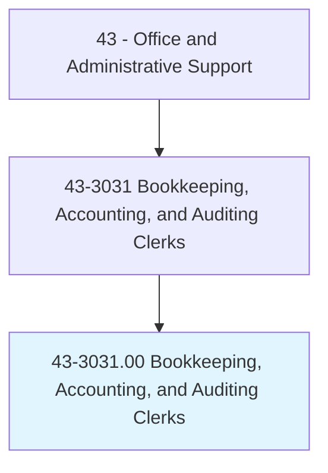
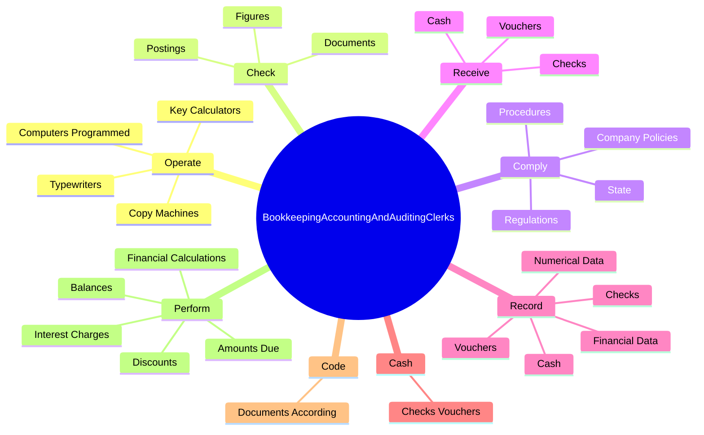

# Bookkeeping, Accounting, and Auditing Clerks

> Compute, classify, and record numerical data to keep financial records complete. Perform any combination of routine calculating, posting, and verifying duties to obtain primary financial data for use in maintaining accounting records. May also check the accuracy of figures, calculations, and postings pertaining to business transactions recorded by other workers.

## Overview

Bookkeeping, Accounting, and Auditing Clerks is an occupation within the Office and Administrative Support category. Compute, classify, and record numerical data to keep financial records complete. Perform any combination of routine calculating, posting, and verifying duties to obtain primary financial data for use in maintaining accounting records.

## Classification Hierarchy

## Key Statistics

| Metric | Value |
|--------|-------|
| SOC Code | 43-3031.00 |
| Category | [Office and Administrative Support](/occupations/Administrative/index) |
| Task Count | 160 |
| Source | O*NET |

## Core Tasks

### operate.ComputersProgrammed

Bookkeeping, Accounting, and Auditing Clerks operate computers programmed as part of their core responsibilities.

**Actions:**
- `operate.ComputersProgrammed.with.AccountingSoftware.to.Record`
- `operate.ComputersProgrammed.with.Store`
- `operate.ComputersProgrammed.with.AnalyzeInformation`
- `operate.KeyCalculators.to.perform.Calculations`

### check.Figures

Bookkeeping, Accounting, and Auditing Clerks check figures as part of their core responsibilities.

**Actions:**
- `check.Figures.for.CorrectEntry`
- `check.Figures.for.MathematicalAccuracy`
- `check.Figures.for.ProperCodes`
- `check.Postings.for.CorrectEntry`

### comply.State

Bookkeeping, Accounting, and Auditing Clerks comply state as part of their core responsibilities.

**Actions:**
- `comply.State`
- `comply.CompanyPolicies`
- `comply.Procedures`
- `comply.Regulations`

## Skills & Competencies

### Technical Skills
- **Office Management** - Advanced
- **Data Entry** - Advanced
- **Records Management** - Advanced

### Soft Skills
- **Communication** - Essential
- **Problem Solving** - Essential
- **Critical Thinking** - Important
- **Teamwork** - Important
- **Adaptability** - Important

## Related Occupations

## Industries

This occupation is found across multiple industries. See [Industries](/industries) for sector-specific employment data.

## Career Progression

---

*Source: O*NET 43-3031.00 - ONETOccupation*
