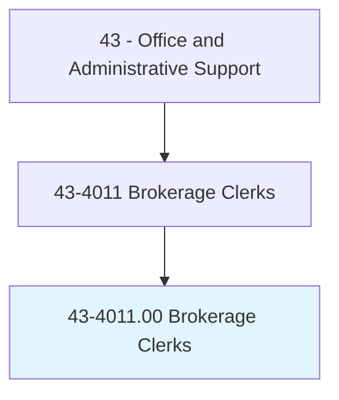
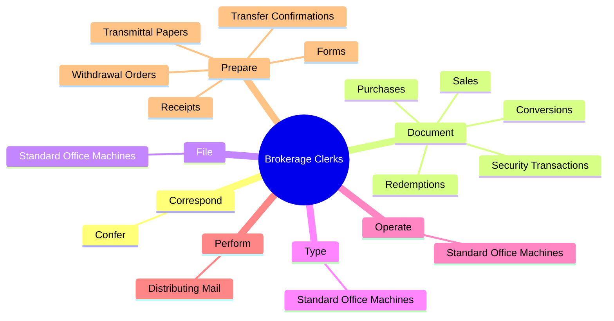
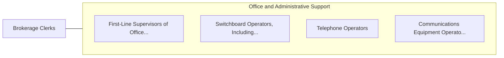

# Brokerage Clerks

> Perform duties related to the purchase, sale, or holding of securities. Duties include writing orders for stock purchases or sales, computing transfer taxes, verifying stock transactions, accepting and delivering securities, tracking stock price fluctuations, computing equity, distributing dividends, and keeping records of daily transactions and holdings.

## Overview

Brokerage Clerks is an occupation within the Office and Administrative Support category. Perform duties related to the purchase, sale, or holding of securities. 

## Classification Hierarchy

## Key Statistics

| Metric | Value |
|--------|-------|
| SOC Code | 43-4011.00 |
| Category | [Office and Administrative Support](/occupations/Administrative/index) |
| Task Count | 51 |
| Source | O*NET |

## Core Tasks

### correspond.Confer

Brokerage Clerks correspond confer as part of their core responsibilities.

**Actions:**
- `correspond.Confer.with.Coworkers.to.answer.Inquiries`
- `correspond.Confer.with.DiscussMarketFluctuations`
- `correspond.Confer.with.ResolveAccountProblems`

### document.SecurityTransactions

Brokerage Clerks document security transactions as part of their core responsibilities.

**Actions:**
- `document.SecurityTransactions`
- `document.Purchases`
- `document.Sales`
- `document.Conversions`

### file.StandardOfficeMachines

Brokerage Clerks file standard office machines as part of their core responsibilities.

**Actions:**
- `file.StandardOfficeMachines`

## Skills & Competencies

### Technical Skills
- **Office Management** - Advanced
- **Data Entry** - Advanced
- **Records Management** - Advanced

### Soft Skills
- **Communication** - Essential
- **Problem Solving** - Essential
- **Critical Thinking** - Important
- **Teamwork** - Important
- **Adaptability** - Important

## Related Occupations

## Industries

This occupation is found across multiple industries. See [Industries](/industries) for sector-specific employment data.

## Career Progression

---

*Source: O*NET 43-4011.00 - ONETOccupation*
