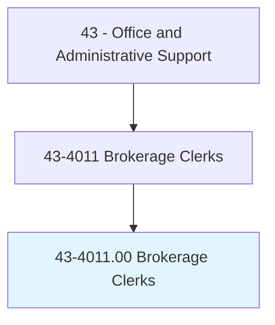
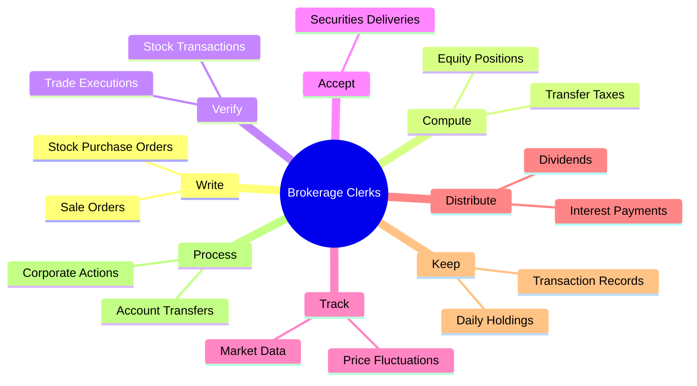
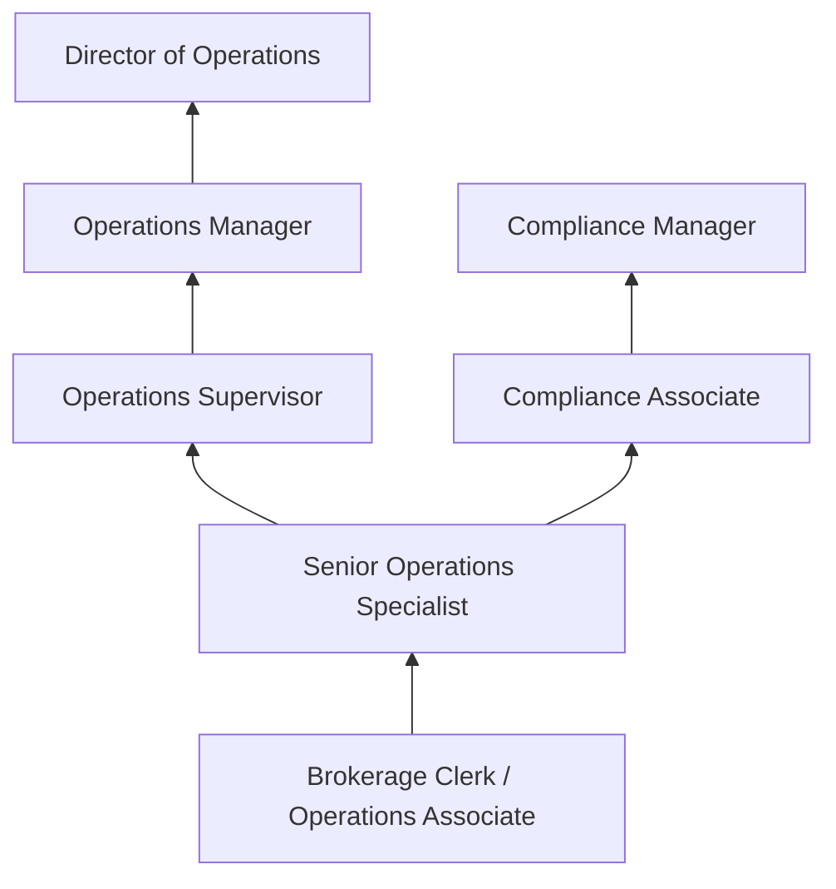
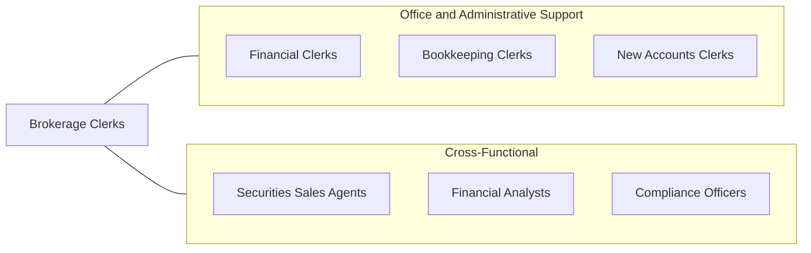

# Brokerage Clerks

> Perform duties related to the purchase, sale, or holding of securities. Duties include writing orders for stock purchases or sales, computing transfer taxes, verifying stock transactions, accepting and delivering securities, tracking stock price fluctuations, computing equity, distributing dividends, and keeping records of daily transactions and holdings.

## Overview

Brokerage Clerks provide essential administrative and operational support in securities firms, investment banks, and financial services companies. They process securities transactions, maintain client account records, verify trade executions, compute transfer taxes and equity positions, distribute dividends, and ensure accurate recordkeeping of daily trading activities. Their work underpins the efficient operation of financial markets by ensuring that trades are properly documented, settled, and reported.

Working in fast-paced trading environments, these clerks must be accurate, detail-oriented, and capable of handling high volumes of time-sensitive transactions. They interface with brokers, traders, clients, and clearinghouse personnel to resolve discrepancies, process transfers, and maintain compliance with securities regulations. The role requires understanding of financial instruments, market operations, and regulatory requirements governing securities transactions.

As financial markets have become increasingly electronic and automated, the brokerage clerk role has evolved to focus more on exception processing, compliance documentation, and client service rather than manual transaction recording. However, the need for human oversight in complex settlements, corporate actions, and regulatory reporting continues to sustain demand for skilled professionals.

## Classification Hierarchy

## Key Statistics

| Metric | Value |
|--------|-------|
| SOC Code | 43-4011.00 |
| Job Zone | 3 (Medium Preparation) |
| Category | [Office and Administrative Support](/occupations/Administrative/index) |
| Median Annual Salary | $56,400 |
| Employment | ~56,000 |
| Projected Growth | -10% (declining) |
| Core Tasks | 45 |
| Source | O*NET |

## Core Tasks

### write.StockOrders

Brokerage Clerks process securities purchase and sale orders.

**Actions:**
- `write.StockPurchaseOrders.for.ClientAccounts` - Document buy orders
- `write.SaleOrders.for.ClientAccounts` - Process sell orders

### compute.TransferTaxes

Brokerage Clerks calculate taxes and equity positions.

**Actions:**
- `compute.TransferTaxes.for.SecuritiesTransactions` - Calculate applicable transfer fees
- `compute.EquityPositions.for.ClientPortfolios` - Determine account equity values

### verify.StockTransactions

Brokerage Clerks confirm trade accuracy and settlement.

**Actions:**
- `verify.StockTransactions.for.Accuracy` - Match trade confirmations to orders
- `verify.TradeExecutions.for.Settlement` - Ensure proper trade settlement

## Skills & Competencies

### Technical Skills
- **Securities Operations** - Advanced
- **Trade Processing and Settlement** - Advanced
- **Financial Recordkeeping** - Advanced
- **Regulatory Compliance (SEC/FINRA)** - Intermediate
- **Trading Platforms and Systems** - Advanced
- **Corporate Actions Processing** - Intermediate
- **Tax Reporting (1099s)** - Intermediate

### Soft Skills
- **Attention to Detail** - Critical
- **Accuracy Under Pressure** - Critical
- **Communication** - Essential
- **Organizational Skills** - Essential
- **Problem Solving** - Important
- **Integrity** - Critical
- **Time Management** - Essential

## Education & Certifications

| Requirement | Details |
|-------------|---------|
| Typical Education | Bachelor's degree in Finance or Business preferred |
| Series 7 or SIE | May be required depending on role |
| FINRA Registration | Background check and fingerprinting required |
| Trading Platform Training | Company-specific systems training |
| Continuing Education | Securities regulatory updates |

## Career Progression

## Industry Variations

| Setting | Focus | Unique Aspects |
|---------|-------|----------------|
| Full-Service Brokerage | Client account management | High-touch service; complex transactions; advisor support |
| Discount Brokerage | High-volume trade processing | Automated systems; exception-based work; efficiency focus |
| Investment Banking | Institutional settlements | Large block trades; complex instruments; international settlement |
| Clearinghouse | Trade clearing and settlement | DTCC interface; margin management; risk processing |

## Technology & Tools

- **Trading Systems** - Bloomberg Terminal, Charles River, Broadridge
- **Settlement** - DTCC platforms, Omgeo
- **Account Management** - CRM systems, portfolio accounting
- **Reporting** - Regulatory reporting tools, Excel
- **Communication** - Secure messaging, Bloomberg chat

## Related Occupations

## Departments

This occupation typically works in:
- [Operations](/departments/Operations) - Trade processing and settlement
- Compliance - Regulatory recordkeeping
- Client Services - Account administration
- [Finance](/departments/Finance) - Financial reporting

---

*Source: O*NET 43-4011.00 - ONETOccupation*
