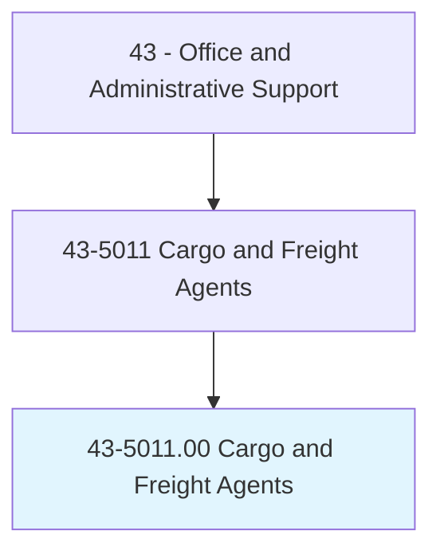
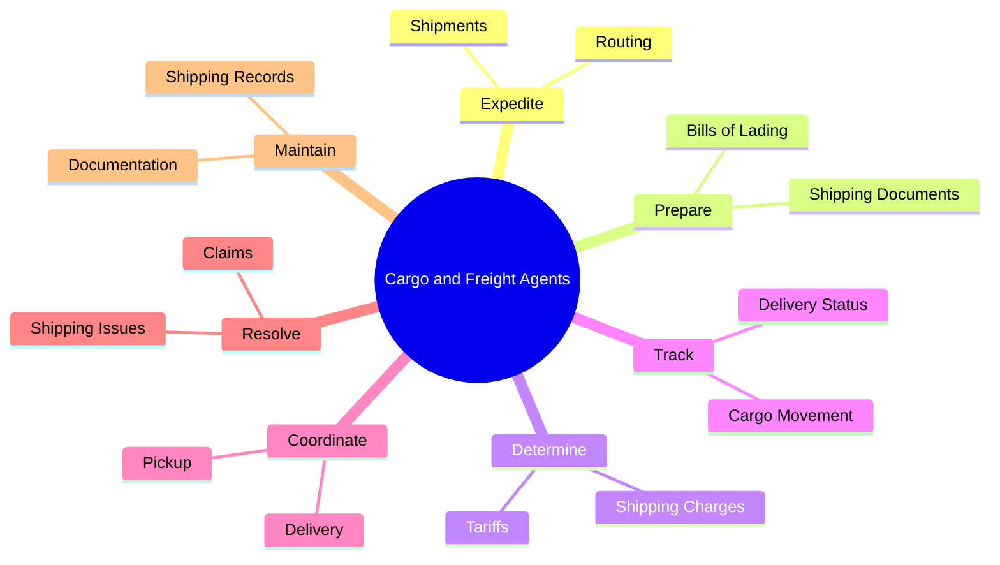
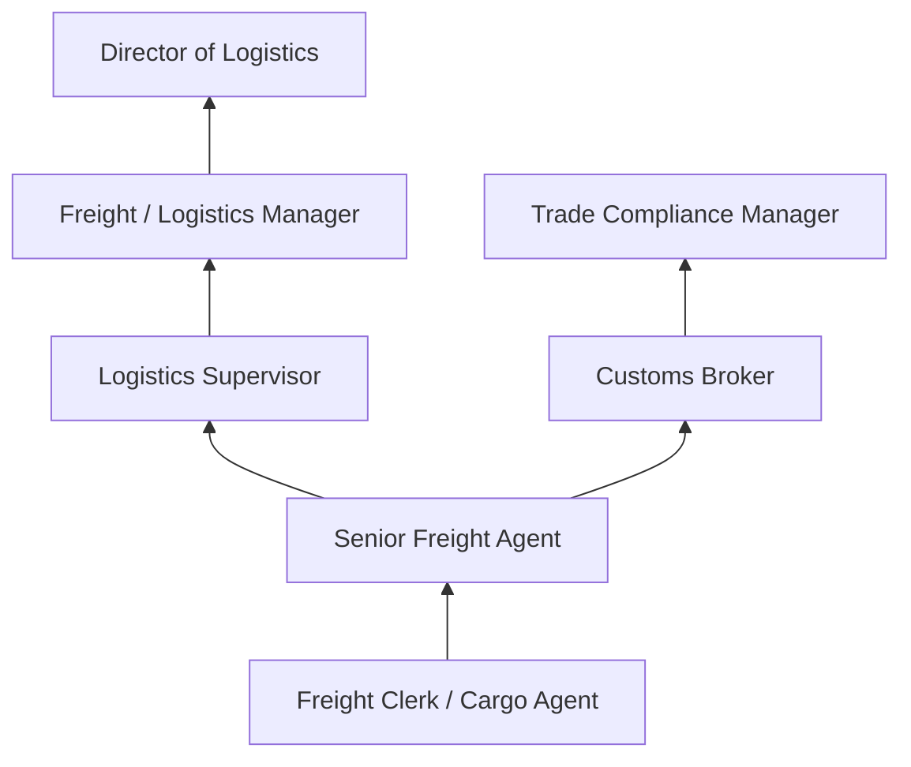
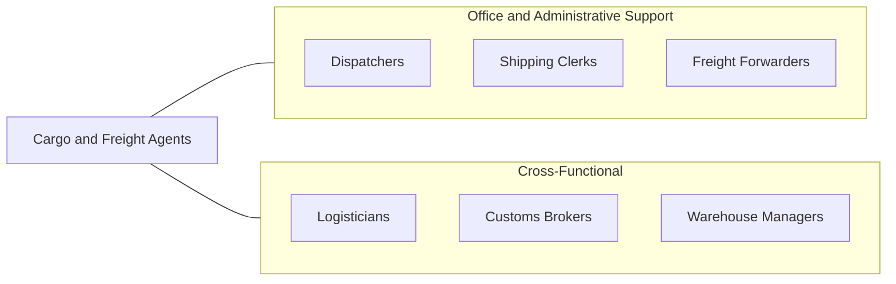

# Cargo and Freight Agents

> Expedite and route movement of incoming and outgoing cargo and freight shipments in airline, train, and trucking terminals and shipping docks. Take orders from customers and arrange pickup of freight and cargo for delivery to loading platform. Prepare and examine bills of lading to determine shipping charges and tariffs.

## Overview

Cargo and Freight Agents coordinate the logistics of moving goods through transportation networks, working at airline terminals, rail yards, trucking depots, and shipping docks. They process shipping documents, calculate freight charges, route shipments, track cargo, and resolve delivery issues. Their coordination ensures that goods move efficiently from origin to destination across complex multimodal transportation systems.

These professionals serve as the operational backbone of supply chain logistics, interfacing between shippers, carriers, customs brokers, and receivers. They prepare bills of lading, determine optimal routing and carrier selection, negotiate rates, arrange pickup and delivery, and maintain records of all shipments. In international trade, they ensure compliance with customs regulations and trade documentation requirements.

The logistics industry's growth, driven by e-commerce and global trade, has sustained demand for freight agents who can navigate increasingly complex supply chains. While technology has automated many routine functions, the ability to solve problems, manage exceptions, and coordinate across multiple parties remains a distinctly human capability.

## Classification Hierarchy

## Key Statistics

| Metric | Value |
|--------|-------|
| SOC Code | 43-5011.00 |
| Job Zone | 2 (Some Preparation) |
| Category | [Office and Administrative Support](/occupations/Administrative/index) |
| Median Annual Salary | $46,900 |
| Employment | ~86,000 |
| Projected Growth | 6% (faster than average) |
| Core Tasks | 55 |
| Source | O*NET |

## Core Tasks

### expedite.Shipments

Cargo and Freight Agents route and expedite cargo movement.

**Actions:**
- `expedite.Shipments.through.TransportationNetworks` - Coordinate multimodal freight routing
- `expedite.Routing.for.OptimalDelivery` - Select best carriers and routes

### prepare.BillsOfLading

Cargo and Freight Agents create and verify shipping documentation.

**Actions:**
- `prepare.BillsOfLading.for.FreightShipments` - Generate legal shipping documents
- `prepare.ShippingDocuments.for.CustomsClearance` - Compile international trade paperwork

## Skills & Competencies

### Technical Skills
- **Freight Documentation and Bills of Lading** - Advanced
- **Transportation Management Systems (TMS)** - Advanced
- **Tariff and Rate Calculation** - Advanced
- **Customs Regulations** - Intermediate
- **Supply Chain Logistics** - Advanced
- **Hazardous Materials Shipping** - Intermediate

### Soft Skills
- **Problem Solving** - Critical
- **Organizational Skills** - Critical
- **Communication** - Essential
- **Attention to Detail** - Essential
- **Multitasking** - Essential
- **Customer Service** - Important

## Education & Certifications

| Requirement | Details |
|-------------|---------|
| Typical Education | High school diploma; associate's degree preferred |
| Certified Logistics Associate (CLA) | MSSC logistics credential |
| Certified Customs Specialist | International trade certification |
| HAZMAT Certification | Required for hazardous materials handling |
| Transportation Broker License | Required for independent operation |
| On-the-Job Training | Moderate; company-specific systems |

## Career Progression

## Industry Variations

| Setting | Focus | Unique Aspects |
|---------|-------|----------------|
| Airlines | Air cargo operations | Time-sensitive; weight restrictions; airport security protocols |
| Trucking | Ground freight | Route optimization; driver coordination; LTL/FTL management |
| Maritime | Ocean freight | Container management; port operations; international documentation |
| Rail | Rail freight | Intermodal coordination; bulk commodities; long-haul efficiency |

## Technology & Tools

- **TMS** - SAP TM, Oracle Transportation, MercuryGate
- **Tracking** - GPS tracking, shipment visibility platforms
- **Documentation** - Electronic bills of lading, customs portals
- **Communication** - Radio, phone, email, EDI
- **Rate Management** - Freight rate databases, quoting tools
- **Compliance** - AES filing, customs documentation systems

## Related Occupations

## Departments

This occupation typically works in:
- [Logistics Department](/departments/Logistics) - Freight coordination
- [Operations](/departments/Operations) - Terminal and dock operations
- [Supply Chain](/departments/SupplyChain) - End-to-end cargo management
- [Customer Service](/departments/CustomerService) - Shipment tracking and inquiries

---

*Source: O*NET 43-5011.00 - ONETOccupation*
