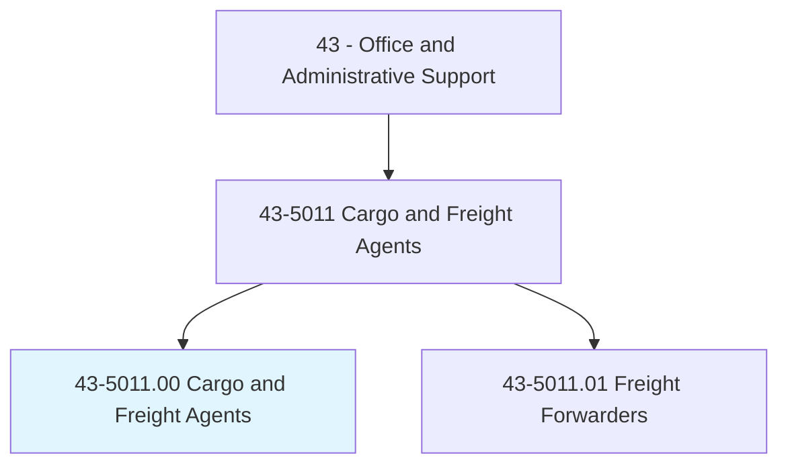
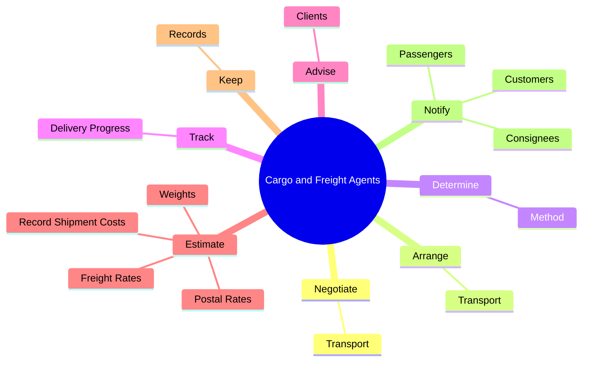
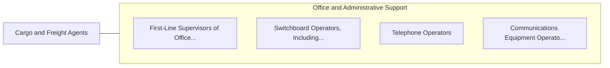

# Cargo and Freight Agents

> Expedite and route movement of incoming and outgoing cargo and freight shipments in airline, train, and trucking terminals and shipping docks. Take orders from customers and arrange pickup of freight and cargo for delivery to loading platform. Prepare and examine bills of lading to determine shipping charges and tariffs.

## Overview

Cargo and Freight Agents is an occupation within the Office and Administrative Support category. Expedite and route movement of incoming and outgoing cargo and freight shipments in airline, train, and trucking terminals and shipping docks. Take orders from customers and arrange pickup of freight and cargo for delivery to loading platform.

## Classification Hierarchy

## Key Statistics

| Metric | Value |
|--------|-------|
| SOC Code | 43-5011.00 |
| Category | [Office and Administrative Support](/occupations/Administrative/index) |
| Task Count | 93 |
| Source | O*NET |

## Core Tasks

### negotiate.Transport

Cargo and Freight Agents negotiate transport as part of their core responsibilities.

**Actions:**
- `negotiate.Transport.of.Goods.with.ShippingCompanies`
- `negotiate.Transport.of.FreightCompanies`

### arrange.Transport

Cargo and Freight Agents arrange transport as part of their core responsibilities.

**Actions:**
- `arrange.Transport.of.Goods.with.ShippingCompanies`
- `arrange.Transport.of.FreightCompanies`

### determine.Method

Cargo and Freight Agents determine method as part of their core responsibilities.

**Actions:**
- `determine.Method.of.Shipment`
- `determine.Method.of.PrepareBills.of.Lading`
- `determine.Method.of.Invoices`
- `determine.Method.of.OtherShippingDocuments`

## Skills & Competencies

### Technical Skills
- **Office Management** - Advanced
- **Data Entry** - Advanced
- **Records Management** - Advanced

### Soft Skills
- **Communication** - Essential
- **Problem Solving** - Essential
- **Critical Thinking** - Important
- **Teamwork** - Important
- **Adaptability** - Important

## Related Occupations

## Industries

This occupation is found across multiple industries. See [Industries](/industries) for sector-specific employment data.

## Career Progression

---

*Source: O*NET 43-5011.00 - ONETOccupation*
