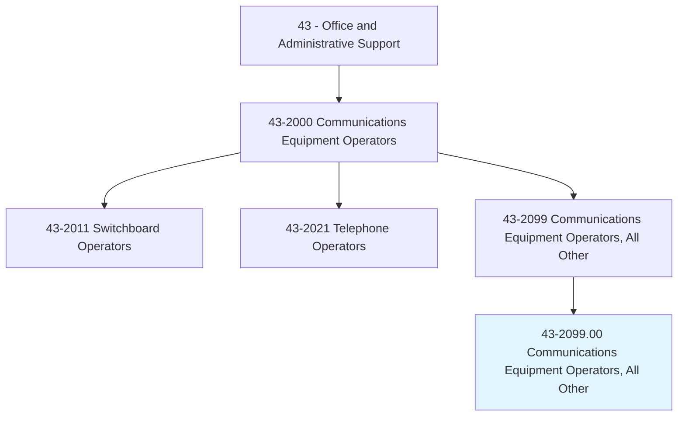
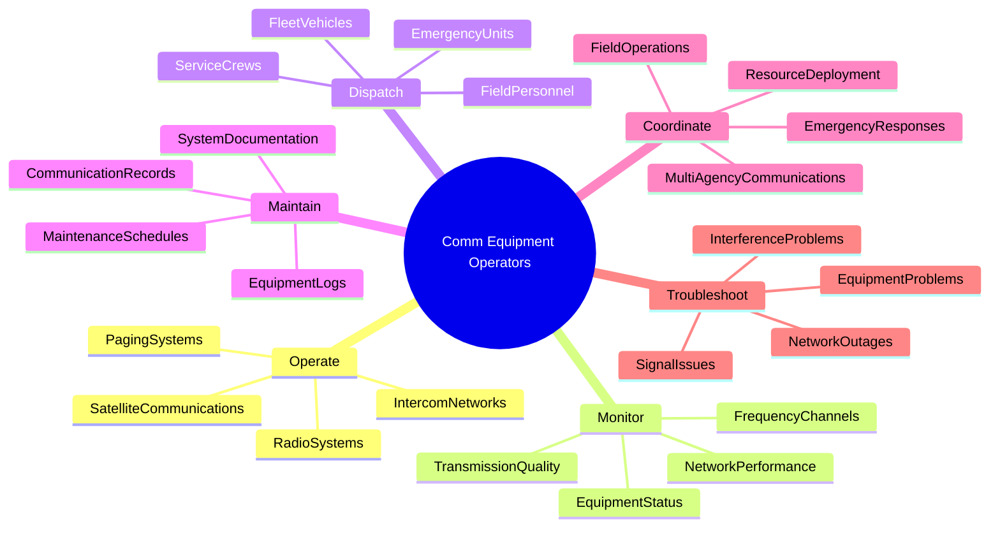
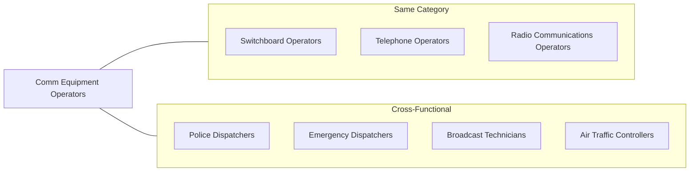
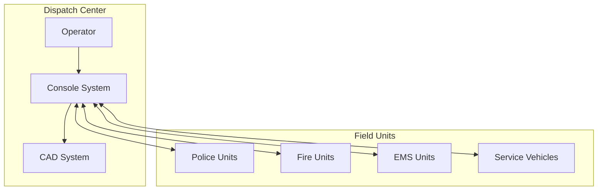
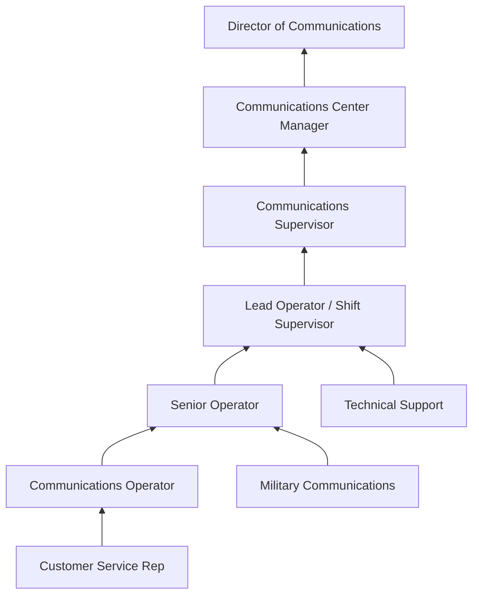

# Communications Equipment Operators, All Other

> All communications equipment operators not listed separately.

## Overview

Communications Equipment Operators, All Other encompasses specialized communications roles that do not fit into the standard switchboard or telephone operator classifications. This category includes professionals who operate various types of communications equipment such as radio consoles, paging systems, intercom networks, public address systems, satellite communications terminals, and specialized dispatch equipment. These operators work in diverse settings including emergency services, transportation, broadcasting, military installations, and industrial facilities where specialized communications are essential to operations.

## Classification Hierarchy

## Key Statistics

| Metric | Value |
|--------|-------|
| SOC Code | 43-2099.00 |
| Job Zone | 2-3 (Some to Medium Preparation) |
| Category | [Office and Administrative Support](/occupations/Administrative/index) |
| Core Tasks | Varies by specialization |
| Source | O*NET |

## Core Tasks

### operate.RadioSystems

Communications Equipment Operators manage radio transmission systems for voice and data communications.

**Actions:**
- `operate.RadioSystems.for.FieldCommunications` - Manage two-way radio networks for mobile personnel
- `operate.PagingSystems.to.alert.Personnel` - Send notifications through paging networks
- `operate.IntercomNetworks.within.Facilities` - Manage internal communication systems
- `operate.SatelliteCommunications.for.RemoteAccess` - Handle satellite-based communication links

### monitor.TransmissionQuality

Communications Equipment Operators ensure reliable signal quality and system performance.

**Actions:**
- `monitor.TransmissionQuality.for.Clarity` - Assess audio and signal quality
- `monitor.EquipmentStatus.for.Functionality` - Track operational status of communications equipment
- `monitor.FrequencyChannels.for.Activity` - Scan and manage radio frequency usage
- `monitor.NetworkPerformance.for.Reliability` - Observe system metrics and performance indicators

### dispatch.EmergencyUnits

Communications Equipment Operators coordinate deployment of resources through radio communications.

**Actions:**
- `dispatch.EmergencyUnits.to.Incidents` - Direct first responders to emergency locations
- `dispatch.FieldPersonnel.to.WorkSites` - Coordinate mobile workforce deployment
- `dispatch.FleetVehicles.for.Operations` - Manage vehicle routing and assignments
- `dispatch.ServiceCrews.for.Maintenance` - Direct technicians to service calls

### maintain.EquipmentLogs

Communications Equipment Operators document system usage and maintain operational records.

**Actions:**
- `maintain.EquipmentLogs.for.Compliance` - Record equipment usage and status
- `maintain.CommunicationRecords.for.Reference` - Document transmission logs
- `maintain.MaintenanceSchedules.for.Equipment` - Track preventive maintenance requirements
- `maintain.SystemDocumentation.for.Operations` - Keep operational procedures current

### coordinate.MultiAgencyCommunications

Communications Equipment Operators facilitate communications across multiple organizations.

**Actions:**
- `coordinate.MultiAgencyCommunications.during.Incidents` - Manage interoperability during joint operations
- `coordinate.EmergencyResponses.with.Agencies` - Link multiple emergency services
- `coordinate.FieldOperations.across.Teams` - Synchronize distributed field teams
- `coordinate.ResourceDeployment.for.Efficiency` - Optimize allocation of assets

## Skills & Competencies

### Technical Skills
- **Radio Communications Systems** - Advanced to Expert
- **Dispatch Software** - Proficient
- **Network Monitoring Tools** - Proficient
- **Geographic Information Systems** - Proficient
- **Emergency Protocols** - Advanced

### Soft Skills
- **Communication** - Critical
- **Attention to Detail** - Critical
- **Stress Management** - Essential
- **Multitasking** - Essential
- **Decision Making** - Essential

## Related Occupations

## Industries

- [Public Administration](/industries/PublicAdministration) - High Employment
- [Transportation and Warehousing](/industries/Transportation) - Moderate Employment
- [Utilities](/industries/Utilities/index) - Moderate Employment
- [Broadcasting and Telecommunications](/industries/Broadcasting) - Moderate Employment
- [Mining, Quarrying, and Oil Extraction](/industries/Mining/index) - Moderate Employment
- [Healthcare and Social Assistance](/industries/Healthcare/index) - Moderate Employment

## Specialization Areas

### Radio Dispatch Operations
Operators who manage two-way radio networks for police, fire, EMS, taxi services, trucking companies, and utility crews. They track field units, relay information, and coordinate responses.

### Public Address and Paging
Operators who manage PA systems in large facilities such as airports, hospitals, stadiums, and manufacturing plants. They make announcements, page individuals, and coordinate emergency notifications.

### Satellite Communications
Operators who manage satellite terminals for remote communications, maritime operations, military applications, and broadcast uplinks. They handle signal acquisition, link budgets, and system maintenance.

### Aviation Communications
Operators who work in flight service stations, airline operations centers, and airport communications. They coordinate with pilots, ground crews, and air traffic facilities.

### Maritime Communications
Operators who manage ship-to-shore communications, Coast Guard dispatch, and port operations communications using VHF marine radio and satellite systems.

### Industrial Communications
Operators in manufacturing, oil and gas, and mining operations who manage internal communications, safety alerting, and coordination of distributed work crews.

## Career Progression

## Education & Training

| Requirement | Details |
|-------------|---------|
| Typical Education | High school diploma; specialized training varies by role |
| Work Experience | Varies; some positions require related experience |
| On-the-Job Training | Moderate to long-term (1-12 months depending on specialization) |
| Common Certifications | FCC Radio License, APCO certifications, specialized system certifications |

## Licensing and Certification

### FCC Licensing
- General Radiotelephone Operator License (GROL)
- Marine Radio Operator Permit (MROP)
- Commercial Radio Operator License
- Restricted Radiotelephone Operator Permit

### Professional Certifications
- APCO (Association of Public-Safety Communications Officials)
  - Registered Public-Safety Leader (RPL)
  - Communications Training Officer (CTO)
- NENA (National Emergency Number Association) certifications
- Manufacturer-specific equipment certifications

## Tools & Technology

### Radio Equipment
- Multi-channel radio consoles
- Repeater systems
- Mobile and portable radio units
- Satellite communication terminals
- Microwave links

### Software Systems
- Computer-aided dispatch (CAD)
- Geographic information systems (GIS)
- Automatic vehicle location (AVL)
- Radio management software
- Recording and logging systems

### Specialized Equipment
- Public address systems
- Paging infrastructure
- Emergency notification systems
- Intercom networks
- Tone and alert encoding systems

## Work Environment

### Physical Setting
- Communications centers and dispatch facilities
- Control rooms and operations centers
- Remote transmission sites
- Mobile command vehicles
- Varies by industry and specialization

### Work Schedule
- 24/7 operations common in emergency services
- Shift work including nights, weekends, and holidays
- On-call requirements in some positions
- Rotating schedules typical

## Industry-Specific Requirements

### Emergency Services
- Background checks and security clearances
- Stress tolerance assessments
- CPR and emergency procedure training
- Ongoing continuing education

### Aviation
- FAA medical certificates may be required
- Aviation terminology knowledge
- Security background checks

### Maritime
- Coast Guard documentation
- STCW (Standards of Training, Certification, and Watchkeeping) compliance
- Maritime safety training

### Military
- Security clearances
- Military-specific training programs
- Physical fitness requirements

## Performance Metrics

| Metric | Description |
|--------|-------------|
| Response Time | Speed of handling incoming communications |
| Dispatch Accuracy | Correct assignment of resources |
| System Uptime | Equipment availability percentage |
| Log Accuracy | Completeness of documentation |
| Protocol Compliance | Adherence to communication procedures |

## Departments

This occupation typically works in:
- Communications Center
- Dispatch Operations
- Emergency Management
- [Operations Center](/departments/Operations/index)

## Related Processes

- [Emergency Dispatch](/processes/EmergencyDispatch)
- [Radio Communications](/processes/RadioCommunications)
- [Field Operations Coordination](/processes/FieldOperations)
- [Public Address and Notification](/processes/PublicAddress)

---

*Source: O*NET 43-2099.00 - ONETOccupation*
