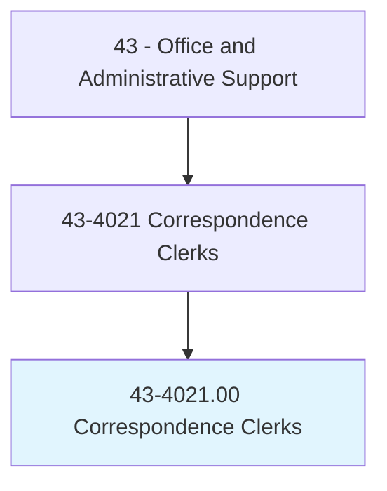
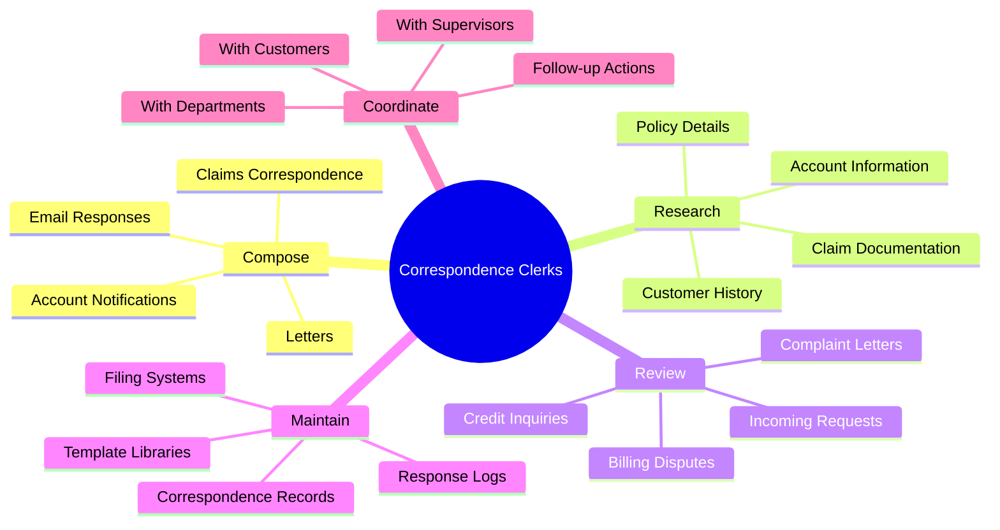
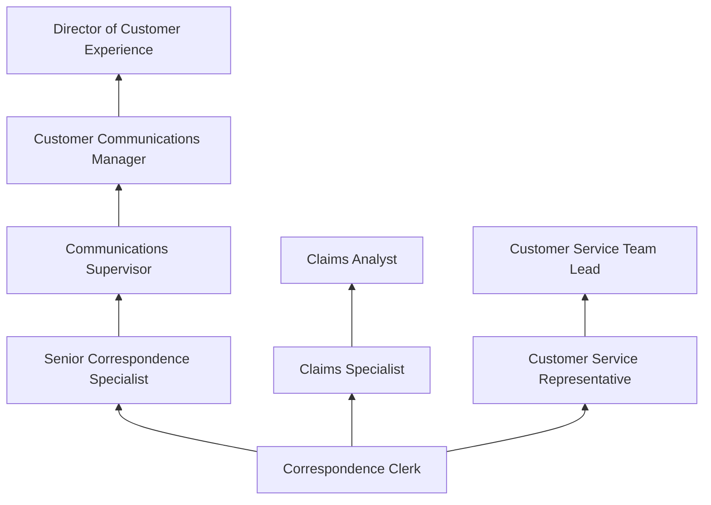
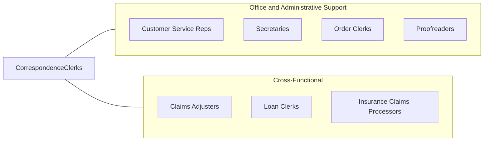

# Correspondence Clerks

> Compose letters or electronic correspondence in reply to requests for merchandise, damage claims, credit and other information, delinquent accounts, incorrect billings, or unsatisfactory services.

## Overview

Correspondence Clerks compose business letters and electronic communications in response to customer inquiries, complaints, claims, and requests. They research accounts, gather relevant data, draft responses using standard templates and company guidelines, and ensure that all outgoing correspondence accurately addresses the customer's concern. Their written communications represent the organization to customers, requiring clarity, professionalism, and accuracy.

These professionals work in insurance companies, financial institutions, government agencies, and large corporations where written communication volume necessitates dedicated staff. They handle damage claims, billing disputes, credit inquiries, delinquent account notifications, and service complaints. The role requires strong writing skills, knowledge of company policies and products, and the ability to interpret customer requests accurately. Correspondence clerks must translate complex policy language into clear, customer-friendly explanations while maintaining legal and regulatory compliance.

While email and automated response systems have reduced the volume of traditional correspondence, complex inquiries requiring personalized, nuanced responses continue to require skilled writers. Many correspondence clerks now work across multiple communication channels, including email, chat, and social media. The profession demands both empathy for customer concerns and adherence to organizational standards, making every response both helpful and professionally consistent with brand voice.

## Classification Hierarchy



## Key Statistics

| Metric | Value |
|--------|-------|
| SOC Code | 43-4021.00 |
| Job Zone | 2 (Some Preparation) |
| Category | [Office and Administrative Support](/occupations/Administrative/index) |
| Median Annual Salary | $38,500 |
| Salary Range | $28,000 - $52,000 |
| 10th Percentile | $28,200 |
| 90th Percentile | $51,800 |
| Employment | ~10,000 |
| Projected Growth | -15% (declining) |
| Annual Openings | ~800 |
| Core Tasks | 28 |
| Source | O*NET |

## Core Tasks



### compose.Correspondence

Correspondence Clerks compose responses as their primary responsibility.

**Actions:**
- `compose.Letters.to.Customers`
- `compose.Responses.for.ClaimInquiries`
- `compose.Notifications.regarding.DelinquentAccounts`
- `draft.Correspondence.using.Templates`

### research.Information

Correspondence Clerks research information to support accurate responses.

**Actions:**
- `research.Accounts.for.CustomerHistory`
- `research.Policies.to.AnswerInquiries`
- `verify.Information.from.MultiplesSources`
- `gather.Documentation.to.SupportResponses`

## Skills & Competencies

### Technical Skills
- **Business Writing** - Expert (professional letter composition)
- **Email and Communication Systems** - Advanced (Outlook, Gmail, correspondence management)
- **CRM and Account Lookup** - Advanced (Salesforce, company-specific systems)
- **Template and Document Management** - Advanced (merge documents, variable content)
- **Company Policy Knowledge** - Expert (products, services, procedures)
- **Word Processing** - Advanced (Microsoft Word, Google Docs)
- **Grammar and Proofreading** - Expert (error-free professional writing)
- **Research Skills** - Advanced (account investigation, policy lookup)

### Soft Skills
- **Written Communication** - Critical (clear, professional writing)
- **Attention to Detail** - Critical (accurate information, proper formatting)
- **Empathy** - Essential (understanding customer concerns)
- **Problem Solving** - Essential (addressing complex inquiries)
- **Reading Comprehension** - Essential (interpreting customer requests)
- **Time Management** - Essential (managing correspondence volume)
- **Diplomacy** - Important (handling difficult situations)
- **Organizational Skills** - Important (tracking multiple cases)

## Education & Certifications

| Requirement | Details |
|-------------|---------|
| Typical Education | High school diploma; some college preferred |
| Preferred Degree | Associate's in Business, Communications, or English |
| Business Writing Training | Company-specific style guides and templates |
| Customer Service Certification | ICMI, HDI, or equivalent credential |
| Industry Certifications | LOMA (insurance), CRCM (banking compliance) |
| On-the-Job Training | 1-3 months of company-specific training |
| Continuing Education | Style updates, regulatory compliance, new systems |

## Career Progression



### Career Pathway Details

| Level | Title | Years Experience | Key Responsibilities |
|-------|-------|------------------|----------------------|
| Entry | Correspondence Clerk | 0-2 years | Routine correspondence, template-based responses |
| Mid | Senior Correspondence Specialist | 2-5 years | Complex inquiries, exception handling, training |
| Senior | Communications Supervisor | 5-8 years | Team oversight, quality review, process improvement |
| Management | Customer Communications Manager | 8-12 years | Department leadership, policy development |
| Executive | Director of Customer Experience | 12+ years | Strategic communications, brand voice |

## Industry Variations

| Setting | Focus | Unique Aspects |
|---------|-------|----------------|
| Insurance | Claims correspondence | Policy language; denial letters; appeals responses; state-specific regulations |
| Banking | Account communications | Regulatory disclosures; dispute resolution; compliance language; FDIC requirements |
| Government | Official correspondence | Formal tone; regulatory citations; FOIA responses; constituent services |
| Healthcare | Patient communications | HIPAA compliance; billing explanations; insurance coordination; medical terminology |
| Utilities | Customer account letters | Rate explanations; service notifications; regulatory filings; public commission rules |
| Retail | Customer service responses | Return policies; order issues; satisfaction guarantees; brand voice consistency |

### Insurance Industry Focus

In insurance settings, correspondence clerks handle claim denials, policy explanations, premium notices, and coverage inquiries. They must understand policy provisions, exclusions, and state insurance regulations. Responses often involve legal implications, requiring precise language and supervisor review for denial letters.

### Banking and Financial Services Focus

Banking correspondence clerks manage regulatory disclosures, dispute resolutions, fee explanations, and compliance-required communications. They must understand Regulation E, Truth in Lending, and Fair Credit practices. Many responses carry legal weight and require documented audit trails.

### Government Agency Focus

Government correspondence clerks handle constituent inquiries, FOIA requests, regulatory correspondence, and official notifications. They must follow strict protocols for record retention, formal addressing, and legal citations. Response times may be mandated by statute.

## Technology & Tools

- **Email Systems** - Microsoft Outlook, Gmail, correspondence management platforms
- **CRM** - Salesforce, Microsoft Dynamics, company-specific platforms
- **Templates** - Document assembly tools, merge templates, variable content systems
- **Word Processing** - Microsoft Word, Google Docs, Adobe Acrobat
- **Account Systems** - Core banking, policy administration, billing systems
- **Quality Assurance** - Correspondence review and approval workflows
- **Document Management** - SharePoint, Laserfiche, document imaging
- **Communication Platforms** - Internal messaging, email queues, ticket systems

### Emerging Technology

- **AI Writing Assistants** - Grammarly, Microsoft Editor, AI-powered drafting
- **Automated Response Systems** - Chatbots, auto-response for common inquiries
- **Sentiment Analysis** - Tools to gauge customer tone and prioritize responses
- **Template Intelligence** - Dynamic template selection based on inquiry type

## Related Occupations



### Related Occupation Comparison

| Occupation | Similarity | Key Difference |
|------------|------------|----------------|
| Customer Service Reps | High | Phone/live vs written communication |
| Claims Adjusters | Medium | Investigation focus vs communication focus |
| Secretaries | Medium | Executive support vs customer-facing |
| Technical Writers | Medium | Documentation vs customer correspondence |

## Industries

- [Insurance and Risk Management](/industries/Insurance) - High Employment
- [Banking and Credit Services](/industries/Finance/Banking) - High Employment
- [Government and Public Administration](/industries/PublicAdministration) - Moderate Employment
- [Healthcare Administration](/industries/Healthcare/index) - Moderate Employment
- [Utilities and Energy](/industries/Utilities) - Moderate Employment
- [Retail and E-Commerce](/industries/Retail/index) - Moderate Employment

## Departments

This occupation typically works in:
- Customer Service - Client communications and inquiry handling
- Claims Department - Claims correspondence and resolution
- Administration - Office communications and records
- Compliance - Regulatory correspondence and disclosures
- Account Services - Billing and account communications
- [Legal Department](/departments/Legal) - Legal correspondence support

## Work Environment

### Physical Setting
- Climate-controlled office environment
- Desk-based work with computer equipment
- Quiet workspace conducive to writing concentration
- Some positions offer remote work opportunities

### Work Schedule
- Typically Monday-Friday, standard business hours
- Some positions may require weekend or extended hours
- Deadline-driven during high-volume periods
- Measured productivity expectations (letters per hour/day)

### Work Characteristics
- High volume of written output
- Repetitive but detail-oriented tasks
- Limited physical activity
- Significant computer screen time
- Minimal direct customer contact

## GraphDL Semantic Structure

```graphdl
Correspondence Clerks perform:
- compose.Letters.to.Customers
- research.Accounts.for.InquiryResponse
- review.Requests.from.Customers
- maintain.Records.of.Correspondence
- draft.Responses.using.Templates
- coordinate.Information.with.Departments
- verify.Details.before.Sending
- follow.Policies.for.Compliance
```

---

*Source: O*NET 43-4021.00 - ONETOccupation*
