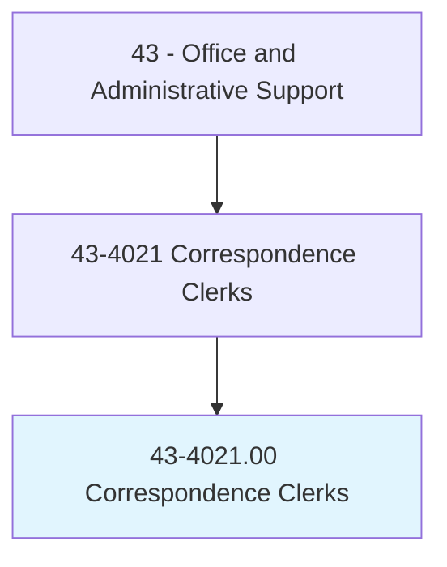
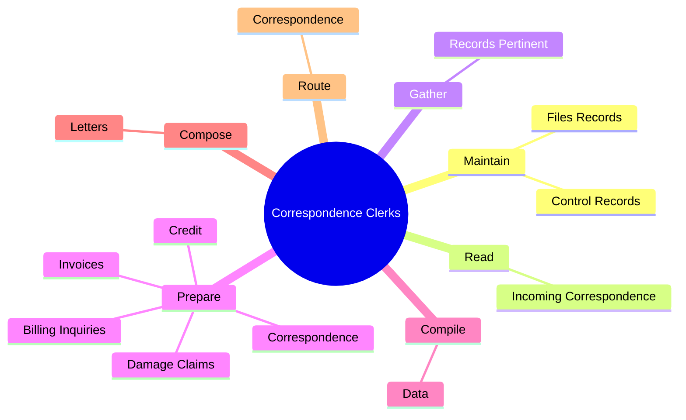
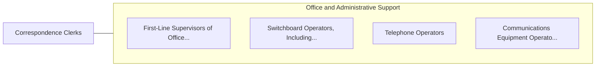

# Correspondence Clerks

> Compose letters or electronic correspondence in reply to requests for merchandise, damage claims, credit and other information, delinquent accounts, incorrect billings, or unsatisfactory services. Duties may include gathering data to formulate reply and preparing correspondence.

## Overview

Correspondence Clerks is an occupation within the Office and Administrative Support category. Compose letters or electronic correspondence in reply to requests for merchandise, damage claims, credit and other information, delinquent accounts, incorrect billings, or unsatisfactory services. 

## Classification Hierarchy

## Key Statistics

| Metric | Value |
|--------|-------|
| SOC Code | 43-4021.00 |
| Category | [Office and Administrative Support](/occupations/Administrative/index) |
| Task Count | 41 |
| Source | O*NET |

## Core Tasks

### maintain.FilesRecords

Correspondence Clerks maintain files records as part of their core responsibilities.

**Actions:**
- `maintain.FilesRecords.to.show.CorrespondenceActivities`
- `maintain.ControlRecords.to.show.CorrespondenceActivities`

### read.IncomingCorrespondence

Correspondence Clerks read incoming correspondence as part of their core responsibilities.

**Actions:**
- `read.IncomingCorrespondence.to.ascertain.NatureOfWritersConcernsDetermineDispositionOfCorrespondence`
- `read.IncomingCorrespondence.to.ToDetermineDispositionOfCorrespondence`

### gather.RecordsPertinent

Correspondence Clerks gather records pertinent as part of their core responsibilities.

**Actions:**
- `gather.RecordsPertinent.to.SpecificProblems`
- `gather.RecordsPertinent.to.review.ThemF`
- `gather.RecordsPertinent.to.Completeness`
- `gather.RecordsPertinent.to.Accuracy`

## Skills & Competencies

### Technical Skills
- **Office Management** - Advanced
- **Data Entry** - Advanced
- **Records Management** - Advanced

### Soft Skills
- **Communication** - Essential
- **Problem Solving** - Essential
- **Critical Thinking** - Important
- **Teamwork** - Important
- **Adaptability** - Important

## Related Occupations

## Industries

This occupation is found across multiple industries. See [Industries](/industries) for sector-specific employment data.

## Career Progression

---

*Source: O*NET 43-4021.00 - ONETOccupation*
