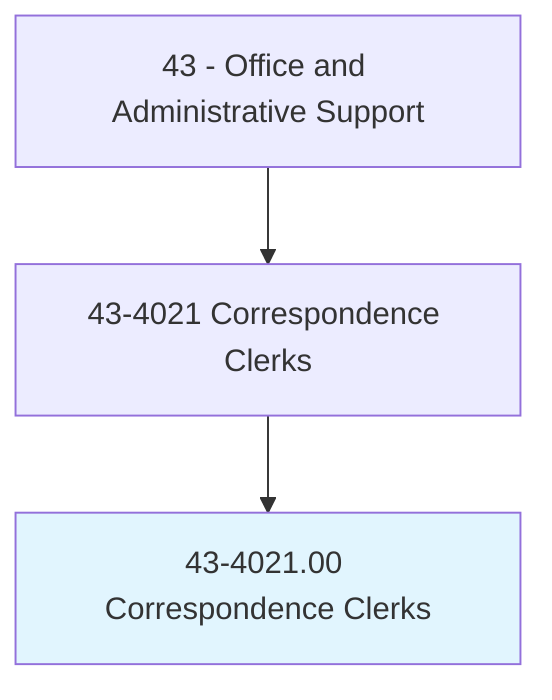
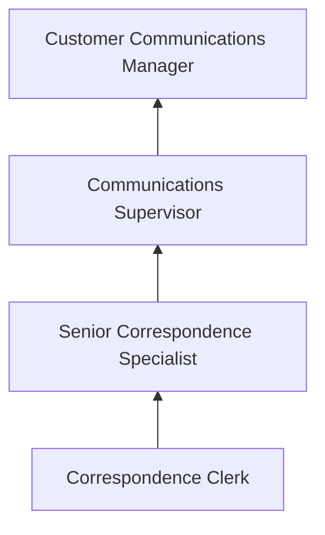
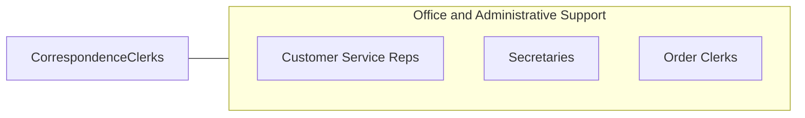

# Correspondence Clerks

> Compose letters or electronic correspondence in reply to requests for merchandise, damage claims, credit and other information, delinquent accounts, incorrect billings, or unsatisfactory services.

## Overview

Correspondence Clerks compose business letters and electronic communications in response to customer inquiries, complaints, claims, and requests. They research accounts, gather relevant data, draft responses using standard templates and company guidelines, and ensure that all outgoing correspondence accurately addresses the customer's concern. Their written communications represent the organization to customers, requiring clarity, professionalism, and accuracy.

These professionals work in insurance companies, financial institutions, government agencies, and large corporations where written communication volume necessitates dedicated staff. They handle damage claims, billing disputes, credit inquiries, delinquent account notifications, and service complaints. The role requires strong writing skills, knowledge of company policies and products, and the ability to interpret customer requests accurately.

While email and automated response systems have reduced the volume of traditional correspondence, complex inquiries requiring personalized, nuanced responses continue to require skilled writers. Many correspondence clerks now work across multiple communication channels, including email, chat, and social media.

## Classification Hierarchy

## Key Statistics

| Metric | Value |
|--------|-------|
| SOC Code | 43-4021.00 |
| Job Zone | 2 (Some Preparation) |
| Category | [Office and Administrative Support](/occupations/Administrative/index) |
| Median Annual Salary | $38,500 |
| Employment | ~10,000 |
| Projected Growth | -15% (declining) |
| Core Tasks | 28 |
| Source | O*NET |

## Core Tasks

Task data and GraphDL actions for this occupation are documented in the [O*NET database](https://www.onetonline.org/link/summary/43-4021.00).

## Skills & Competencies

### Technical Skills
- **Business Writing** - Advanced
- **Email and Communication Systems** - Advanced
- **CRM and Account Lookup** - Intermediate
- **Template and Document Management** - Intermediate
- **Company Policy Knowledge** - Advanced

### Soft Skills
- **Written Communication** - Critical
- **Attention to Detail** - Critical
- **Empathy** - Essential
- **Problem Solving** - Essential
- **Reading Comprehension** - Essential

## Education & Certifications

| Requirement | Details |
|-------------|---------|
| Typical Education | High school diploma; some college preferred |
| Business Writing Training | Company-specific style guides and templates |
| Customer Service Certification | Optional; enhances career prospects |

## Career Progression

## Industry Variations

| Setting | Focus | Unique Aspects |
|---------|-------|----------------|
| Insurance | Claims correspondence | Policy language; denial letters; appeals responses |
| Banking | Account communications | Regulatory disclosures; dispute resolution; compliance language |
| Government | Official correspondence | Formal tone; regulatory citations; FOIA responses |
| Healthcare | Patient communications | HIPAA compliance; billing explanations; insurance coordination |

## Technology & Tools

- **Email Systems** - Outlook, Gmail, correspondence management
- **CRM** - Salesforce, company-specific platforms
- **Templates** - Document assembly tools, merge templates
- **Word Processing** - Microsoft Word, Google Docs

## Related Occupations

## Departments

This occupation typically works in:
- [Customer Service](/departments/CustomerService) - Client communications
- [Claims](/departments/Claims) - Claims correspondence
- [Administration](/departments/Administration) - Office communications
- [Compliance](/departments/Compliance) - Regulatory correspondence

---

*Source: O*NET 43-4021.00 - ONETOccupation*
