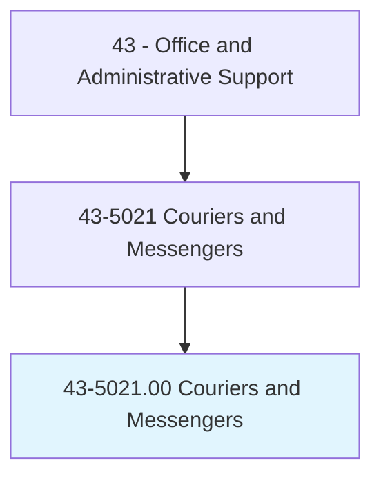
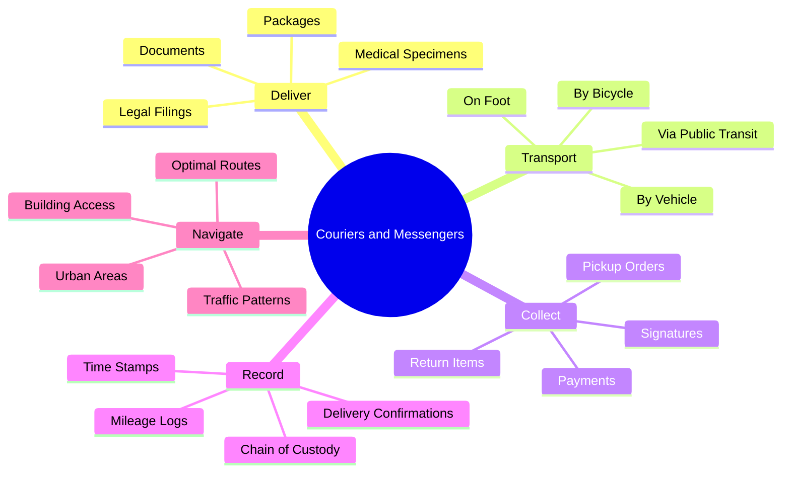
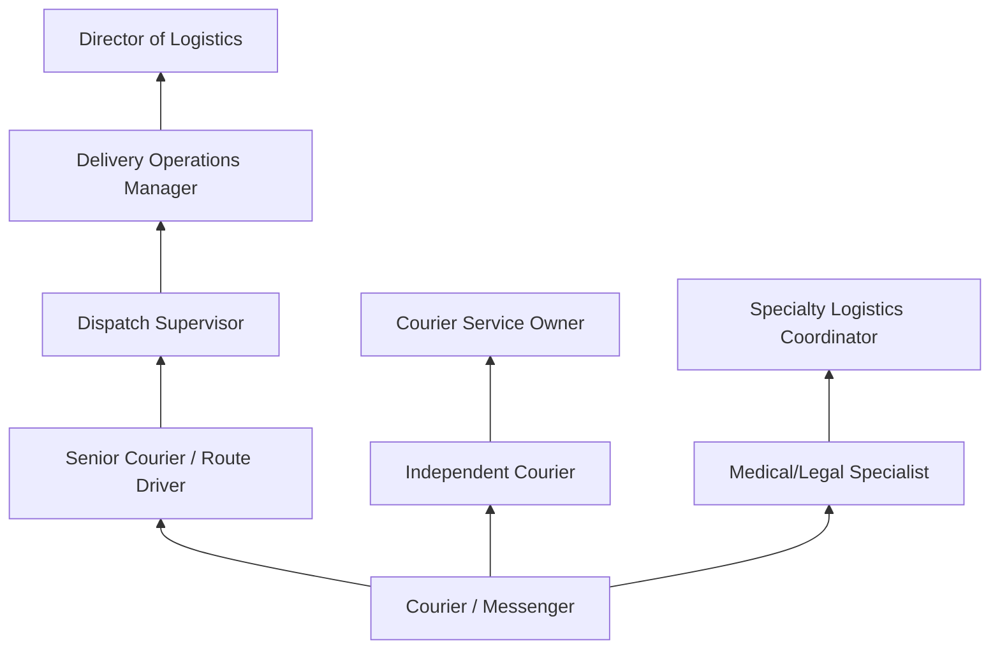
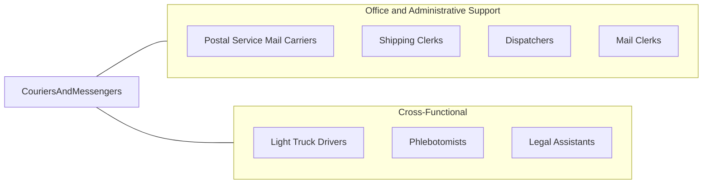

# Couriers and Messengers

> Pick up and deliver messages, documents, packages, and other items between offices or departments within an establishment or directly to other business concerns, traveling by foot, bicycle, motorcycle, automobile, or public conveyance.

## Overview

Couriers and Messengers pick up and deliver documents, packages, and other items between offices, businesses, and individuals, traveling by foot, bicycle, motorcycle, automobile, or public transportation. They serve as the physical link in communication and logistics chains where speed, security, or personal handling is required, transporting legal documents, medical specimens, financial instruments, and time-sensitive materials.

The profession encompasses a range of roles from in-house messengers who circulate within large organizations to independent couriers who serve multiple clients across urban areas. Bicycle messengers are iconic in dense urban environments where traffic congestion makes two-wheeled transport the fastest option. Same-day delivery services, legal document runners, and medical courier services represent specialized segments of this occupation requiring specific knowledge and certifications.

While digital communication has reduced demand for routine document delivery, specialized courier services for legal filings, medical specimens, pharmaceuticals, and high-value items continue to thrive. The growth of same-day and on-demand delivery services through platforms like DoorDash, Postmates, Instacart, and specialized medical courier networks has created new employment models for courier professionals, blending traditional messenger work with gig economy structures.

## Classification Hierarchy



## Key Statistics

| Metric | Value |
|--------|-------|
| SOC Code | 43-5021.00 |
| Job Zone | 1 (Little or No Preparation) |
| Category | [Office and Administrative Support](/occupations/Administrative/index) |
| Median Annual Salary | $35,100 |
| Salary Range | $24,000 - $52,000 |
| 10th Percentile | $24,500 |
| 90th Percentile | $51,200 |
| Employment | ~67,000 |
| Projected Growth | -11% (declining) |
| Annual Openings | ~8,000 |
| Core Tasks | 25 |
| Source | O*NET |

## Core Tasks



### deliver.Items

Couriers deliver items as their primary responsibility.

**Actions:**
- `deliver.Documents.to.Offices`
- `deliver.Packages.to.Businesses`
- `deliver.Specimens.to.Laboratories`
- `transport.Filings.to.Courts`

### collect.Confirmations

Couriers collect confirmations and signatures as part of delivery.

**Actions:**
- `collect.Signatures.for.Confirmation`
- `collect.Payments.from.Recipients`
- `obtain.Receipts.for.Documentation`
- `verify.Identity.of.Recipients`

## Skills & Competencies

### Technical Skills
- **Route Navigation and GPS** - Expert (Google Maps, Waze, city navigation)
- **Delivery Tracking Systems** - Advanced (mobile apps, scanning devices)
- **Chain of Custody Documentation** - Advanced (legal and medical requirements)
- **Vehicle Operation** - Advanced (safe driving, traffic laws)
- **Time Management** - Expert (meeting strict deadlines)
- **Mobile Device Proficiency** - Advanced (smartphones, delivery apps)
- **Basic Vehicle Maintenance** - Intermediate (bicycle, motorcycle, auto)
- **Building Security Protocols** - Advanced (access procedures, identification)

### Soft Skills
- **Reliability and Punctuality** - Critical (time-sensitive deliveries)
- **Physical Stamina** - Critical (walking, cycling, lifting)
- **Navigation Skills** - Critical (finding addresses efficiently)
- **Customer Service** - Essential (professional interaction)
- **Independence** - Essential (self-directed work)
- **Weather Resilience** - Essential (outdoor work in all conditions)
- **Problem Solving** - Important (alternate routes, delivery issues)
- **Stress Tolerance** - Important (traffic, deadlines, pressure)

## Education & Certifications

| Requirement | Details |
|-------------|---------|
| Typical Education | High school diploma or less |
| Driver's License | Required for vehicle-based courier roles; clean driving record |
| HIPAA Training | Required for medical courier positions handling specimens |
| Chain of Custody Certification | Required for legal and evidence courier work |
| OSHA Hazmat Awareness | Required for handling biohazard materials |
| Background Check | Required for most courier positions |
| Insurance | Commercial auto or liability for independent couriers |
| First Aid/CPR | Recommended for medical couriers |

## Career Progression



### Career Pathway Details

| Level | Title | Years Experience | Key Responsibilities |
|-------|-------|------------------|----------------------|
| Entry | Courier / Messenger | 0-1 years | Basic deliveries, route following |
| Mid | Senior Courier / Route Driver | 1-3 years | Complex routes, specialized deliveries, training |
| Specialized | Medical/Legal Courier Specialist | 2-5 years | Certified handling, compliance, client relations |
| Supervisory | Dispatch Supervisor | 3-5 years | Route coordination, driver management |
| Management | Delivery Operations Manager | 5-10 years | Fleet oversight, client contracts, process improvement |
| Executive | Director of Logistics | 10+ years | Strategic operations, business development |
| Entrepreneurial | Courier Service Owner | Varies | Business ownership, fleet management, sales |

## Industry Variations

| Setting | Focus | Unique Aspects |
|---------|-------|----------------|
| Legal Services | Court filings, document delivery | Time-sensitive deadlines; chain of custody; court schedules; filing procedures |
| Healthcare | Specimen and pharmaceutical delivery | Temperature control; HIPAA; biohazard handling; laboratory protocols |
| Financial Services | Document and check delivery | Security protocols; signature requirements; bonded couriers; regulatory compliance |
| General Business | Inter-office and B2B delivery | Scheduled routes; package variety; urban navigation; client relationships |
| E-Commerce / On-Demand | Same-day delivery | Gig platforms; customer-facing; tips; rating systems; app-based dispatch |
| Government | Official document transport | Security clearances; sensitive materials; official protocols |

### Medical Courier Specialization

Medical couriers transport specimens, blood products, pharmaceuticals, and medical equipment between healthcare facilities and laboratories. They must maintain proper temperatures using coolers and temperature monitors, follow biohazard handling procedures, and document chain of custody meticulously. HIPAA training and OSHA bloodborne pathogen awareness are required. This specialization offers higher pay but requires additional certification.

### Legal Courier Specialization

Legal couriers handle court filings, subpoenas, discovery documents, and sensitive legal materials. They must understand filing deadlines, court procedures, and chain of custody requirements for evidence. Timeliness is critical as missed filing deadlines can have significant legal consequences. Many legal couriers become experts in local court systems and filing requirements.

### Gig Economy Platforms

Modern courier work increasingly involves gig platforms like DoorDash, Instacart, Amazon Flex, and Postmates. These platforms offer flexibility but require couriers to use personal vehicles, manage their own expenses, and handle customer-facing interactions with rating systems that affect earning potential.

## Technology & Tools

- **Navigation** - Google Maps, Waze, Apple Maps, city-specific apps
- **Tracking** - GPS tracking devices, delivery confirmation apps, barcode scanners
- **Communication** - Smartphones, two-way radio, push-to-talk apps
- **Delivery Platforms** - DoorDash Driver, Uber Eats, Amazon Flex, specialized courier apps
- **Documentation** - Digital signature capture, photo confirmation, timestamp apps
- **Dispatch Systems** - OnTime Dispatch, Elite EXTRA, Route4Me
- **Fleet Management** - Vehicle tracking, mileage logging, expense tracking

### Vehicle and Equipment

- **Bicycles** - Road bikes, cargo bikes, e-bikes for urban delivery
- **Motorcycles** - Scooters, motorcycles for faster urban transit
- **Automobiles** - Personal vehicles, company vehicles, cargo vans
- **Specialized Equipment** - Coolers for specimens, insulated bags, document cases
- **Safety Gear** - Helmets, high-visibility clothing, weather protection

## Related Occupations



### Related Occupation Comparison

| Occupation | Similarity | Key Difference |
|------------|------------|----------------|
| Postal Mail Carriers | High | Federal employment vs private; route-based vs on-demand |
| Delivery Truck Drivers | High | Vehicle size; commercial license requirements |
| Dispatchers | Medium | Coordination role vs delivery role |
| Shipping Clerks | Medium | Warehouse-based vs field-based |

## Industries

- [Professional Services](/industries/ProfessionalServices) - Legal and business document delivery
- [Healthcare](/industries/Healthcare/index) - Medical specimen and pharmaceutical transport
- [Financial Services](/industries/Finance/index) - Document and check delivery
- [E-Commerce and Retail](/industries/Retail/index) - Same-day and on-demand delivery
- [Government](/industries/PublicAdministration) - Official document transport
- [Legal Services](/industries/ProfessionalServices/Legal) - Court filing and legal document delivery

## Departments

This occupation typically works in:
- Mail Services - Internal mail and package operations
- [Operations](/departments/Operations) - Delivery logistics and fleet management
- [Legal Department](/departments/Legal) - Court filing and document delivery
- Laboratory Services - Specimen and sample transport
- Facilities - Inter-office mail and package distribution
- [Supply Chain](/departments/SupplyChain) - Time-sensitive material transport

## Work Environment

### Physical Setting
- Outdoor work in all weather conditions
- Urban streets, office buildings, hospitals, courts
- Vehicle-based or foot/bicycle-based transport
- Significant time navigating traffic and finding addresses

### Work Schedule
- Variable schedules based on employer type
- Rush periods around court deadlines, business hours
- Some positions require early morning or late evening hours
- On-demand/gig work offers flexible scheduling
- Weekend work common in delivery and e-commerce

### Physical Demands
- Walking, cycling, or driving for extended periods
- Lifting packages (typically 20-50 lbs)
- Climbing stairs in buildings without elevators
- Exposure to weather extremes
- Traffic navigation and safety awareness

### Work Characteristics
- High degree of independence and autonomy
- Time pressure and deadline-driven work
- Variable daily routes and destinations
- Customer interaction at delivery points
- Performance measured by delivery completion and timeliness

## GraphDL Semantic Structure

```graphdl
Couriers and Messengers perform:
- deliver.Packages.to.Recipients
- transport.Documents.between.Offices
- collect.Signatures.for.Confirmation
- navigate.Routes.through.Cities
- maintain.Records.of.Deliveries
- verify.Identity.of.Recipients
- handle.Specimens.following.Protocols
- meet.Deadlines.for.TimelyDelivery
```

---

*Source: O*NET 43-5021.00 - ONETOccupation*
