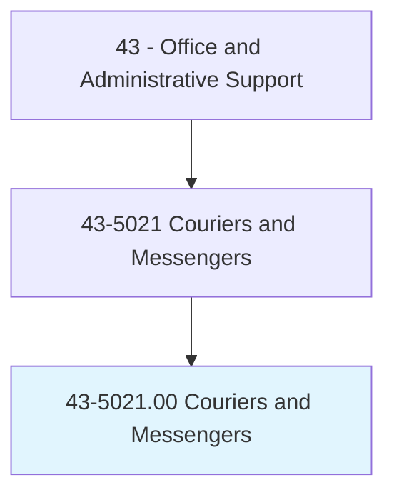
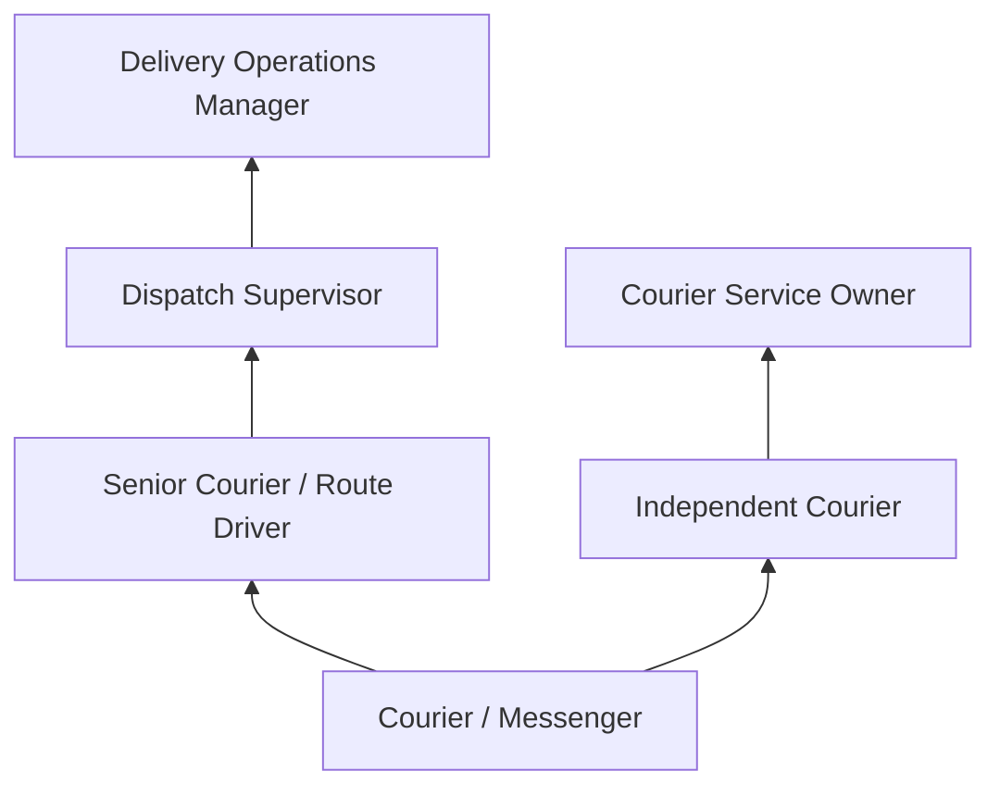
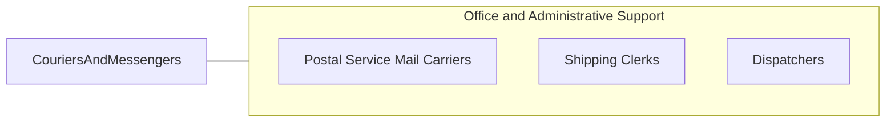

# Couriers and Messengers

> Pick up and deliver messages, documents, packages, and other items between offices or departments within an establishment or directly to other business concerns, traveling by foot, bicycle, motorcycle, automobile, or public conveyance.

## Overview

Couriers and Messengers pick up and deliver documents, packages, and other items between offices, businesses, and individuals, traveling by foot, bicycle, motorcycle, automobile, or public transportation. They serve as the physical link in communication and logistics chains where speed, security, or personal handling is required, transporting legal documents, medical specimens, financial instruments, and time-sensitive materials.

The profession encompasses a range of roles from in-house messengers who circulate within large organizations to independent couriers who serve multiple clients across urban areas. Bicycle messengers are iconic in dense urban environments where traffic congestion makes two-wheeled transport the fastest option. Same-day delivery services, legal document runners, and medical courier services represent specialized segments of this occupation.

While digital communication has reduced demand for routine document delivery, specialized courier services for legal filings, medical specimens, pharmaceuticals, and high-value items continue to thrive. The growth of same-day and on-demand delivery services through platforms like DoorDash, Postmates, and specialized medical courier networks has created new employment models for courier professionals.

## Classification Hierarchy

## Key Statistics

| Metric | Value |
|--------|-------|
| SOC Code | 43-5021.00 |
| Job Zone | 1 (Little or No Preparation) |
| Category | [Office and Administrative Support](/occupations/Administrative/index) |
| Median Annual Salary | $35,100 |
| Employment | ~67,000 |
| Projected Growth | -11% (declining) |
| Core Tasks | 25 |
| Source | O*NET |

## Core Tasks

Task data and GraphDL actions for this occupation are documented in the [O*NET database](https://www.onetonline.org/link/summary/43-5021.00).

## Skills & Competencies

### Technical Skills
- **Route Navigation and GPS** - Advanced
- **Delivery Tracking Systems** - Intermediate
- **Chain of Custody Documentation** - Intermediate
- **Vehicle Operation** - Advanced
- **Time Management** - Advanced

### Soft Skills
- **Reliability and Punctuality** - Critical
- **Physical Stamina** - Essential
- **Navigation Skills** - Critical
- **Customer Service** - Important
- **Independence** - Essential

## Education & Certifications

| Requirement | Details |
|-------------|---------|
| Typical Education | High school diploma or less |
| Driver's License | Required for vehicle-based courier roles |
| HIPAA Training | Required for medical courier positions |
| Chain of Custody Training | Required for legal and evidence courier work |

## Career Progression

## Industry Variations

| Setting | Focus | Unique Aspects |
|---------|-------|----------------|
| Legal Services | Court filings, document delivery | Time-sensitive deadlines; chain of custody; court schedules |
| Healthcare | Specimen and pharmaceutical delivery | Temperature control; HIPAA; biohazard handling |
| Financial Services | Document and check delivery | Security protocols; signature requirements; bonded couriers |
| General Business | Inter-office and B2B delivery | Scheduled routes; package variety; urban navigation |

## Technology & Tools

- **Navigation** - Google Maps, Waze, city maps
- **Tracking** - GPS tracking, delivery confirmation apps
- **Communication** - Mobile phone, two-way radio
- **Delivery Platforms** - On-demand delivery apps

## Related Occupations

## Departments

This occupation typically works in:
- Mail Services - Internal mail operations
- [Operations](/departments/Operations) - Delivery logistics
- [Legal Department](/departments/Legal) - Court filing delivery
- Laboratory - Specimen transport

---

*Source: O*NET 43-5021.00 - ONETOccupation*
