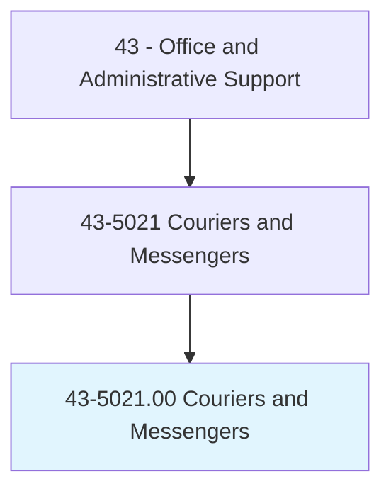
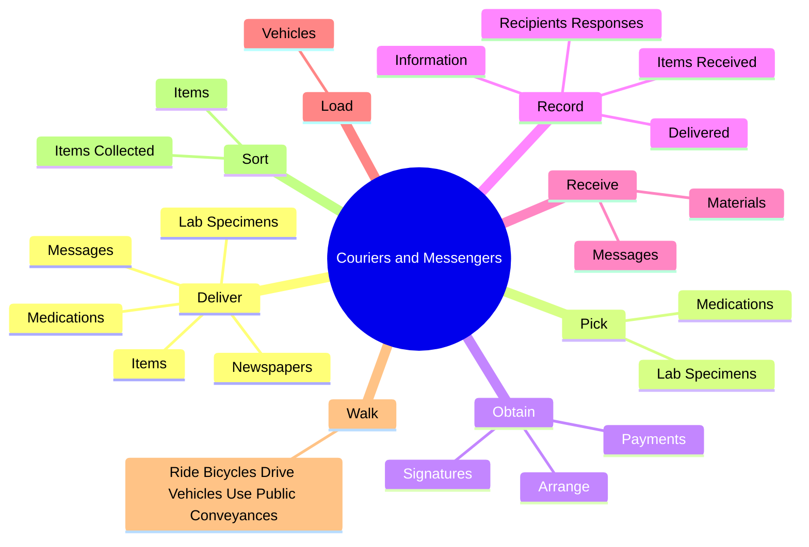
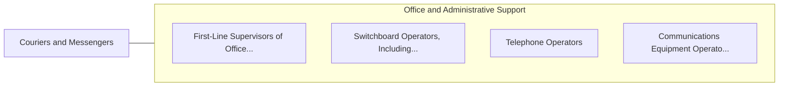

# Couriers and Messengers

> Pick up and deliver messages, documents, packages, and other items between offices or departments within an establishment or directly to other business concerns, traveling by foot, bicycle, motorcycle, automobile, or public conveyance.

## Overview

Couriers and Messengers is classified under Office and Administrative Support (SOC 43). Pick up and deliver messages, documents, packages, and other items between offices or departments within an establishment or directly to other business concerns, traveling by foot, bicycle, motorcycle, automobile, or public conveyance.

## Classification Hierarchy

## Key Statistics

| Metric | Value |
|--------|-------|
| SOC Code | 43-5021.00 |
| Category | [Office and Administrative Support](/occupations/Administrative/index) |
| Task Count | 69 |
| Source | O*NET |

## Core Tasks

### deliver.LabSpecimens

Couriers and Messengers deliver lab specimens as part of their core responsibilities.

**Actions:**
- `deliver.LabSpecimens.to.FromHospitalsMedicalFacilities`
- `deliver.LabSpecimens.to.OtherMedicalFacilities`
- `deliver.Medications.to.FromHospitalsMedicalFacilities`
- `deliver.Medications.to.OtherMedicalFacilities`

### pick.LabSpecimens

Couriers and Messengers pick lab specimens as part of their core responsibilities.

**Actions:**
- `pick.LabSpecimens.to.FromHospitalsMedicalFacilities`
- `pick.LabSpecimens.to.OtherMedicalFacilities`
- `pick.Medications.to.FromHospitalsMedicalFacilities`
- `pick.Medications.to.OtherMedicalFacilities`

### obtain.Signatures

Couriers and Messengers obtain signatures as part of their core responsibilities.

**Actions:**
- `obtain.Signatures.for.Recipients.to.make.Payments`
- `obtain.Payments.for.Recipients.to.make.Payments`
- `obtain.Arrange.for.Recipients.to.make.Payments`

## Skills & Competencies

### Technical Skills
- **Office Management** - Advanced
- **Data Entry** - Advanced
- **Records Management** - Advanced

### Soft Skills
- **Communication** - Essential
- **Problem Solving** - Essential
- **Critical Thinking** - Important
- **Teamwork** - Important
- **Adaptability** - Important

## Related Occupations

## Industries

This occupation is found across multiple industries. See [Industries](/industries) for sector-specific employment data.

## Career Progression

---

*Source: O*NET 43-5021.00 - ONETOccupation*
