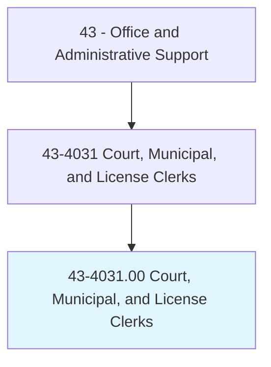
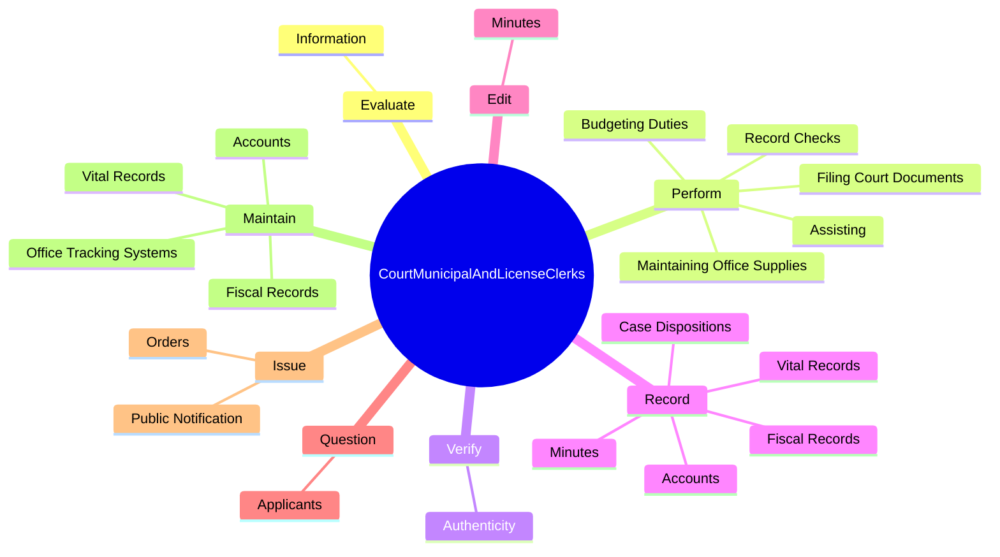

# Court, Municipal, and License Clerks

> Perform clerical duties for courts of law, municipalities, or governmental licensing agencies and bureaus. May prepare docket of cases to be called; secure information for judges and court; prepare draft agendas or bylaws for town or city council; answer official correspondence; keep fiscal records and accounts; issue licenses or permits; and record data, administer tests, or collect fees.

## Overview

Court, Municipal, and License Clerks is an occupation within the Office and Administrative Support category. Perform clerical duties for courts of law, municipalities, or governmental licensing agencies and bureaus. 

## Classification Hierarchy

## Key Statistics

| Metric | Value |
|--------|-------|
| SOC Code | 43-4031.00 |
| Category | [Office and Administrative Support](/occupations/Administrative/index) |
| Task Count | 111 |
| Source | O*NET |

## Core Tasks

### evaluate.Information

Court, Municipal, and License Clerks evaluate information as part of their core responsibilities.

**Actions:**
- `evaluate.Information.on.Applications.to.verify.CompletenessToDetermineWhetherApplicantsAreQualifiedToObtainDesiredLicenses`
- `evaluate.Information.on.Accuracy.to.determine.WhetherApplicantsAreQualifiedToObtainDesiredLicenses`

### perform.FilingCourtDocuments

Court, Municipal, and License Clerks perform filing court documents as part of their core responsibilities.

**Actions:**
- `perform.FilingCourtDocuments`
- `perform.MaintainingOfficeSupplies`
- `perform.BudgetingDuties.in.BudgetPreparation`
- `perform.BudgetingDuties.in.ExpenditureReview`

### verify.Authenticity

Court, Municipal, and License Clerks verify authenticity as part of their core responsibilities.

**Actions:**
- `verify.Authenticity.of.Documents`
- `verify.Authenticity.of.ForeignIdentification`
- `verify.Authenticity.of.ImmigrationDocuments`

## Skills & Competencies

### Technical Skills
- **Office Management** - Advanced
- **Data Entry** - Advanced
- **Records Management** - Advanced

### Soft Skills
- **Communication** - Essential
- **Problem Solving** - Essential
- **Critical Thinking** - Important
- **Teamwork** - Important
- **Adaptability** - Important

## Related Occupations

## Industries

This occupation is found across multiple industries. See [Industries](/industries) for sector-specific employment data.

## Career Progression

---

*Source: O*NET 43-4031.00 - ONETOccupation*
