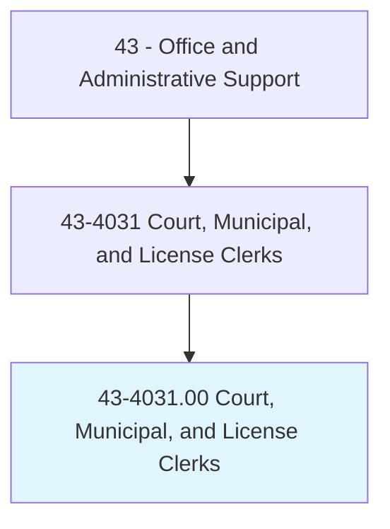
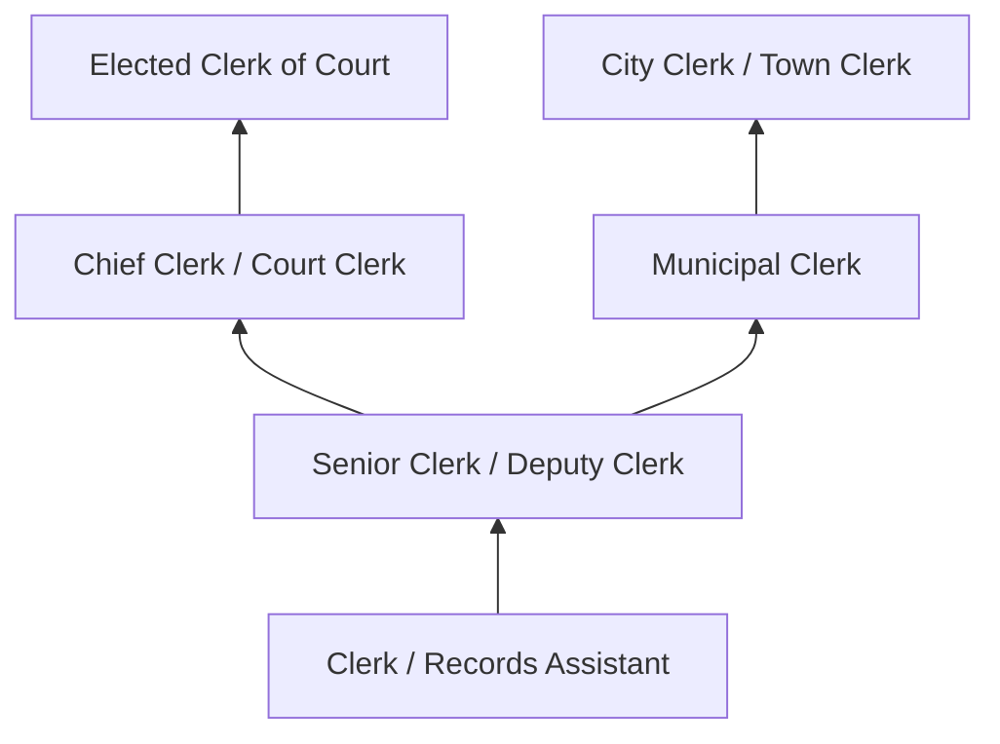
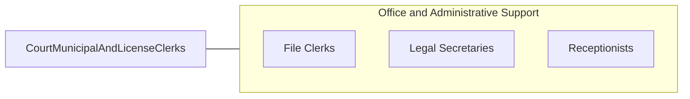

# Court, Municipal, and License Clerks

> Perform clerical duties for courts of law, municipalities, or governmental licensing agencies and bureaus. May prepare docket of cases to be called; secure information for judges and court; prepare draft agendas or bylaws for town or city council; answer official correspondence; keep fiscal records and accounts; issue licenses or permits; and record data, administer tests, or collect fees.

## Overview

Court, Municipal, and License Clerks perform essential administrative functions for courts, local governments, and licensing agencies. In courts, they manage case dockets, process filings, maintain records, and support judicial proceedings. In municipal government, they prepare agendas, record minutes, process official correspondence, and maintain public records. In licensing bureaus, they issue permits and licenses, collect fees, administer tests, and ensure compliance with regulatory requirements.

These clerks serve as the administrative backbone of government operations, providing the organizational structure that enables courts to process cases, municipalities to govern, and agencies to regulate. They interact directly with the public, attorneys, government officials, and law enforcement, requiring knowledge of legal procedures, government operations, and regulatory requirements specific to their jurisdiction.

The role demands integrity, as clerks often handle sensitive legal documents, financial transactions, and confidential records. Many positions require background checks and bonding. Court clerks in particular must understand legal terminology, filing procedures, and courtroom protocols, while municipal clerks often serve as the official record-keeper for their jurisdiction.

## Classification Hierarchy

## Key Statistics

| Metric | Value |
|--------|-------|
| SOC Code | 43-4031.00 |
| Job Zone | 3 (Medium Preparation) |
| Category | [Office and Administrative Support](/occupations/Administrative/index) |
| Median Annual Salary | $43,600 |
| Employment | ~95,000 |
| Projected Growth | -2% (declining slightly) |
| Core Tasks | 65 |
| Source | O*NET |

## Core Tasks

Task data and GraphDL actions for this occupation are documented in the [O*NET database](https://www.onetonline.org/link/summary/43-4031.00).

## Skills & Competencies

### Technical Skills
- **Case Management Systems** - Advanced
- **Legal Documentation** - Advanced
- **Records Management** - Advanced
- **Government Accounting** - Intermediate
- **Licensing Systems** - Advanced
- **Meeting Minutes and Agendas** - Advanced

### Soft Skills
- **Attention to Detail** - Critical
- **Integrity** - Critical
- **Customer Service** - Essential
- **Organizational Skills** - Essential
- **Written Communication** - Essential
- **Confidentiality** - Critical

## Education & Certifications

| Requirement | Details |
|-------------|---------|
| Typical Education | High school diploma; associate's degree preferred |
| Certified Municipal Clerk (CMC) | IIMC professional certification |
| Master Municipal Clerk (MMC) | Advanced IIMC designation |
| Certified Court Manager | NACM certification |
| Notary Public | Often required for document certification |

## Career Progression

## Industry Variations

| Setting | Focus | Unique Aspects |
|---------|-------|----------------|
| Courts | Case management, filings | Legal terminology; courtroom protocols; evidence custody |
| Municipal Government | Council support, public records | Open meeting laws; FOIA; election administration |
| Licensing Agencies | Permit issuance, fee collection | Regulatory compliance; testing administration; renewal processing |
| Vital Records | Birth, death, marriage certificates | Document authentication; genealogy research; fraud prevention |

## Technology & Tools

- **Case Management** - Tyler Technologies, Thomson Reuters C-Track
- **Records Management** - Laserfiche, electronic filing systems
- **Meeting Management** - Agenda software, minutes recording
- **Licensing** - Online permit portals, fee processing
- **Document Management** - Scanning, digital archiving

## Related Occupations

## Departments

This occupation typically works in:
- Court Administration - Judicial support
- City Clerk's Office - Municipal records
- Licensing - Permit and license issuance
- Records Management - Public records

---

*Source: O*NET 43-4031.00 - ONETOccupation*
