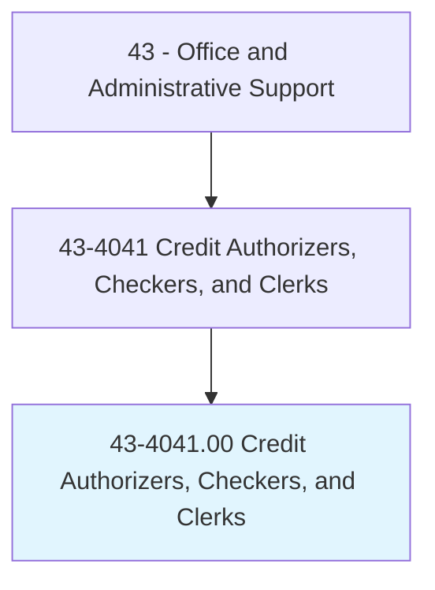
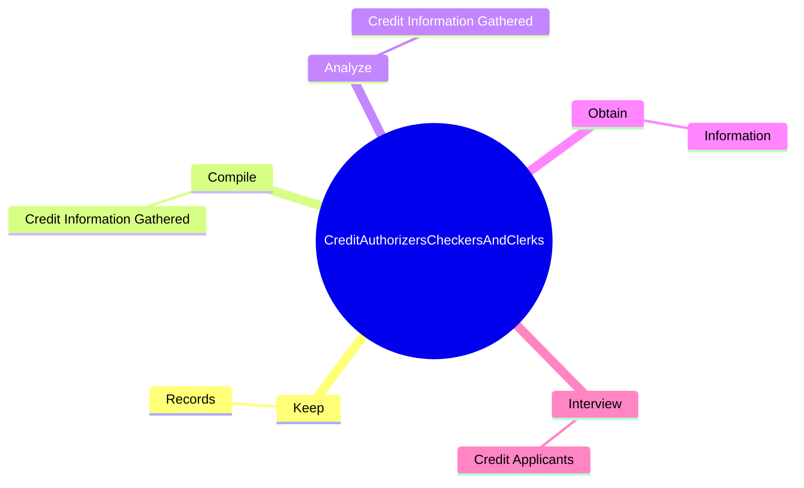
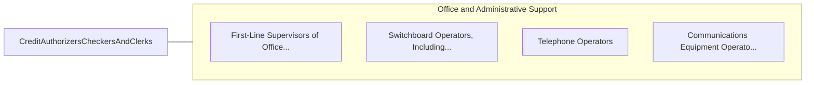

# Credit Authorizers, Checkers, and Clerks

> Authorize credit charges against customers' accounts. Investigate history and credit standing of individuals or business establishments applying for credit. May interview applicants to obtain personal and financial data, determine credit worthiness, process applications, and notify customers of acceptance or rejection of credit.

## Overview

Credit Authorizers, Checkers, and Clerks is an occupation within the Office and Administrative Support category. Authorize credit charges against customers' accounts. Investigate history and credit standing of individuals or business establishments applying for credit.

## Classification Hierarchy

## Key Statistics

| Metric | Value |
|--------|-------|
| SOC Code | 43-4041.00 |
| Category | [Office and Administrative Support](/occupations/Administrative) |
| Task Count | 45 |
| Source | O*NET |

## Core Tasks

### keep.Records

Credit Authorizers, Checkers, and Clerks keep records as part of their core responsibilities.

**Actions:**
- `keep.Records.of.CustomersCharges`
- `keep.Records.of.Payments`

### compile.CreditInformationGathered

Credit Authorizers, Checkers, and Clerks compile credit information gathered as part of their core responsibilities.

**Actions:**
- `compile.CreditInformationGathered.by.Investigation`

### analyze.CreditInformationGathered

Credit Authorizers, Checkers, and Clerks analyze credit information gathered as part of their core responsibilities.

**Actions:**
- `analyze.CreditInformationGathered.by.Investigation`

## Skills & Competencies

### Technical Skills
- **Office Management** - Advanced
- **Data Entry** - Advanced
- **Records Management** - Advanced

### Soft Skills
- **Communication** - Essential
- **Problem Solving** - Essential
- **Critical Thinking** - Important
- **Teamwork** - Important
- **Adaptability** - Important

## Related Occupations

## Industries

This occupation is found across multiple industries. See [Industries](/industries) for sector-specific employment data.

## Career Progression

---

*Source: O*NET 43-4041.00 - ONETOccupation*
