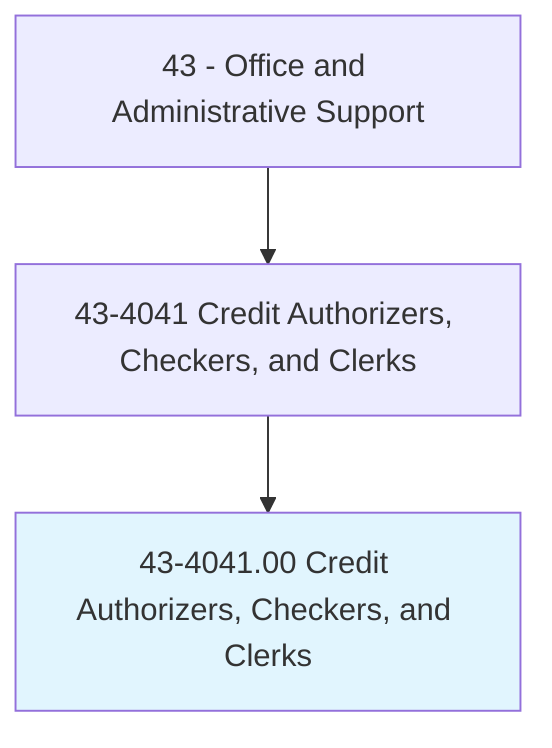
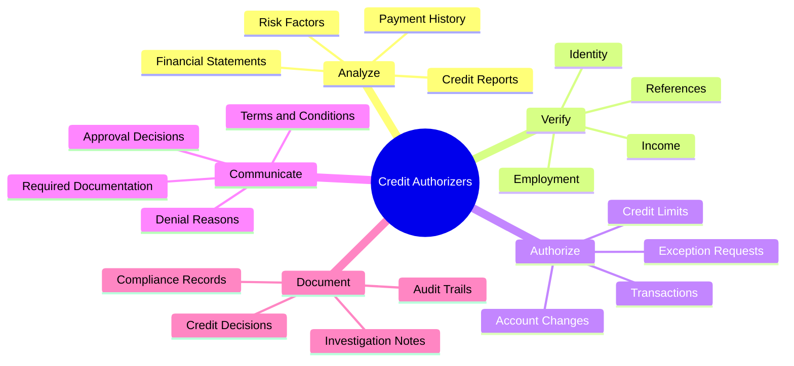
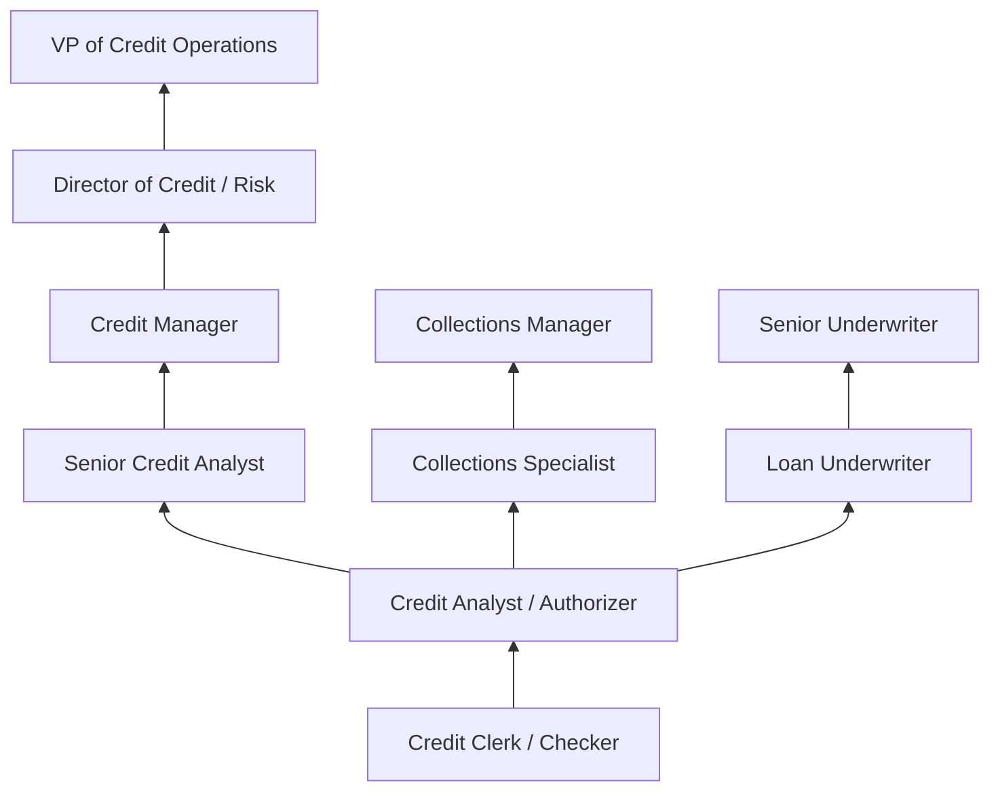
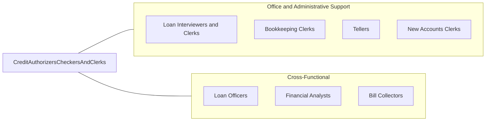

# Credit Authorizers, Checkers, and Clerks

> Authorize credit charges against customers' accounts. Investigate history and credit standing of individuals or business establishments applying for credit.

## Overview

Credit Authorizers, Checkers, and Clerks evaluate the creditworthiness of individuals and businesses applying for credit, authorize credit transactions, and manage the credit approval process. They review credit applications, investigate financial histories, verify references, and determine whether to approve or deny credit requests based on established criteria and organizational policies.

Working in banks, retail companies, credit bureaus, and financial services firms, these professionals analyze credit reports, verify employment and income, assess risk factors, and make credit decisions within established guidelines. They communicate approval or denial decisions to applicants, explain terms and conditions, and maintain detailed records of all credit transactions and investigations. The role requires balancing customer service with risk management, making sound judgments that protect organizational interests while serving customer needs.

The role has evolved significantly with automated credit scoring systems (FICO, VantageScore) and digital verification tools, but human judgment remains essential for borderline cases, exception processing, and complex commercial credit evaluations. Credit professionals must understand consumer protection regulations including the Fair Credit Reporting Act (FCRA), Equal Credit Opportunity Act (ECOA), and Truth in Lending Act (TILA), ensuring that all credit decisions comply with federal and state requirements.

## Classification Hierarchy



## Key Statistics

| Metric | Value |
|--------|-------|
| SOC Code | 43-4041.00 |
| Job Zone | 3 (Medium Preparation) |
| Category | [Office and Administrative Support](/occupations/Administrative/index) |
| Median Annual Salary | $42,600 |
| Salary Range | $30,000 - $62,000 |
| 10th Percentile | $30,200 |
| 90th Percentile | $61,800 |
| Employment | ~52,000 |
| Projected Growth | -10% (declining) |
| Annual Openings | ~4,500 |
| Core Tasks | 40 |
| Source | O*NET |

## Core Tasks



### analyze.CreditApplications

Credit Authorizers analyze applications as their primary responsibility.

**Actions:**
- `analyze.CreditReports.from.Bureaus`
- `analyze.FinancialStatements.for.RiskAssessment`
- `evaluate.PaymentHistory.of.Applicants`
- `assess.RiskFactors.to.DetermineCredit`

### verify.ApplicantInformation

Credit Authorizers verify information to ensure accuracy.

**Actions:**
- `verify.Employment.with.Employers`
- `verify.Income.through.Documentation`
- `verify.Identity.using.Credentials`
- `contact.References.for.Verification`

## Skills & Competencies

### Technical Skills
- **Credit Analysis and Scoring** - Expert (FICO interpretation, risk assessment)
- **Financial Statement Review** - Advanced (income verification, debt ratios)
- **Credit Bureau Systems** - Expert (Experian, Equifax, TransUnion portals)
- **Risk Assessment Methodology** - Advanced (scoring models, exception criteria)
- **Regulatory Compliance (FCRA, ECOA)** - Expert (fair lending, adverse action)
- **Data Entry and Verification** - Advanced (accurate record-keeping)
- **CRM and Account Systems** - Advanced (Salesforce, core banking systems)
- **Spreadsheet Analysis** - Intermediate (debt calculations, ratio analysis)

### Soft Skills
- **Analytical Thinking** - Critical (evaluating complex financial situations)
- **Attention to Detail** - Critical (accurate data verification)
- **Judgment and Decision Making** - Critical (credit approval decisions)
- **Communication** - Essential (explaining decisions to applicants)
- **Integrity** - Critical (ethical handling of financial information)
- **Confidentiality** - Critical (protecting sensitive data)
- **Customer Service** - Essential (professional applicant interaction)
- **Time Management** - Important (processing volume efficiently)

## Education & Certifications

| Requirement | Details |
|-------------|---------|
| Typical Education | High school diploma; associate's degree preferred |
| Preferred Degree | Associate's or Bachelor's in Finance, Business, or Accounting |
| Credit Business Associate (CBA) | NACM entry-level credential |
| Credit Business Fellow (CBF) | NACM intermediate credential |
| Certified Credit Executive (CCE) | NACM advanced certification |
| FCRA Compliance Training | Required for credit reporting roles |
| Fair Lending Training | Required for consumer credit positions |
| On-the-Job Training | Moderate; company-specific systems and criteria |
| Continuing Education | Annual compliance updates, industry changes |

## Career Progression



### Career Pathway Details

| Level | Title | Years Experience | Key Responsibilities |
|-------|-------|------------------|----------------------|
| Entry | Credit Clerk / Checker | 0-2 years | Data entry, verification, routine approvals |
| Mid | Credit Analyst / Authorizer | 2-5 years | Full credit analysis, approval authority |
| Senior | Senior Credit Analyst | 5-8 years | Complex cases, exception decisions, training |
| Management | Credit Manager | 8-12 years | Team leadership, policy development, risk oversight |
| Director | Director of Credit | 12-15 years | Department strategy, executive reporting |
| Executive | VP of Credit Operations | 15+ years | Enterprise credit strategy, board reporting |

## Industry Variations

| Setting | Focus | Unique Aspects |
|---------|-------|----------------|
| Banking | Consumer and commercial credit | Loan underwriting; deposit accounts; regulatory compliance; federal oversight |
| Retail | Store credit and charge accounts | Point-of-sale approvals; promotional financing; returns credit; instant decisions |
| Credit Bureaus | Credit reporting and scoring | Data accuracy; dispute resolution; consumer relations; FCRA compliance |
| Collections | Delinquent account management | Recovery strategies; negotiation; legal compliance; skip tracing |
| Auto Finance | Vehicle lending | Dealer relations; collateral valuation; repo procedures; LTV calculations |
| Mortgage | Home loans | Extensive documentation; appraisals; title review; TRID compliance |

### Banking Industry Focus

Bank credit professionals handle consumer loans, credit cards, lines of credit, and commercial lending. They work within strict regulatory frameworks including OCC, FDIC, and state banking regulations. Credit decisions must balance risk with community reinvestment obligations, and fair lending practices are closely monitored.

### Retail Credit Focus

Retail credit clerks process store credit card applications at point of sale, often making instant decisions based on automated scoring. They handle promotional financing offers (0% APR, deferred interest), manage credit limit increases, and process returns to credit accounts. Volume and speed are emphasized.

### Commercial Credit Focus

Commercial credit analysts evaluate business creditworthiness for B2B transactions, trade credit, and commercial loans. They analyze business financial statements, industry trends, and ownership structures. Commercial credit requires more complex analysis than consumer credit and often involves larger exposure amounts.

## Technology & Tools

- **Credit Systems** - Experian PowerCurve, Equifax Decision 360, TransUnion CreditVision
- **Scoring Tools** - FICO Score, VantageScore, custom scorecards
- **CRM** - Salesforce, Microsoft Dynamics, core banking systems
- **Verification Services** - The Work Number, income verification APIs, identity verification
- **Compliance Tools** - Fair lending monitoring, adverse action letter generators
- **Document Management** - Digital application processing, e-signatures
- **Analytics** - Credit risk dashboards, portfolio monitoring, trend analysis

### Emerging Technology

- **AI/Machine Learning** - Alternative data scoring, fraud detection, automated underwriting
- **Open Banking** - Real-time account verification, income analysis from bank data
- **Blockchain** - Identity verification, credit history portability
- **RPA** - Automated document processing, verification workflows

## Related Occupations



### Related Occupation Comparison

| Occupation | Similarity | Key Difference |
|------------|------------|----------------|
| Loan Officers | High | Sales focus vs analysis focus; higher authority |
| Loan Interviewers | High | Data collection vs decision-making emphasis |
| Bill Collectors | Medium | Post-default vs pre-approval focus |
| Financial Analysts | Medium | Investment focus vs credit focus |

## Industries

- [Banking and Depository Institutions](/industries/Finance/Banking) - High Employment
- [Retail Trade](/industries/Retail/index) - High Employment
- [Credit Bureaus and Reporting](/industries/Finance/CreditServices) - Moderate Employment
- [Auto Dealers and Financing](/industries/Retail/MotorVehicle) - Moderate Employment
- [Insurance Carriers](/industries/Insurance) - Moderate Employment
- [Healthcare Revenue Cycle](/industries/Healthcare/index) - Moderate Employment

## Departments

This occupation typically works in:
- Credit Department - Credit evaluation and authorization
- Risk Management - Credit risk assessment and policy
- Customer Service - Application processing and inquiries
- Collections - Delinquent account management
- Underwriting - Loan and credit underwriting
- Compliance - Regulatory compliance and fair lending

## Work Environment

### Physical Setting
- Climate-controlled office environment
- Desk-based work with multiple computer monitors
- Call center or open office layouts common
- Some positions offer remote work opportunities

### Work Schedule
- Typically Monday-Friday, standard business hours
- Retail positions may include evenings and weekends
- Call center positions may involve shift work
- Peak periods around promotional events and holidays

### Work Characteristics
- High volume decision-making
- Deadline pressure for application processing
- Detailed documentation requirements
- Customer interaction via phone and correspondence
- Regulatory scrutiny and audit requirements

## Regulatory Environment

### Key Regulations

| Regulation | Purpose | Credit Professional Responsibility |
|------------|---------|-----------------------------------|
| Fair Credit Reporting Act (FCRA) | Governs credit report use | Permissible purpose, adverse action notices |
| Equal Credit Opportunity Act (ECOA) | Prohibits discrimination | Fair lending, prohibited basis awareness |
| Truth in Lending Act (TILA) | Disclosure requirements | APR, terms, cost disclosure |
| Gramm-Leach-Bliley Act | Privacy protection | Customer data security |
| UDAP/UDAAP | Unfair practices | Consumer protection in credit decisions |

## GraphDL Semantic Structure

```graphdl
Credit Authorizers, Checkers, and Clerks perform:
- analyze.CreditReports.for.RiskAssessment
- verify.Information.from.Applicants
- authorize.CreditLimits.based.on.Criteria
- communicate.Decisions.to.Applicants
- document.Transactions.for.Compliance
- evaluate.FinancialStatements.of.Businesses
- process.Applications.within.Guidelines
- maintain.Records.for.AuditTrails
```

---

*Source: O*NET 43-4041.00 - ONETOccupation*
