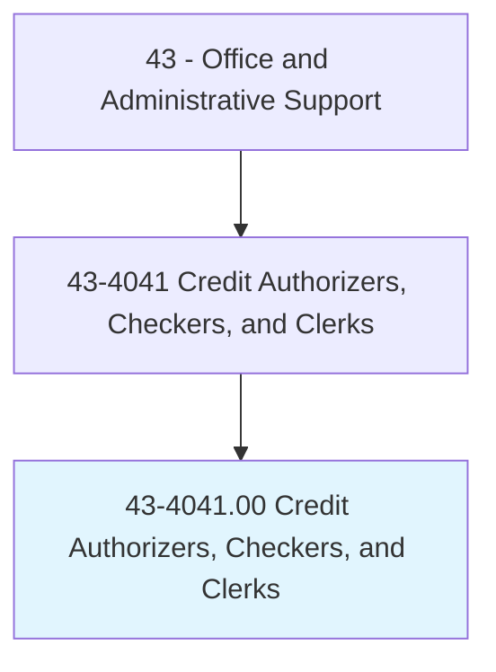
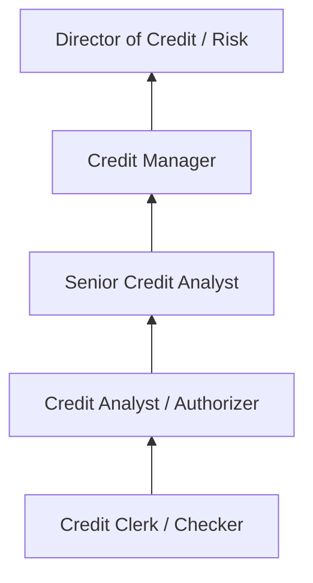
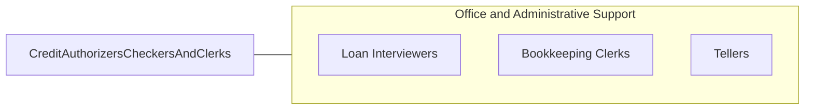

# Credit Authorizers, Checkers, and Clerks

> Authorize credit charges against customers' accounts. Investigate history and credit standing of individuals or business establishments applying for credit.

## Overview

Credit Authorizers, Checkers, and Clerks evaluate the creditworthiness of individuals and businesses applying for credit, authorize credit transactions, and manage the credit approval process. They review credit applications, investigate financial histories, verify references, and determine whether to approve or deny credit requests based on established criteria and organizational policies.

Working in banks, retail companies, credit bureaus, and financial services firms, these professionals analyze credit reports, verify employment and income, assess risk factors, and make credit decisions within established guidelines. They communicate approval or denial decisions to applicants, explain terms and conditions, and maintain detailed records of all credit transactions and investigations.

The role has evolved with automated credit scoring systems (FICO) and digital verification tools, but human judgment remains essential for borderline cases, exception processing, and complex commercial credit evaluations. Credit professionals must understand consumer protection regulations including the Fair Credit Reporting Act (FCRA), Equal Credit Opportunity Act (ECOA), and Truth in Lending Act (TILA).

## Classification Hierarchy

## Key Statistics

| Metric | Value |
|--------|-------|
| SOC Code | 43-4041.00 |
| Job Zone | 3 (Medium Preparation) |
| Category | [Office and Administrative Support](/occupations/Administrative/index) |
| Median Annual Salary | $42,600 |
| Employment | ~52,000 |
| Projected Growth | -10% (declining) |
| Core Tasks | 40 |
| Source | O*NET |

## Core Tasks

Core task data with GraphDL semantic actions for this occupation is maintained in the data pipeline. See [O*NET 43-4041.00](https://www.onetonline.org/link/summary/43-4041.00) for detailed task information.

## Skills & Competencies

### Technical Skills
- **Credit Analysis and Scoring** - Advanced
- **Financial Statement Review** - Intermediate
- **Credit Bureau Systems** - Advanced
- **Risk Assessment** - Intermediate
- **Regulatory Compliance (FCRA, ECOA)** - Advanced
- **Data Entry and Verification** - Advanced

### Soft Skills
- **Analytical Thinking** - Critical
- **Attention to Detail** - Critical
- **Judgment and Decision Making** - Essential
- **Communication** - Essential
- **Integrity** - Critical
- **Confidentiality** - Critical

## Education & Certifications

| Requirement | Details |
|-------------|---------|
| Typical Education | High school diploma; associate's degree preferred |
| Credit Business Associate (CBA) | NACM entry-level credential |
| Certified Credit Executive (CCE) | NACM advanced certification |
| FCRA Compliance Training | Required for credit reporting roles |
| On-the-Job Training | Moderate; company-specific systems |

## Career Progression

## Industry Variations

| Setting | Focus | Unique Aspects |
|---------|-------|----------------|
| Banking | Consumer and commercial credit | Loan underwriting; deposit accounts; regulatory compliance |
| Retail | Store credit and charge accounts | Point-of-sale approvals; promotional financing; returns credit |
| Credit Bureaus | Credit reporting and scoring | Data accuracy; dispute resolution; consumer relations |
| Collections | Delinquent account management | Recovery strategies; negotiation; legal compliance |

## Technology & Tools

- **Credit Systems** - Experian, Equifax, TransUnion portals
- **Scoring Tools** - FICO, VantageScore platforms
- **CRM** - Salesforce, company-specific systems
- **Verification** - Income and employment verification services
- **Compliance** - Fair lending monitoring tools

## Related Occupations

## Departments

This occupation typically works in:
- Credit Department - Credit evaluation and authorization
- Risk Management - Credit risk assessment
- Customer Service - Application processing
- Collections - Delinquent account management

---

*Source: O*NET 43-4041.00 - ONETOccupation*
