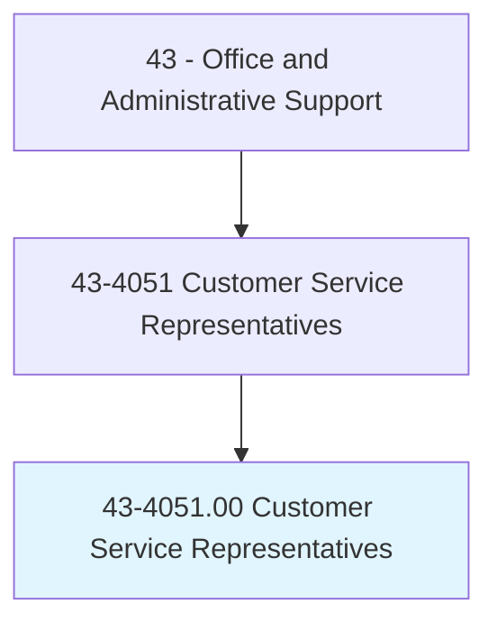
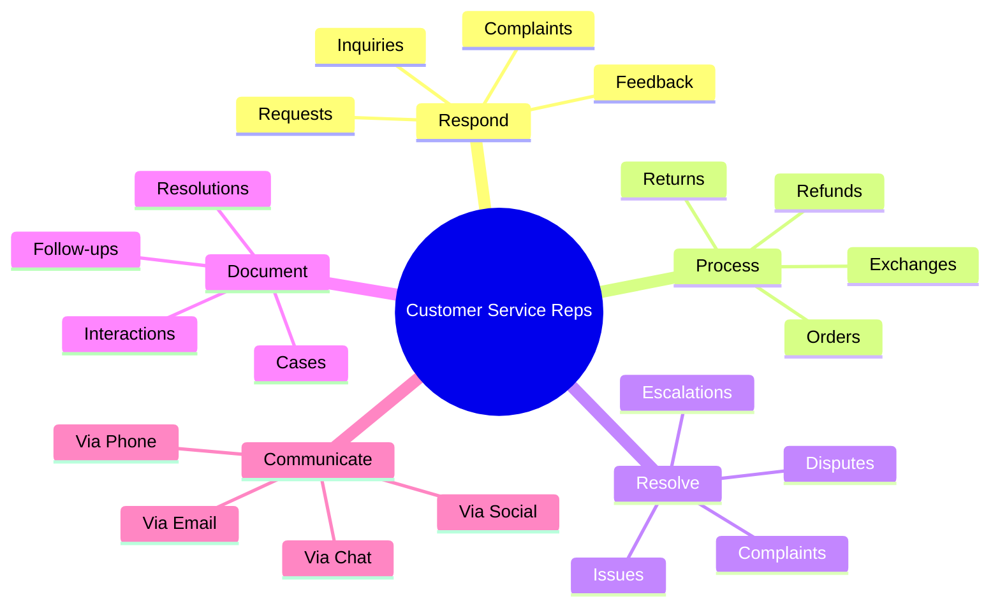
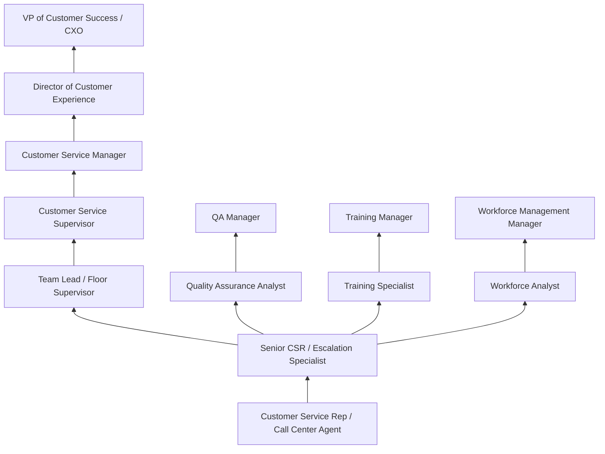
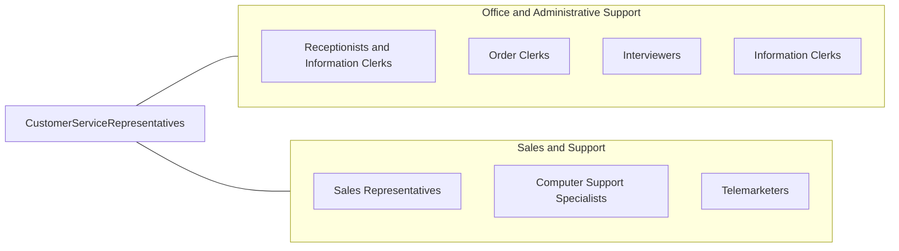

# Customer Service Representatives

> Interact with customers to provide basic or scripted information in response to routine inquiries about products and services. May handle and resolve general complaints. Excludes individuals whose duties are primarily installation, sales, or repair.

## Overview

Customer Service Representatives serve as the primary point of contact between organizations and their customers, handling inquiries, resolving complaints, processing orders, and providing information about products and services. They communicate through multiple channels including phone, email, live chat, social media, and in-person interactions, ensuring that customer needs are addressed promptly and professionally. CSRs are the human face of organizations, building relationships that drive customer loyalty and satisfaction.

This is one of the largest occupations in the American economy, with nearly three million workers spanning virtually every industry sector. CSRs work in dedicated call centers, retail environments, corporate headquarters, financial institutions, healthcare facilities, government agencies, and increasingly from remote home offices. Their responsibilities range from answering basic product questions to troubleshooting technical issues, processing returns and exchanges, updating account information, handling billing disputes, and escalating complex problems to specialized teams. Many CSRs also have sales responsibilities, identifying opportunities to upsell or cross-sell products during service interactions.

The role has evolved significantly with technology, incorporating sophisticated CRM systems, AI-powered knowledge bases, chatbots for routine queries, and omnichannel communication platforms that enable seamless customer engagement across multiple touchpoints. Despite automation handling many routine inquiries, skilled representatives remain essential for complex problem resolution, relationship building, de-escalation of frustrated customers, and situations requiring empathy, judgment, and creative solutions. The COVID-19 pandemic accelerated the shift to remote customer service, and many organizations now operate hybrid or fully remote customer service operations.

## Classification Hierarchy



## Key Statistics

| Metric | Value |
|--------|-------|
| SOC Code | 43-4051.00 |
| Job Zone | 2 (Some Preparation) |
| Category | [Office and Administrative Support](/occupations/Administrative/index) |
| Median Annual Salary | $37,300 |
| Salary Range | $26,000 - $56,000 |
| 10th Percentile | $26,500 |
| 90th Percentile | $55,800 |
| Employment | ~2,900,000 |
| Projected Growth | -4% (declining) |
| Annual Openings | ~389,000 |
| Core Tasks | 40 |
| Source | O*NET |

## Core Tasks



### respond.ToInquiries

Customer Service Representatives handle incoming customer inquiries.

**Actions:**
- `answer.Questions.about.Products`
- `provide.Information.regarding.Services`
- `explain.Policies.to.Customers`
- `clarify.Procedures.for.Transactions`

### resolve.CustomerIssues

Customer Service Representatives resolve customer problems and complaints.

**Actions:**
- `investigate.Issues.for.Resolution`
- `escalate.Problems.to.Supervisors`
- `negotiate.Solutions.with.Customers`
- `follow.Up.on.OpenCases`

## Skills & Competencies

### Technical Skills
- **CRM Systems (Salesforce, Zendesk, HubSpot)** - Advanced (case management, customer history, workflow automation)
- **Multi-Channel Communication Platforms** - Advanced (phone, chat, email, social integration)
- **Product and Service Knowledge** - Advanced (deep expertise in company offerings)
- **Ticketing and Case Management** - Advanced (ServiceNow, Freshdesk, Jira Service)
- **Order Processing Systems** - Intermediate (ERP, e-commerce platforms)
- **Knowledge Base Navigation** - Advanced (Guru, Confluence, internal wikis)
- **Typing and Data Entry** - Advanced (40+ WPM while conversing)
- **Quality Assurance Tools** - Intermediate (call monitoring, CSAT surveys)

### Soft Skills
- **Active Listening** - Critical (understanding customer needs completely)
- **Empathy** - Critical (connecting with customer emotions)
- **Patience** - Critical (maintaining composure with difficult customers)
- **Communication** - Critical (clear, professional verbal and written skills)
- **Problem Solving** - Essential (creative solutions within policy)
- **Conflict Resolution** - Essential (de-escalation techniques)
- **Adaptability** - Essential (handling diverse situations)
- **Stress Management** - Important (high-volume, high-pressure environment)

## Education & Certifications

| Requirement | Details |
|-------------|---------|
| Typical Education | High school diploma |
| Preferred Education | Associate's degree in business or communications |
| HDI Customer Service Rep (HDI-CSR) | Industry-standard service certification |
| COPC Customer Experience | Contact center performance standards |
| Six Sigma Yellow Belt | Process improvement fundamentals |
| Product-Specific Training | Company-provided certification programs |
| Language Certifications | Bilingual/multilingual credentials |
| Continuing Education | Customer experience workshops, soft skills training |

## Career Progression



### Career Pathway Details

| Level | Title | Years Experience | Key Responsibilities |
|-------|-------|------------------|----------------------|
| Entry | Customer Service Rep | 0-1 years | Basic inquiries, standard procedures, queue handling |
| Mid | Senior CSR / Escalation Specialist | 1-3 years | Complex issues, VIP customers, mentoring |
| Lead | Team Lead / Floor Supervisor | 3-5 years | Real-time coaching, queue management, reporting |
| Supervisory | Customer Service Supervisor | 5-8 years | Team performance, scheduling, quality monitoring |
| Management | Customer Service Manager | 8-12 years | Department operations, KPIs, budget management |
| Director | Director of Customer Experience | 12-15 years | Strategy, technology, cross-functional leadership |
| Executive | VP of Customer Success | 15+ years | Enterprise CX strategy, P&L responsibility |

### Specialization Paths

| Specialization | Focus Area | Additional Skills Needed |
|----------------|------------|-----------------------------|
| Technical Support | Product troubleshooting | Technical knowledge, diagnostic skills |
| Quality Assurance | Service standards | Evaluation criteria, coaching |
| Training & Development | Agent education | Instructional design, facilitation |
| Workforce Management | Staffing optimization | Forecasting, scheduling software |
| Customer Success | Relationship management | Account management, retention strategies |

## Industry Variations

| Setting | Focus | Unique Aspects |
|---------|-------|----------------|
| Financial Services | Account inquiries, transactions | Regulatory compliance; fraud detection; identity verification; investment questions |
| Technology/Software | Technical troubleshooting | Tiered support; remote diagnostics; SLA adherence; bug reporting |
| Healthcare | Patient support, insurance | HIPAA compliance; appointment scheduling; benefits explanation; empathy-critical |
| Retail/E-Commerce | Orders, returns, product info | Peak season surges; loyalty programs; omnichannel support; inventory queries |
| Telecommunications | Service issues, billing | Technical troubleshooting; retention offers; plan changes; outage communication |
| Travel/Hospitality | Reservations, changes | Rebooking; travel disruptions; loyalty programs; 24/7 global support |

### Financial Services Customer Service

Financial services CSRs handle sensitive account information, balance inquiries, transaction disputes, and fraud alerts. They must verify customer identity before discussing accounts, explain complex financial products, and comply with regulations including Reg E, FCRA, and state banking laws. Many calls involve helping customers navigate online banking, mobile apps, and payment systems.

### Technology Support

Technology company CSRs often serve as tier-one support, handling basic troubleshooting, password resets, software questions, and service disruptions. They work within escalation frameworks, documenting issues thoroughly for engineering teams. Product knowledge requirements are high, and many tech CSRs specialize in specific product lines or customer segments.

### Healthcare Customer Service

Healthcare CSRs navigate complex insurance systems, appointment scheduling, billing questions, and patient communication. HIPAA training is mandatory, and representatives must balance efficiency with sensitivity when dealing with patients who may be stressed or unwell. Many healthcare CSRs specialize in areas like insurance verification, prior authorization, or patient financial services.

### Retail and E-Commerce

Retail CSRs handle high volumes during peak shopping seasons, processing orders, managing returns, tracking shipments, and handling product inquiries. They often have sales goals alongside service metrics, creating opportunities to recommend products. E-commerce growth has increased chat and email support while maintaining phone service for complex issues.

## Technology & Tools

### CRM and Case Management
- **Salesforce Service Cloud** - Enterprise CRM and case management
- **Zendesk** - Omnichannel support platform
- **Freshdesk** - Cloud-based helpdesk
- **HubSpot Service Hub** - Integrated service platform
- **ServiceNow** - IT and customer service management

### Communication Platforms
- **Five9** - Cloud contact center
- **Genesys Cloud** - Customer experience platform
- **Twilio Flex** - Programmable contact center
- **RingCentral** - Unified communications
- **Talkdesk** - AI-powered contact center

### Quality and Analytics
- **Nice CXone** - Quality management and analytics
- **Calabrio** - Workforce optimization
- **CSAT/NPS Tools** - Medallia, Qualtrics, SurveyMonkey
- **Speech Analytics** - CallMiner, Verint
- **Real-time Dashboards** - Wallboards, performance trackers

### Knowledge Management
- **Guru** - AI-powered knowledge platform
- **Confluence** - Team wikis and documentation
- **Zendesk Guide** - Help center creation
- **Notion** - Internal knowledge bases
- **Bloomfire** - Knowledge sharing platform

## Related Occupations



### Related Occupation Comparison

| Occupation | Similarity | Key Difference |
|------------|------------|----------------|
| Technical Support Specialists | High | Technical troubleshooting vs general service |
| Sales Representatives | Medium | Revenue focus vs service focus |
| Receptionists | Medium | In-person vs multi-channel service |
| Call Center Agents | High | Sometimes synonymous, sometimes specialized |

## Industries

- [Retail Trade](/industries/Retail) - High Employment
- [Financial Services](/industries/Finance) - High Employment
- [Healthcare](/industries/Healthcare/index) - High Employment
- [Information Technology](/industries/Information) - High Employment
- [Telecommunications](/industries/Information/Telecom) - High Employment
- [Insurance](/industries/Insurance) - Moderate Employment
- [Government](/industries/PublicAdministration) - Moderate Employment

## Departments

This occupation typically works in:
- Customer Service - Primary department for inbound/outbound support
- Technical Support - Product and service troubleshooting
- [Sales](/departments/Sales) - Order processing, upselling, cross-selling
- [Operations](/departments/Operations) - Account management, fulfillment support
- Billing - Payment processing, dispute resolution
- Retention - Customer loyalty and churn prevention

## Work Environment

### Physical Setting
- Call center floor with cubicles or open workstations
- Headset and computer equipment standard
- Noise-dampening features for call quality
- Remote/work-from-home arrangements increasingly common
- Break rooms and quiet spaces for stress relief

### Work Schedule
- 24/7 operations in many organizations
- Shift work including evenings, weekends, holidays
- Part-time positions widely available
- Peak periods vary by industry (retail holidays, tax season)
- Scheduled breaks required in call center environments

### Work Characteristics
- High call/interaction volume throughout shift
- Performance metrics constantly monitored
- Repetitive nature of common inquiries
- Emotional labor dealing with frustrated customers
- Team environment with real-time support

### Performance Metrics

| Metric | Description | Typical Target |
|--------|-------------|----------------|
| Average Handle Time (AHT) | Total interaction duration | 5-8 minutes (varies by industry) |
| First Contact Resolution (FCR) | Issues resolved on first contact | >70% |
| Customer Satisfaction (CSAT) | Post-interaction survey scores | >85% |
| Net Promoter Score (NPS) | Customer likelihood to recommend | Varies by company |
| Service Level | Calls answered within threshold | 80% in 20 seconds |

## GraphDL Semantic Structure

```graphdl
Customer Service Representatives perform:
- respond.To.CustomerInquiries
- resolve.Issues.for.CustomerSatisfaction
- process.Orders.through.Systems
- document.Interactions.in.CRM
- escalate.ComplexProblems.to.Specialists
- communicate.Information.across.Channels
- maintain.Records.for.Customers
- provide.Solutions.within.Policy
```

---

*Source: O*NET 43-4051.00 - ONETOccupation*
