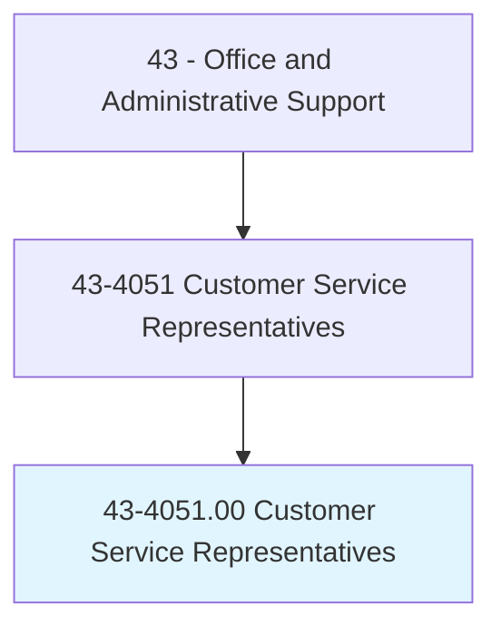
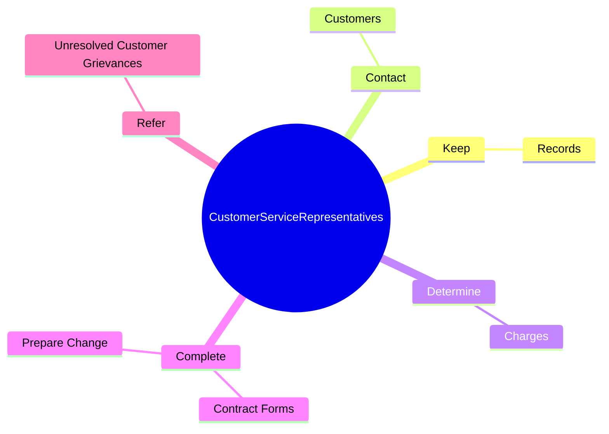
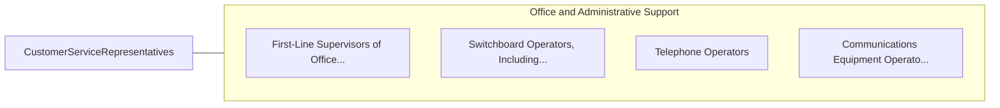

# Customer Service Representatives

> Interact with customers to provide basic or scripted information in response to routine inquiries about products and services. May handle and resolve general complaints. Excludes individuals whose duties are primarily installation, sales, repair, and technical support.

## Overview

Customer Service Representatives is an occupation within the Office and Administrative Support category. Interact with customers to provide basic or scripted information in response to routine inquiries about products and services. May handle and resolve general complaints.

## Classification Hierarchy

## Key Statistics

| Metric | Value |
|--------|-------|
| SOC Code | 43-4051.00 |
| Category | [Office and Administrative Support](/occupations/Administrative) |
| Task Count | 45 |
| Source | O*NET |

## Core Tasks

### keep.Records

Customer Service Representatives keep records as part of their core responsibilities.

**Actions:**
- `keep.Records.of.Customerinteractions`
- `keep.Records.of.Transactions`
- `keep.Records.of.RecordingDetails.of.Inquiries`
- `keep.Records.of.Complaints`

### contact.Customers

Customer Service Representatives contact customers as part of their core responsibilities.

**Actions:**
- `contact.Customers.to.respond.ToInquiriesNotifyThemOfClaimInvestigationResultsPlannedAdjustments`
- `contact.Customers.to.ToNotifyThemOfClaimInvestigationResultsPlannedAdjustments`

### determine.Charges

Customer Service Representatives determine charges as part of their core responsibilities.

**Actions:**
- `determine.Charges.for.ServicesRequested`
- `determine.Charges.for.CollectDeposits`
- `determine.Charges.for.Payments`
- `determine.Charges.for.ArrangeF`

## Skills & Competencies

### Technical Skills
- **Office Management** - Advanced
- **Data Entry** - Advanced
- **Records Management** - Advanced

### Soft Skills
- **Communication** - Essential
- **Problem Solving** - Essential
- **Critical Thinking** - Important
- **Teamwork** - Important
- **Adaptability** - Important

## Related Occupations

## Industries

This occupation is found across multiple industries. See [Industries](/industries) for sector-specific employment data.

## Career Progression

---

*Source: O*NET 43-4051.00 - ONETOccupation*
