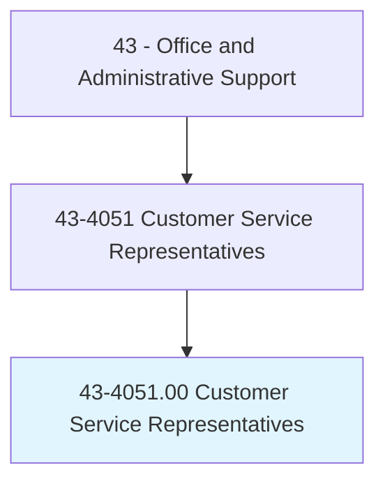
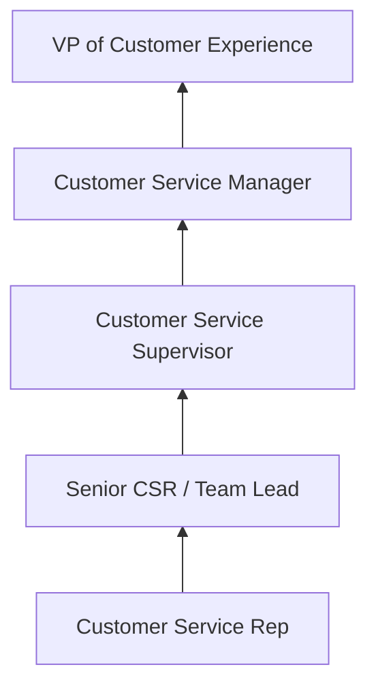
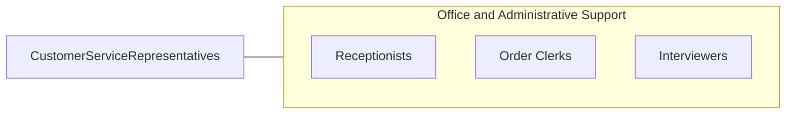

# Customer Service Representatives

> Interact with customers to provide basic or scripted information in response to routine inquiries about products and services. May handle and resolve general complaints. Excludes individuals whose duties are primarily installation, sales, or repair.

## Overview

Customer Service Representatives serve as the primary point of contact between organizations and their customers, handling inquiries, resolving complaints, processing orders, and providing information about products and services. They communicate through multiple channels including phone, email, live chat, social media, and in-person interactions, ensuring that customer needs are addressed promptly and professionally.

This is one of the largest occupations in the American economy, spanning virtually every industry. CSRs work in call centers, retail environments, corporate offices, and increasingly from remote locations. Their responsibilities range from answering basic product questions to troubleshooting technical issues, processing returns, updating account information, and escalating complex problems to specialized teams.

The role has evolved significantly with technology, incorporating CRM systems, knowledge bases, AI-assisted tools, and omnichannel communication platforms. Despite automation handling routine inquiries, skilled representatives remain essential for complex problem resolution, relationship building, and situations requiring empathy and judgment.

## Classification Hierarchy

## Key Statistics

| Metric | Value |
|--------|-------|
| SOC Code | 43-4051.00 |
| Job Zone | 2 (Some Preparation) |
| Category | [Office and Administrative Support](/occupations/Administrative/index) |
| Median Annual Salary | $37,300 |
| Employment | ~2,900,000 |
| Projected Growth | -4% (declining) |
| Core Tasks | 40 |
| Source | O*NET |

## Core Tasks

Core task data with GraphDL semantic actions for this occupation is maintained in the data pipeline. See [O*NET 43-4051.00](https://www.onetonline.org/link/summary/43-4051.00) for detailed task information.

## Skills & Competencies

### Technical Skills
- **CRM Systems (Salesforce, Zendesk)** - Advanced
- **Multi-Channel Communication** - Advanced
- **Product and Service Knowledge** - Advanced
- **Order Processing Systems** - Intermediate
- **Ticketing and Case Management** - Advanced

### Soft Skills
- **Active Listening** - Critical
- **Patience** - Critical
- **Empathy** - Critical
- **Problem Solving** - Essential
- **Communication** - Critical
- **Conflict Resolution** - Essential

## Education & Certifications

| Requirement | Details |
|-------------|---------|
| Typical Education | High school diploma |
| HDI Customer Service Rep | Industry certification |
| COPC Certification | Contact center standards |
| Product-Specific Training | Company-provided |

## Career Progression

## Industry Variations

| Setting | Focus | Unique Aspects |
|---------|-------|----------------|
| Financial Services | Account inquiries, transactions | Regulatory compliance; fraud detection; identity verification |
| Technology | Technical troubleshooting | Tiered support; remote diagnostics; SLA adherence |
| Healthcare | Patient support, insurance | HIPAA compliance; appointment scheduling; benefits explanation |
| Retail/E-Commerce | Orders, returns, product info | Peak season surges; loyalty programs; omnichannel support |

## Technology & Tools

- **CRM** - Salesforce, Zendesk, HubSpot, Freshdesk
- **Communication** - Five9, Genesys, Twilio, live chat
- **Knowledge Base** - Guru, Confluence, internal wikis
- **Analytics** - QA monitoring, CSAT/NPS tools

## Related Occupations

## Departments

This occupation typically works in:
- [Customer Service](/departments/CustomerService) - Inbound/outbound support
- [Technical Support](/departments/TechSupport) - Product troubleshooting
- [Sales](/departments/Sales) - Order processing and upselling
- [Operations](/departments/Operations) - Account management

---

*Source: O*NET 43-4051.00 - ONETOccupation*
