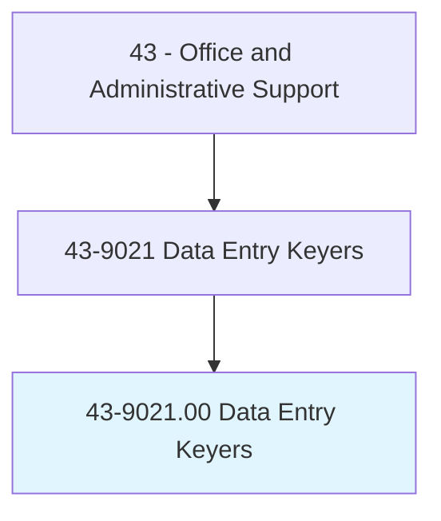
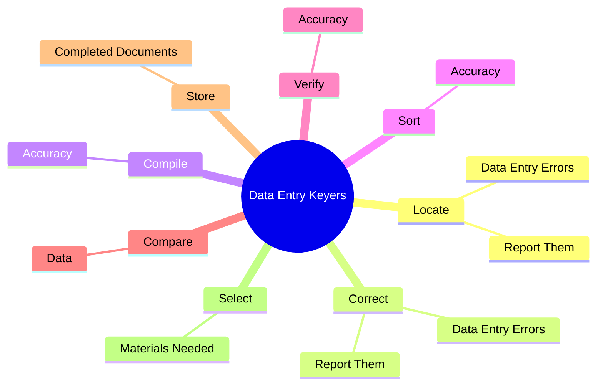
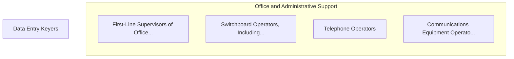

# Data Entry Keyers

> Operate data entry device, such as keyboard or photo composing perforator. Duties may include verifying data and preparing materials for printing.

## Overview

Data Entry Keyers is an occupation within the Office and Administrative Support category. Operate data entry device, such as keyboard or photo composing perforator. 

## Classification Hierarchy

## Key Statistics

| Metric | Value |
|--------|-------|
| SOC Code | 43-9021.00 |
| Category | [Office and Administrative Support](/occupations/Administrative) |
| Task Count | 44 |
| Source | O*NET |

## Core Tasks

### locate.DataEntryErrors

Data Entry Keyers locate data entry errors as part of their core responsibilities.

**Actions:**
- `locate.DataEntryErrors.to.Supervisors`
- `locate.ReportThem.to.Supervisors`

### correct.DataEntryErrors

Data Entry Keyers correct data entry errors as part of their core responsibilities.

**Actions:**
- `correct.DataEntryErrors.to.Supervisors`
- `correct.ReportThem.to.Supervisors`

### compile.Accuracy

Data Entry Keyers compile accuracy as part of their core responsibilities.

**Actions:**
- `compile.Accuracy.of.DataBeforeItIsEntered`

## Skills & Competencies

### Technical Skills
- **Office Management** - Advanced
- **Data Entry** - Advanced
- **Records Management** - Advanced

### Soft Skills
- **Communication** - Essential
- **Problem Solving** - Essential
- **Critical Thinking** - Important
- **Teamwork** - Important
- **Adaptability** - Important

## Related Occupations

## Industries

This occupation is found across multiple industries. See [Industries](/industries) for sector-specific employment data.

## Career Progression

---

*Source: O*NET 43-9021.00 - ONETOccupation*
