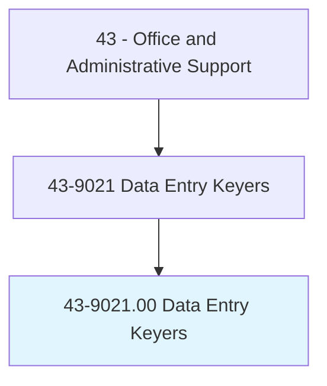
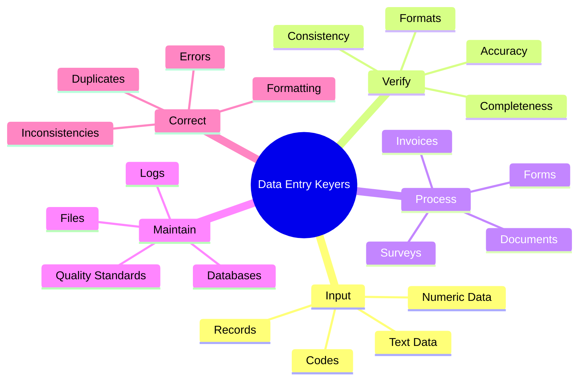
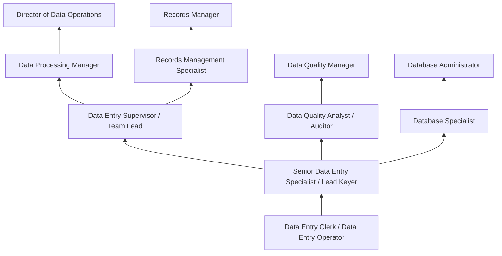
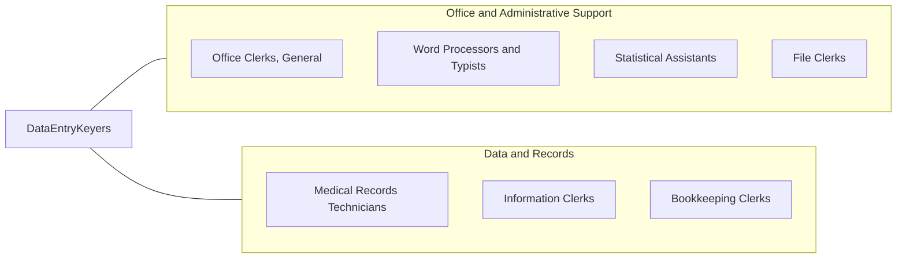

# Data Entry Keyers

> Operate data entry device, such as keyboard or photo composing perforator. Duties may include verifying data and preparing materials for printing.

## Overview

Data Entry Keyers are specialized clerical professionals who input, verify, and maintain data in computer systems using keyboards, scanners, and other input devices. They transcribe information from source documents -- forms, surveys, invoices, reports, medical records, and other documents -- into digital databases and information systems, ensuring accuracy and completeness of organizational data. Their work transforms paper-based and handwritten information into structured digital records that organizations depend on for operations, analysis, and compliance.

Working across industries including healthcare, finance, government, insurance, logistics, and legal services, data entry keyers process high volumes of records with demanding speed and accuracy requirements. Experienced keyers can input 10,000-15,000 keystrokes per hour while maintaining error rates below one percent. They verify entered data against source documents, identify and correct errors, flag inconsistencies for review, and maintain quality standards throughout production cycles. Many specialize in numeric data entry using 10-key keypads, achieving speeds of 8,000+ keystrokes per hour for financial and statistical data.

While optical character recognition (OCR), intelligent document processing, and AI-powered data extraction tools have automated some routine data entry functions, the profession continues to serve essential roles in digitizing handwritten records, processing forms that resist automation, handling exceptions flagged by automated systems, and performing quality verification of machine-generated data. The growth of remote work has expanded opportunities for home-based data entry positions, with many organizations using distributed teams for large digitization projects and ongoing data processing operations.

## Classification Hierarchy



## Key Statistics

| Metric | Value |
|--------|-------|
| SOC Code | 43-9021.00 |
| Job Zone | 2 (Some Preparation) |
| Category | [Office and Administrative Support](/occupations/Administrative/index) |
| Median Annual Salary | $35,930 |
| Salary Range | $26,000 - $50,000 |
| 10th Percentile | $26,500 |
| 90th Percentile | $49,800 |
| Employment | ~155,000 |
| Projected Growth | -25% (rapidly declining) |
| Annual Openings | ~17,000 |
| Core Tasks | 25 |
| Source | O*NET |

## Core Tasks



### input.DataRecords

Data Entry Keyers input information from source documents into computer systems.

**Actions:**
- `input.Data.from.SourceDocuments`
- `transcribe.Information.into.Databases`
- `enter.Records.using.Keyboards`
- `key.NumericData.via.10Key`

### verify.DataAccuracy

Data Entry Keyers verify the accuracy of entered data.

**Actions:**
- `verify.Entries.against.SourceDocuments`
- `identify.Errors.for.Correction`
- `validate.Data.using.SystemChecks`
- `review.Records.for.Completeness`

## Skills & Competencies

### Technical Skills
- **Keyboard Speed and Accuracy** - Expert (8,000-15,000+ keystrokes/hour)
- **10-Key Numeric Entry** - Expert (8,000+ keystrokes/hour)
- **Data Entry Software** - Advanced (proprietary systems, CRM, ERP)
- **Database Navigation** - Advanced (SQL basics, record management)
- **Document Scanning and OCR** - Advanced (scanner operation, image quality)
- **Spreadsheet Applications** - Advanced (Excel data manipulation, formulas)
- **Quality Verification Methods** - Advanced (proofreading, validation)
- **Document Management Systems** - Intermediate (imaging, retrieval, archiving)

### Soft Skills
- **Attention to Detail** - Critical (catching errors, maintaining accuracy)
- **Accuracy** - Critical (error rates below 1%)
- **Concentration and Focus** - Critical (sustained performance over hours)
- **Speed** - Essential (meeting production targets)
- **Organizational Skills** - Important (managing document flow)
- **Reliability** - Essential (consistent output quality)
- **Self-Discipline** - Important (especially for remote work)
- **Adaptability** - Important (learning new systems and formats)

## Education & Certifications

| Requirement | Details |
|-------------|---------|
| Typical Education | High school diploma |
| Preferred Education | Vocational training or associate's degree |
| Typing Certification | 40-60+ WPM with high accuracy |
| 10-Key Certification | Numeric keypad proficiency (8,000+ kph) |
| Data Entry Certification | Employer-specific or NCDA certification |
| Microsoft Office Specialist | Excel and database proficiency |
| Medical Terminology | Required for healthcare data entry |
| Legal Terminology | Required for legal document processing |

## Career Progression



### Career Pathway Details

| Level | Title | Years Experience | Key Responsibilities |
|-------|-------|------------------|----------------------|
| Entry | Data Entry Clerk / Operator | 0-1 years | Basic data input, standard formats, volume targets |
| Mid | Senior Data Entry Specialist | 1-3 years | Complex documents, quality verification, training support |
| Lead | Lead Keyer / Team Lead | 3-5 years | Production coordination, quality review, workflow management |
| Supervisory | Data Entry Supervisor | 5-8 years | Team oversight, scheduling, performance management, reporting |
| Management | Data Processing Manager | 8-12 years | Department operations, vendor management, technology decisions |
| Director | Director of Data Operations | 12+ years | Enterprise data strategy, budget, technology transformation |

### Transition Paths

| Path | Skills Applied | Additional Requirements |
|------|---------------|-------------------------|
| Data Quality Analyst | Accuracy, verification | Analytical skills, quality frameworks |
| Database Administrator | System knowledge | Technical training, SQL proficiency |
| Records Management | Organization, compliance | Records management certification |
| Business Analyst | Data understanding | Analytical skills, business knowledge |

## Industry Variations

| Setting | Focus | Unique Aspects |
|---------|-------|----------------|
| Healthcare | Medical records digitization | HIPAA compliance; medical terminology; EHR systems; ICD-10 coding |
| Insurance | Claims and policy processing | Policy forms; claims documentation; regulatory records; underwriting data |
| Government | Census and survey data | Large-scale processing; standardized forms; security clearance; public records |
| Finance | Transaction records | Accuracy-critical; audit trails; regulatory requirements; banking data |
| Legal | Case documentation | Legal terminology; court filings; discovery documents; confidentiality |
| Logistics | Shipping and inventory | Bill of lading; tracking numbers; warehouse systems; real-time updates |

### Healthcare Data Entry

Healthcare data entry keyers process patient records, insurance claims, lab results, and medical documentation. They must understand medical terminology, ICD-10 and CPT coding systems, and HIPAA privacy requirements. Electronic Health Record (EHR) systems like Epic, Cerner, and Meditech are standard tools. Accuracy is critical as errors can affect patient care and billing.

### Insurance Data Entry

Insurance keyers process policy applications, claims forms, endorsements, and correspondence. They work with specialized insurance software and must understand policy terms, coverage types, and claims procedures. Regulatory compliance varies by state and insurance type (health, property, life, auto).

### Government Data Entry

Government data entry involves processing tax forms, census surveys, license applications, vital records, and regulatory filings. Security requirements may include background checks and facility clearances. Large-scale projects like decennial census processing employ thousands of temporary keyers.

### Financial Services Data Entry

Financial data entry requires extreme accuracy for transaction processing, account maintenance, and regulatory reporting. Audit trails must be maintained, and many positions require understanding of banking regulations and financial instruments. Real-time data entry for trading operations has specific accuracy and speed requirements.

## Technology & Tools

### Data Entry Software
- **Proprietary Capture Systems** - Industry-specific data entry applications
- **CRM Systems** - Salesforce, Microsoft Dynamics, HubSpot
- **ERP Systems** - SAP, Oracle, NetSuite data entry modules
- **Forms Processing** - Adobe Experience Manager, Formstack

### Database and Spreadsheet Tools
- **Microsoft Excel** - Data manipulation, validation, formatting
- **Microsoft Access** - Database forms and queries
- **SQL Interfaces** - Basic query tools for data verification
- **Google Sheets** - Cloud-based collaborative data entry

### Document Processing
- **OCR Software** - ABBYY, Kofax, Adobe Acrobat
- **Document Scanners** - Fujitsu, Canon, Kodak production scanners
- **Image Enhancement** - Quality improvement for difficult documents
- **Workflow Systems** - Document routing and tracking

### Quality and Production Tools
- **Keystroke Counting** - Production monitoring software
- **Error Tracking** - Quality management systems
- **Batch Processing** - Document batch management
- **Time Tracking** - Productivity measurement

## Related Occupations



### Related Occupation Comparison

| Occupation | Similarity | Key Difference |
|------------|------------|----------------|
| Word Processors | High | Document creation vs data transcription |
| Medical Records Technicians | Medium | Healthcare specialty with coding responsibilities |
| Statistical Assistants | Medium | Statistical analysis vs data input |
| Office Clerks, General | Medium | Broader duties vs specialized data entry |

## Industries

- [Healthcare](/industries/Healthcare/index) - High Employment
- [Finance and Insurance](/industries/Finance) - High Employment
- [Government](/industries/PublicAdministration) - High Employment
- [Professional Services](/industries/ProfessionalServices) - Moderate Employment
- [Retail](/industries/Retail) - Moderate Employment
- [Logistics and Transportation](/industries/Transportation) - Moderate Employment

## Departments

This occupation typically works in:
- Data Processing - Primary data input operations
- Records Management - Document digitization and filing
- Administration - Office data management
- [Information Technology](/departments/Technology) - Database maintenance support
- Medical Records - Healthcare documentation
- Claims Processing - Insurance and benefits administration

## Work Environment

### Physical Setting
- Office environment with ergonomic workstation
- Computer, keyboard, and often dual monitors
- Document holders and reference materials nearby
- Increasingly remote/work-from-home positions
- Production floor settings for high-volume operations

### Work Schedule
- Typically Monday-Friday, standard business hours
- Shift work for 24/7 operations (financial services)
- Project-based work with deadline pressure
- Overtime common during peak periods
- Flexible scheduling for remote positions

### Physical Demands
- Sitting for extended periods
- Repetitive hand and finger movements
- Eye strain from screen focus
- Risk of repetitive strain injuries (RSI)
- Ergonomic considerations important

### Work Characteristics
- Production quotas and accuracy standards
- Individual work with limited interaction
- Quiet environment for concentration
- Performance metrics closely monitored
- Routine, predictable work patterns

### Ergonomic Considerations
- Proper keyboard and monitor positioning
- Regular breaks for stretching
- Wrist supports and ergonomic keyboards
- Anti-glare screens and proper lighting
- Standing desk options increasingly available

## Production Standards

### Key Performance Indicators

| Metric | Description | Typical Standard |
|--------|-------------|------------------|
| Keystrokes Per Hour (KPH) | Production speed | 8,000-15,000+ KPH |
| Error Rate | Accuracy percentage | <1% errors |
| Documents Per Hour | Throughput | Varies by document type |
| Batch Completion | Production targets | Daily/weekly quotas |
| Quality Audit Scores | Random sample accuracy | >99% |

### Quality Verification
- Double-entry verification for critical data
- Random sample auditing by supervisors
- System validation checks and edits
- Source document comparison
- Exception reporting and correction

## GraphDL Semantic Structure

```graphdl
Data Entry Keyers perform:
- input.Data.from.SourceDocuments
- verify.Accuracy.of.EnteredData
- correct.Errors.in.Records
- maintain.Databases.for.Organization
- process.Documents.through.Systems
- validate.Information.against.Sources
- report.Exceptions.to.Supervisors
- meet.ProductionStandards.for.Quality
```

---

*Source: O*NET 43-9021.00 - ONETOccupation*
