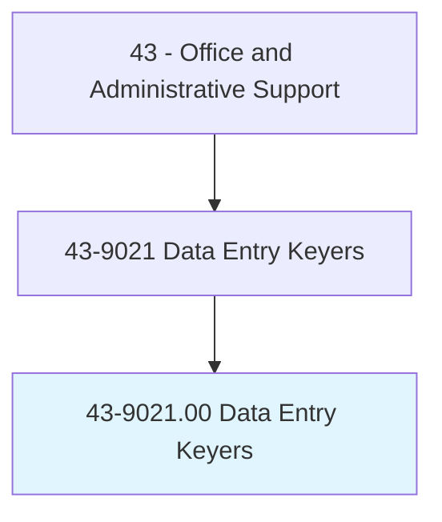
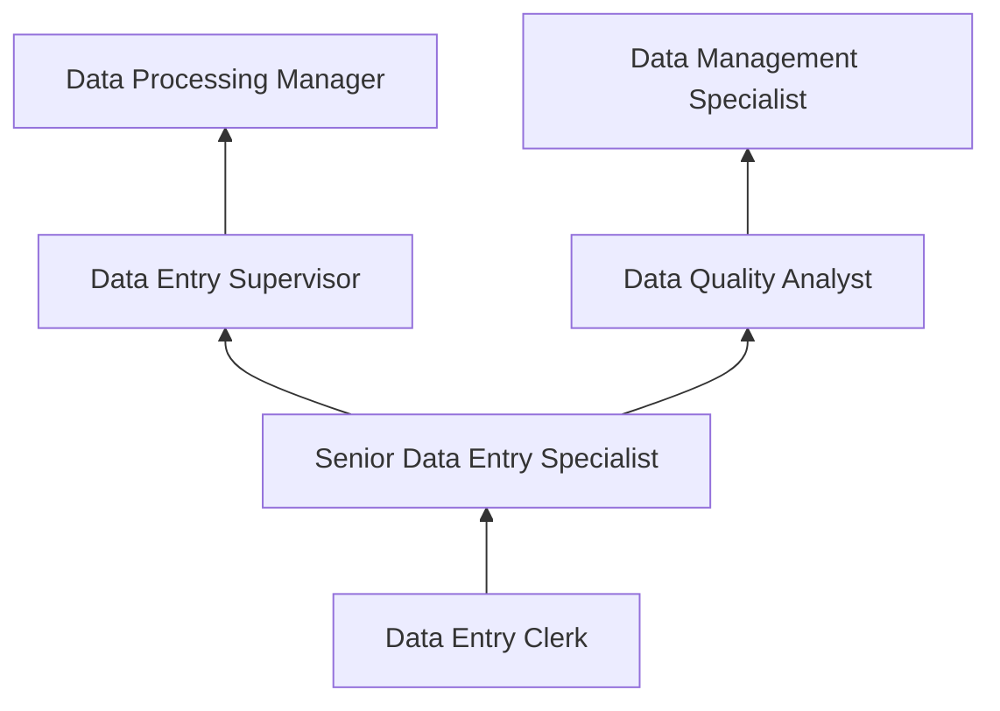
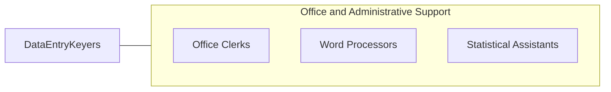

# Data Entry Keyers

> Operate data entry device, such as keyboard or photo composing perforator. Duties may include verifying data and preparing materials for printing.

## Overview

Data Entry Keyers are specialized clerical professionals who input, verify, and maintain data in computer systems using keyboards, scanners, and other input devices. They transcribe information from source documents -- forms, surveys, invoices, reports, and other records -- into digital databases and information systems, ensuring accuracy and completeness of organizational data.

Working across industries including healthcare, finance, government, insurance, and logistics, data entry keyers process high volumes of records that organizations depend on for operations, analysis, and decision-making. Speed and accuracy are the defining performance metrics: experienced keyers can input thousands of keystrokes per hour while maintaining error rates below one percent. They verify entered data against source documents, correct errors, and maintain quality standards.

While optical character recognition (OCR), automated data capture, and AI-powered extraction tools have reduced some routine data entry demand, the profession continues to serve essential functions in digitizing paper records, processing forms that resist automation, and performing quality verification of machine-generated data. Remote and freelance data entry work has expanded with cloud-based systems and distributed workforces.

## Classification Hierarchy

## Key Statistics

| Metric | Value |
|--------|-------|
| SOC Code | 43-9021.00 |
| Job Zone | 2 (Some Preparation) |
| Category | [Office and Administrative Support](/occupations/Administrative/index) |
| Median Annual Salary | $35,930 |
| Employment | ~155,000 |
| Projected Growth | -25% (rapidly declining) |
| Core Tasks | 25 |
| Source | O*NET |

## Core Tasks

Core task data with GraphDL semantic actions for this occupation is maintained in the data pipeline. See [O*NET 43-9021.00](https://www.onetonline.org/link/summary/43-9021.00) for detailed task information.

## Skills & Competencies

### Technical Skills
- **Keyboard Speed and Accuracy** - Expert (8,000+ keystrokes/hour)
- **Data Entry Software** - Advanced
- **Database Systems** - Intermediate
- **Document Scanning and OCR** - Intermediate
- **Spreadsheet Applications** - Intermediate
- **Quality Verification Methods** - Advanced

### Soft Skills
- **Attention to Detail** - Critical
- **Accuracy** - Critical
- **Concentration and Focus** - Critical
- **Speed** - Essential
- **Organizational Skills** - Important
- **Reliability** - Essential

## Education & Certifications

| Requirement | Details |
|-------------|---------|
| Typical Education | High school diploma |
| Typing Certification | 40-60+ WPM with high accuracy |
| 10-Key Certification | Numeric keypad proficiency |
| Data Entry Certification | Employer-specific testing |
| Microsoft Office Specialist | Excel and database proficiency |

## Career Progression

## Industry Variations

| Setting | Focus | Unique Aspects |
|---------|-------|----------------|
| Healthcare | Medical records digitization | HIPAA compliance; medical terminology; EHR systems |
| Insurance | Claims and policy data processing | Policy forms; claims documentation; regulatory records |
| Government | Census and survey data | Large-scale processing; standardized forms; security clearance |
| Finance | Transaction and account records | Accuracy-critical; audit trails; regulatory requirements |

## Technology & Tools

- **Data Entry Software** - Proprietary data capture systems
- **Databases** - SQL databases, Access, CRM systems
- **Scanning** - OCR software, document scanners
- **Spreadsheets** - Excel, Google Sheets
- **Communication** - Email, messaging platforms

## Related Occupations

## Departments

This occupation typically works in:
- Data Processing - Data input operations
- Records Management - Document digitization
- Administration - Office data management
- [IT Department](/departments/Technology) - Database maintenance

---

*Source: O*NET 43-9021.00 - ONETOccupation*
