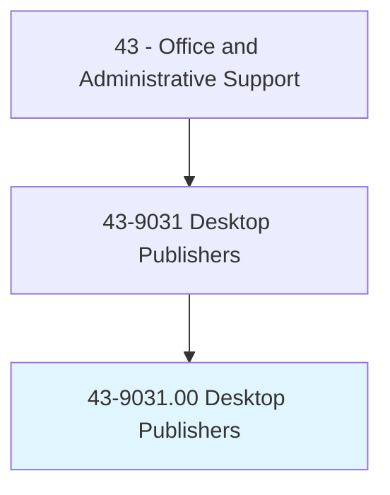
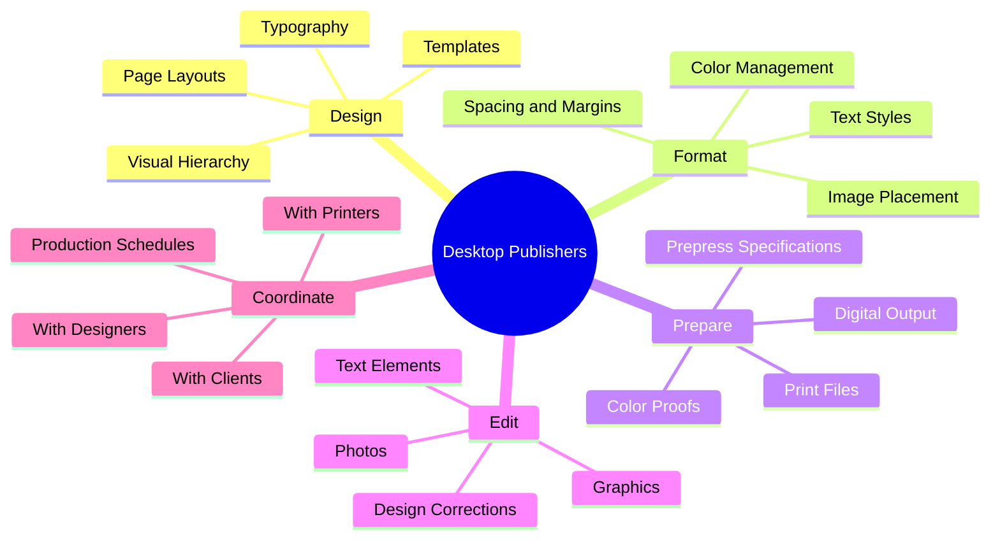
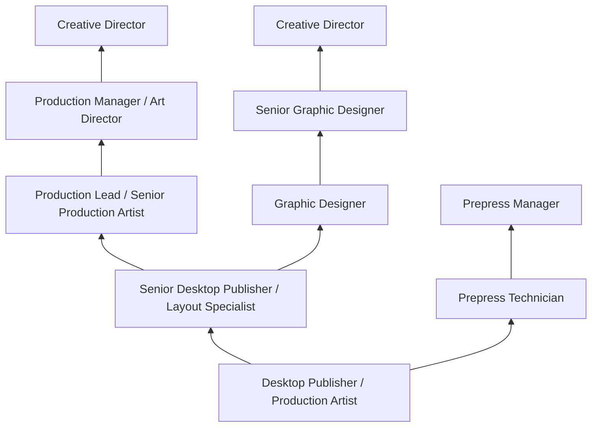
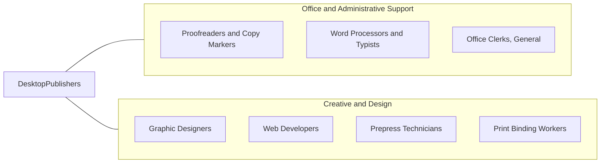

# Desktop Publishers

> Format typescript and graphic elements using computer software to produce publication-ready material.

## Overview

Desktop Publishers use specialized software to design and format documents, combining text, graphics, photographs, and other visual elements into publication-ready layouts. They produce newsletters, brochures, books, magazines, catalogs, advertisements, and other printed or digital materials, ensuring that content is visually appealing, properly formatted, and meets production specifications.

Working in publishing houses, print shops, marketing departments, and advertising agencies, desktop publishers translate design concepts into finished layouts. They set type specifications, arrange page elements, adjust images, create templates, and prepare files for commercial printing or digital distribution. The role bridges graphic design and production, requiring both aesthetic sensibility and technical proficiency with publishing tools. Desktop publishers must understand typography principles, color theory, page composition, and the technical requirements of various output formats.

The profession has evolved significantly as publishing tools have become more accessible and design functions have merged with other roles. While dedicated desktop publishing positions have declined, the skills remain in demand across marketing, communications, and creative departments where professionals with publishing expertise produce everything from corporate reports to digital content. Many desktop publishers have expanded their skill sets to include web design, digital asset creation, and multimedia production.

## Classification Hierarchy



## Key Statistics

| Metric | Value |
|--------|-------|
| SOC Code | 43-9031.00 |
| Job Zone | 3 (Medium Preparation) |
| Category | [Office and Administrative Support](/occupations/Administrative/index) |
| Median Annual Salary | $48,200 |
| Salary Range | $32,000 - $72,000 |
| 10th Percentile | $32,500 |
| 90th Percentile | $71,800 |
| Employment | ~13,000 |
| Projected Growth | -15% (declining) |
| Annual Openings | ~1,200 |
| Core Tasks | 30 |
| Source | O*NET |

## Core Tasks



### design.Layouts

Desktop Publishers design publication layouts as a core responsibility.

**Actions:**
- `design.PageLayouts.for.Publications`
- `design.Templates.for.ConsistentBranding`
- `arrange.Elements.on.Pages`
- `create.VisualHierarchy.using.Typography`

### prepare.ProductionFiles

Desktop Publishers prepare files for print and digital output.

**Actions:**
- `prepare.Files.for.CommercialPrinting`
- `prepare.DigitalOutput.for.WebPublishing`
- `create.Proofs.for.ClientApproval`
- `verify.Specifications.with.Printers`

## Skills & Competencies

### Technical Skills
- **Adobe InDesign** - Expert (professional layout and publishing)
- **Adobe Photoshop** - Advanced (image editing and preparation)
- **Adobe Illustrator** - Advanced (vector graphics and logo work)
- **Typography and Layout** - Expert (font selection, spacing, hierarchy)
- **Print Production** - Expert (bleeds, marks, color separations)
- **Color Management** - Advanced (CMYK, Pantone, color profiles)
- **Prepress and File Preparation** - Expert (preflight, PDF/X standards)
- **Digital Publishing** - Advanced (ePub, HTML, interactive PDFs)
- **Microsoft Office** - Advanced (Word, PowerPoint integration)
- **Font Management** - Advanced (Adobe Fonts, font licensing)

### Soft Skills
- **Attention to Detail** - Critical (error-free publications)
- **Visual Aesthetics** - Critical (design judgment and composition)
- **Creativity** - Essential (layout innovation and problem-solving)
- **Time Management** - Essential (meeting production deadlines)
- **Communication** - Essential (working with designers and clients)
- **Technical Problem Solving** - Essential (troubleshooting production issues)
- **Organization** - Important (managing multiple projects)
- **Collaboration** - Important (team-based production workflows)

## Education & Certifications

| Requirement | Details |
|-------------|---------|
| Typical Education | Associate's or bachelor's degree in Graphic Design, Visual Communications, or related field |
| Preferred Degree | BFA in Graphic Design, BA in Communications |
| Adobe Certified Professional | InDesign, Photoshop, Illustrator certifications |
| Print Production Certification | Industry-specific prepress credentials |
| Portfolio | Professional work samples required for employment |
| Typography Training | Formal coursework or specialized training |
| Color Management Training | ICC profiles, color calibration |
| Continuing Education | Software updates, industry trends, new technologies |

## Career Progression



### Career Pathway Details

| Level | Title | Years Experience | Key Responsibilities |
|-------|-------|------------------|----------------------|
| Entry | Desktop Publisher / Production Artist | 0-2 years | Template-based layouts, file preparation, corrections |
| Mid | Senior Desktop Publisher | 2-5 years | Complex layouts, template creation, quality control |
| Senior | Production Lead | 5-8 years | Team coordination, client interaction, process improvement |
| Management | Production Manager | 8-12 years | Department leadership, vendor management, workflow design |
| Executive | Art Director / Creative Director | 12+ years | Creative strategy, brand management, team leadership |

### Alternative Career Paths

| Path | Skills Applied | Typical Transition |
|------|---------------|-------------------|
| Graphic Designer | Layout, typography, visual design | Broaden creative scope |
| Web Designer | Digital publishing, visual design | Add HTML/CSS skills |
| UX/UI Designer | Layout, user experience | Add interaction design skills |
| Marketing Specialist | Production, content creation | Add marketing strategy |
| Print Production Manager | Prepress, vendor relations | Add management skills |

## Industry Variations

| Setting | Focus | Unique Aspects |
|---------|-------|----------------|
| Publishing | Books, magazines, journals | Long-form layout; editorial design; print specifications; ISBN management |
| Marketing | Collateral, brochures, ads | Brand compliance; multi-format output; rapid turnaround; campaign consistency |
| Corporate | Reports, presentations | Template management; brand standards; executive communications; annual reports |
| Print Services | Commercial printing production | Prepress; color proofing; vendor coordination; file verification |
| Newspapers | Daily publication layout | Speed; editorial workflow; advertising placement; modular design |
| Packaging | Product packaging design | Die lines; regulatory requirements; barcode placement; production specifications |

### Publishing Industry Focus

In book and magazine publishing, desktop publishers handle complex long-form documents requiring consistent typography, chapter styling, index and table of contents generation, and adherence to house styles. They work with editorial teams on manuscript preparation and with production teams on print specifications. Understanding of book binding, paper selection, and print runs is valuable.

### Marketing and Advertising Focus

Marketing desktop publishers produce diverse collateral including brochures, flyers, advertisements, trade show materials, and digital assets. Speed and brand consistency are paramount. They often work from brand guidelines and templates, producing variations for different markets, languages, or promotions. Understanding of marketing objectives enhances effectiveness.

### Corporate Communications Focus

Corporate desktop publishers create annual reports, investor presentations, internal communications, and executive materials. They manage brand standards across the organization, create and maintain template libraries, and ensure consistent visual identity. Understanding of corporate hierarchy and communication protocols is important.

## Technology & Tools

### Primary Software
- **Layout** - Adobe InDesign (industry standard), QuarkXPress (legacy)
- **Graphics** - Adobe Photoshop, Illustrator, Affinity Designer
- **PDF** - Adobe Acrobat Pro, preflight tools, PDF/X compliance
- **Fonts** - Adobe Fonts, font management utilities, type foundry tools

### Production Tools
- **Prepress** - FlightCheck, PitStop, Enfocus preflight tools
- **Proofing** - Soft proofing, color calibration devices, proof printers
- **Asset Management** - Adobe Experience Manager, Canto, Bynder
- **Collaboration** - Adobe Creative Cloud, project management tools

### Emerging Technologies
- **Variable Data Publishing** - Personalized document generation
- **Interactive PDFs** - Multimedia, forms, navigation
- **Digital Publishing** - Adobe Digital Publishing Suite, HTML5 output
- **Automation** - ExtendScript, InDesign Server, template automation
- **AI-Assisted Design** - Adobe Sensei, layout suggestions, image enhancement

## Related Occupations



### Related Occupation Comparison

| Occupation | Similarity | Key Difference |
|------------|------------|----------------|
| Graphic Designers | High | Broader creative scope vs production focus |
| Prepress Technicians | High | Print preparation vs layout creation |
| Web Developers | Medium | Digital output vs print focus |
| Proofreaders | Medium | Content review vs layout production |
| Technical Writers | Medium | Content creation vs visual formatting |

## Industries

- [Publishing Industries](/industries/Information/Publishing) - High Employment
- [Advertising and Marketing](/industries/ProfessionalServices/Advertising) - High Employment
- [Printing and Related Support](/industries/Manufacturing/Printing) - Moderate Employment
- [Corporate Communications](/industries/ProfessionalServices) - Moderate Employment
- [Government](/industries/PublicAdministration) - Moderate Employment
- [Educational Services](/industries/Education) - Moderate Employment

## Departments

This occupation typically works in:
- [Marketing Department](/departments/Marketing) - Marketing collateral production
- Communications - Corporate publications and internal communications
- Creative Services - Design and layout production
- Print Production - Prepress and printing coordination
- Publications - Editorial production and publishing
- [IT/Digital](/departments/Technology) - Digital asset management

## Work Environment

### Physical Setting
- Climate-controlled office or studio environment
- Desk-based work with high-resolution monitors (often dual monitors)
- Color-calibrated displays for accurate color representation
- Access to proof printers and production equipment

### Work Schedule
- Typically Monday-Friday, standard business hours
- Deadline-driven periods may require extended hours
- Publication schedules may create regular crunch periods
- Some positions offer remote work opportunities

### Work Characteristics
- Detail-oriented, precision work
- Extended computer screen time
- Sedentary work with minimal physical demands
- Project-based with multiple simultaneous assignments
- Collaborative work with designers, editors, and clients

## Portfolio Development

### Essential Portfolio Elements
- Book or magazine layouts demonstrating typography skills
- Marketing collateral showing brand consistency
- Before/after examples of layout improvements
- Template systems and style guides
- Multi-format output (print and digital)
- Complex document structures (tables, charts, indexes)

### Portfolio Best Practices
- Show process as well as final output
- Include production specifications and constraints
- Demonstrate range across industries and formats
- Highlight problem-solving and creative solutions
- Keep portfolio current with recent work

## GraphDL Semantic Structure

```graphdl
Desktop Publishers perform:
- design.Layouts.for.Publications
- format.Documents.using.SoftwareTools
- prepare.Files.for.CommercialPrinting
- edit.Graphics.in.Layouts
- create.Templates.for.ConsistentBranding
- coordinate.Production.with.Printers
- verify.Colors.for.Accuracy
- manage.Assets.for.Projects
```

---

*Source: O*NET 43-9031.00 - ONETOccupation*
