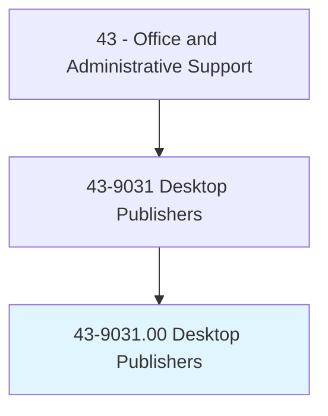
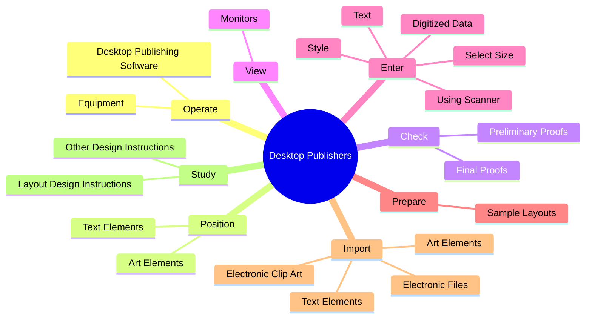

# Desktop Publishers

> Format typescript and graphic elements using computer software to produce publication-ready material.

## Overview

Desktop Publishers is classified under Office and Administrative Support (SOC 43). Format typescript and graphic elements using computer software to produce publication-ready material.

## Classification Hierarchy

## Key Statistics

| Metric | Value |
|--------|-------|
| SOC Code | 43-9031.00 |
| Category | [Office and Administrative Support](/occupations/Administrative/index) |
| Task Count | 94 |
| Source | O*NET |

## Core Tasks

### operate.DesktopPublishingSoftware

Desktop Publishers operate desktop publishing software as part of their core responsibilities.

**Actions:**
- `operate.DesktopPublishingSoftware.to.design`
- `operate.DesktopPublishingSoftware.to.lay.Out`
- `operate.DesktopPublishingSoftware.to.produce.CameraReadyCopy`
- `operate.Equipment.to.design`

### position.TextElements

Desktop Publishers position text elements as part of their core responsibilities.

**Actions:**
- `position.TextElements.from.VarietyOfDatabasesInVisuallyAppealingWay.to.design.PrintPages`
- `position.TextElements.from.WebPages`
- `position.TextElements.from.UsingKnowledge.of.TypeStyles`
- `position.TextElements.from.Size`

### check.PreliminaryProofs

Desktop Publishers check preliminary proofs as part of their core responsibilities.

**Actions:**
- `check.PreliminaryProofs.for.Errors`
- `check.PreliminaryProofs.for.MakeNecessaryCorrections`
- `check.FinalProofs.for.Errors`
- `check.FinalProofs.for.MakeNecessaryCorrections`

## Skills & Competencies

### Technical Skills
- **Office Management** - Advanced
- **Data Entry** - Advanced
- **Records Management** - Advanced

### Soft Skills
- **Communication** - Essential
- **Problem Solving** - Essential
- **Critical Thinking** - Important
- **Teamwork** - Important
- **Adaptability** - Important

## Related Occupations

## Industries

This occupation is found across multiple industries. See [Industries](/industries) for sector-specific employment data.

## Career Progression

---

*Source: O*NET 43-9031.00 - ONETOccupation*
