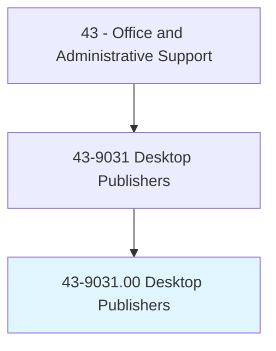
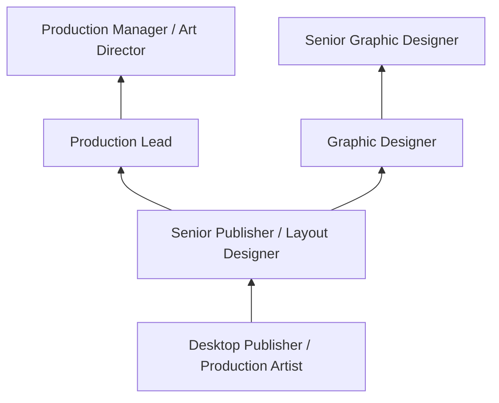

# Desktop Publishers

> Format typescript and graphic elements using computer software to produce publication-ready material.

## Overview

Desktop Publishers use specialized software to design and format documents, combining text, graphics, photographs, and other visual elements into publication-ready layouts. They produce newsletters, brochures, books, magazines, catalogs, advertisements, and other printed or digital materials, ensuring that content is visually appealing, properly formatted, and meets production specifications.

Working in publishing houses, print shops, marketing departments, and advertising agencies, desktop publishers translate design concepts into finished layouts. They set type specifications, arrange page elements, adjust images, create templates, and prepare files for commercial printing or digital distribution. The role bridges graphic design and production, requiring both aesthetic sensibility and technical proficiency with publishing tools.

The profession has evolved significantly as publishing tools have become more accessible and design functions have merged with other roles. While dedicated desktop publishing positions have declined, the skills remain in demand across marketing, communications, and creative departments where professionals with publishing expertise produce everything from corporate reports to digital content.

## Classification Hierarchy

## Key Statistics

| Metric | Value |
|--------|-------|
| SOC Code | 43-9031.00 |
| Job Zone | 3 (Medium Preparation) |
| Category | [Office and Administrative Support](/occupations/Administrative/index) |
| Median Annual Salary | $48,200 |
| Employment | ~13,000 |
| Projected Growth | -15% (declining) |
| Core Tasks | 30 |
| Source | O*NET |

## Core Tasks

Core task data with GraphDL semantic actions for this occupation is maintained in the data pipeline. See [O*NET 43-9031.00](https://www.onetonline.org/link/summary/43-9031.00) for detailed task information.

## Skills & Competencies

### Technical Skills
- **Adobe InDesign** - Expert
- **Adobe Photoshop and Illustrator** - Advanced
- **Typography and Layout** - Expert
- **Print Production** - Advanced
- **Color Management** - Advanced
- **Prepress and File Preparation** - Advanced

### Soft Skills
- **Attention to Detail** - Critical
- **Visual Aesthetics** - Essential
- **Creativity** - Essential
- **Time Management** - Essential
- **Communication** - Important
- **Technical Problem Solving** - Important

## Education & Certifications

| Requirement | Details |
|-------------|---------|
| Typical Education | Associate's or bachelor's degree in Graphic Design or related field |
| Adobe Certified Professional | InDesign, Photoshop, Illustrator |
| Print Production Certification | Industry-specific prepress credentials |
| Portfolio | Professional work samples required |

## Career Progression

## Industry Variations

| Setting | Focus | Unique Aspects |
|---------|-------|----------------|
| Publishing | Books, magazines, journals | Long-form layout; editorial design; print specifications |
| Marketing | Collateral, brochures, ads | Brand compliance; multi-format output; rapid turnaround |
| Corporate | Reports, presentations | Template management; brand standards; executive communications |
| Print Services | Commercial printing production | Prepress; color proofing; vendor coordination |

## Technology & Tools

- **Layout** - Adobe InDesign, QuarkXPress
- **Graphics** - Adobe Photoshop, Illustrator
- **Prepress** - Preflight tools, PDF production
- **Fonts** - Adobe Fonts, font management utilities
- **Proofing** - Soft proofing, color calibration
- **Digital Publishing** - HTML/CSS, ePub, digital flipbooks

## Related Occupations

## Departments

This occupation typically works in:
- [Marketing Department](/departments/Marketing) - Marketing collateral production
- Communications - Corporate publications
- Creative Services - Design and layout
- Print Production - Prepress and printing

---

*Source: O*NET 43-9031.00 - ONETOccupation*
