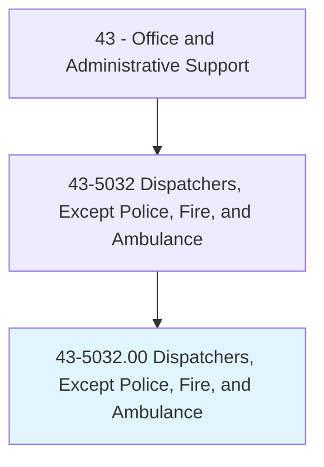
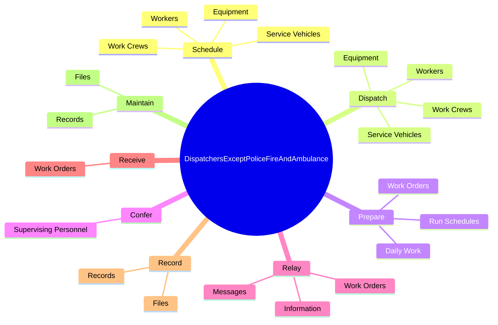
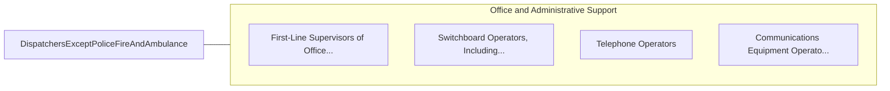

# Dispatchers, Except Police, Fire, and Ambulance

> Schedule and dispatch workers, work crews, equipment, or service vehicles for conveyance of materials, freight, or passengers, or for normal installation, service, or emergency repairs rendered outside the place of business. Duties may include using radio, telephone, or computer to transmit assignments and compiling statistics and reports on work progress.

## Overview

Dispatchers, Except Police, Fire, and Ambulance is an occupation within the Office and Administrative Support category. Schedule and dispatch workers, work crews, equipment, or service vehicles for conveyance of materials, freight, or passengers, or for normal installation, service, or emergency repairs rendered outside the place of business. 

## Classification Hierarchy

## Key Statistics

| Metric | Value |
|--------|-------|
| SOC Code | 43-5032.00 |
| Category | [Office and Administrative Support](/occupations/Administrative) |
| Task Count | 118 |
| Source | O*NET |

## Core Tasks

### schedule.Workers

Dispatchers, Except Police, Fire, and Ambulance schedule workers as part of their core responsibilities.

**Actions:**
- `schedule.Workers.to.appropriate.Locations`
- `schedule.Workers.to.AccordingToCustomerRequests`
- `schedule.Workers.to.Specifications`
- `schedule.Workers.to.Needs`

### dispatch.Workers

Dispatchers, Except Police, Fire, and Ambulance dispatch workers as part of their core responsibilities.

**Actions:**
- `dispatch.Workers.to.appropriate.Locations`
- `dispatch.Workers.to.AccordingToCustomerRequests`
- `dispatch.Workers.to.Specifications`
- `dispatch.Workers.to.Needs`

### prepare.DailyWork

Dispatchers, Except Police, Fire, and Ambulance prepare daily work as part of their core responsibilities.

**Actions:**
- `prepare.DailyWork`
- `prepare.RunSchedules`
- `prepare.WorkOrders`

## Skills & Competencies

### Technical Skills
- **Office Management** - Advanced
- **Data Entry** - Advanced
- **Records Management** - Advanced

### Soft Skills
- **Communication** - Essential
- **Problem Solving** - Essential
- **Critical Thinking** - Important
- **Teamwork** - Important
- **Adaptability** - Important

## Related Occupations

## Industries

This occupation is found across multiple industries. See [Industries](/industries) for sector-specific employment data.

## Career Progression

---

*Source: O*NET 43-5032.00 - ONETOccupation*
