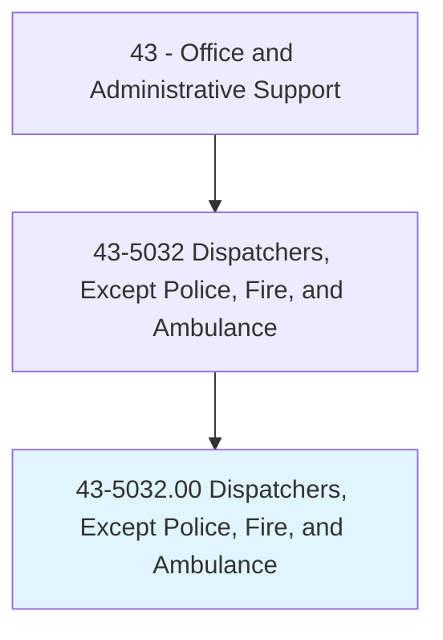
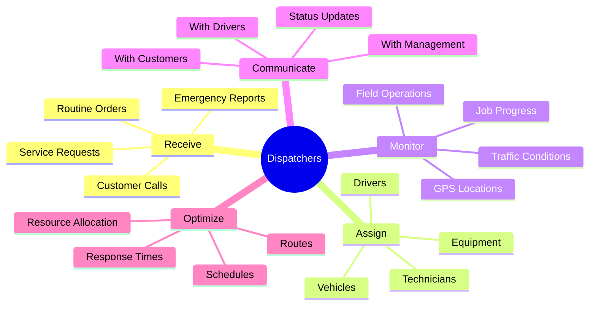
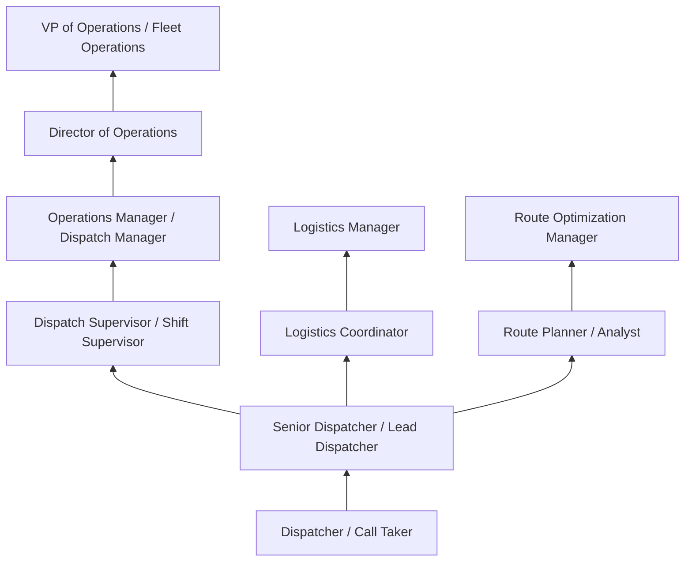
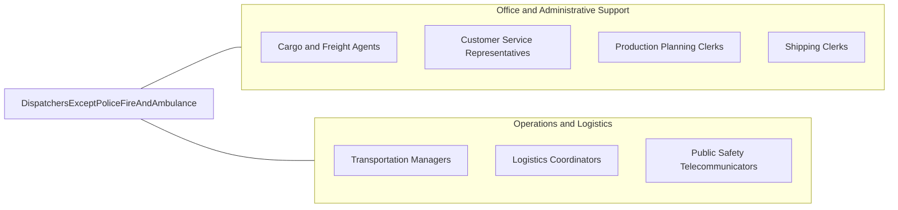

# Dispatchers, Except Police, Fire, and Ambulance

> Schedule and dispatch workers, work crews, equipment, or service vehicles for conveyance of materials, freight, or passengers, or for normal installation, service, or emergency repairs rendered outside the place of business.

## Overview

Dispatchers coordinate the deployment of workers, vehicles, and equipment to serve customers and fulfill service requests. They receive incoming calls, prioritize requests, assign resources, monitor field operations, and communicate with drivers and technicians to ensure efficient routing and timely service delivery. Dispatchers serve as the critical link between customers requesting service and field personnel delivering it.

Working in trucking, utilities, towing, HVAC, telecommunications, and taxi/rideshare companies, dispatchers serve as the communication hub between customers requesting service and field personnel delivering it. They use computer-aided dispatch systems, GPS tracking, and radio communications to manage real-time operations across geographic territories. The role requires quick thinking, excellent communication skills, and the ability to optimize resources under constantly changing conditions.

The role demands quick decision-making, multitasking ability, and clear communication under pressure. Dispatchers must balance competing priorities -- emergency vs routine requests, geographic efficiency, worker availability, and customer expectations -- while maintaining composure during high-volume periods. Technology has transformed dispatching with GPS tracking, automated routing, and real-time communication tools, but human judgment remains essential for handling exceptions and complex situations.

## Classification Hierarchy



## Key Statistics

| Metric | Value |
|--------|-------|
| SOC Code | 43-5032.00 |
| Job Zone | 3 (Medium Preparation) |
| Category | [Office and Administrative Support](/occupations/Administrative/index) |
| Median Annual Salary | $43,600 |
| Salary Range | $30,000 - $62,000 |
| 10th Percentile | $30,200 |
| 90th Percentile | $61,500 |
| Employment | ~198,000 |
| Projected Growth | 3% (as fast as average) |
| Annual Openings | ~25,000 |
| Core Tasks | 50 |
| Source | O*NET |

## Core Tasks



### assign.Resources

Dispatchers assign resources to fulfill service requests.

**Actions:**
- `assign.Drivers.to.Deliveries`
- `assign.Technicians.to.ServiceCalls`
- `assign.Vehicles.for.Transport`
- `dispatch.Crews.to.JobSites`

### monitor.Operations

Dispatchers monitor field operations in real-time.

**Actions:**
- `monitor.Locations.via.GPS`
- `monitor.Progress.of.Jobs`
- `track.Vehicles.on.Routes`
- `coordinate.Responses.to.Emergencies`

## Skills & Competencies

### Technical Skills
- **Computer-Aided Dispatch (CAD)** - Expert (dispatch software, workflow management)
- **GPS and Fleet Tracking** - Expert (real-time location monitoring, geofencing)
- **Radio Communications** - Advanced (two-way radio, push-to-talk systems)
- **Route Optimization** - Advanced (efficient routing, traffic awareness)
- **Scheduling Systems** - Expert (appointment booking, resource calendars)
- **CRM and Customer Systems** - Advanced (customer records, service history)
- **Multi-Line Phone Systems** - Advanced (call handling, transfers)
- **Data Entry** - Advanced (accurate record-keeping, documentation)

### Soft Skills
- **Multitasking** - Critical (managing multiple simultaneous activities)
- **Quick Decision Making** - Critical (rapid resource allocation)
- **Communication** - Critical (clear, concise directions)
- **Composure Under Pressure** - Critical (handling emergencies calmly)
- **Organization** - Essential (tracking multiple jobs and resources)
- **Problem Solving** - Essential (handling exceptions and complications)
- **Customer Service** - Essential (professional customer interaction)
- **Geographic Knowledge** - Important (local area familiarity)

## Education & Certifications

| Requirement | Details |
|-------------|---------|
| Typical Education | High school diploma |
| Preferred Education | Associate's degree in Business, Logistics, or related field |
| Dispatch Certification | Industry-specific training (trucking, utilities, service) |
| FCC Radio License | Required for some positions using commercial radio |
| CDL Knowledge | Beneficial for trucking dispatch understanding regulations |
| OSHA Safety Training | Required for some industries |
| On-the-Job Training | Moderate to extensive depending on complexity |
| Continuing Education | Software updates, industry regulations, safety protocols |

## Career Progression



### Career Pathway Details

| Level | Title | Years Experience | Key Responsibilities |
|-------|-------|------------------|----------------------|
| Entry | Dispatcher / Call Taker | 0-2 years | Basic dispatching, call handling, data entry |
| Mid | Senior Dispatcher / Lead | 2-5 years | Complex dispatching, training, exception handling |
| Supervisory | Dispatch Supervisor | 5-8 years | Shift management, team coordination, performance monitoring |
| Management | Operations Manager | 8-12 years | Department leadership, process improvement, vendor relations |
| Director | Director of Operations | 12-15 years | Strategic planning, fleet management, budget oversight |
| Executive | VP of Operations | 15+ years | Enterprise operations, strategic initiatives, executive leadership |

## Industry Variations

| Setting | Focus | Unique Aspects |
|---------|-------|----------------|
| Trucking | Freight and delivery | Load optimization; DOT hours compliance; multi-stop routing; broker coordination |
| Utilities | Service crew deployment | Emergency response; territory management; outage coordination; safety protocols |
| HVAC/Plumbing | Service technician dispatch | Appointment scheduling; parts availability; skill matching; customer callbacks |
| Taxi/Rideshare | Passenger transport | Real-time demand; surge management; driver assignment; customer ratings |
| Towing | Roadside assistance | Emergency response; law enforcement coordination; vehicle storage; insurance verification |
| Telecommunications | Installation and repair | Appointment windows; equipment inventory; permit coordination; customer notification |

### Trucking and Freight Dispatch

Trucking dispatchers coordinate freight movements, managing driver assignments, load matching, and compliance with Department of Transportation hours-of-service regulations. They work with load boards, brokers, and shippers to optimize capacity utilization. Understanding of commercial driver regulations, weight limits, and route restrictions is essential. Many trucking dispatchers work overnight shifts to support cross-country operations.

### Utility Dispatch

Utility dispatchers manage service crews responding to outages, installations, and maintenance requests. They prioritize emergency situations (gas leaks, downed power lines) while maintaining routine service schedules. Storm response requires rapid scaling of operations and mutual aid coordination with other utilities. Safety protocols and regulatory compliance are paramount.

### Service Industry Dispatch (HVAC, Plumbing, Electrical)

Service dispatchers schedule technicians for residential and commercial service calls, balancing appointment times, technician skills, parts availability, and geographic efficiency. They handle customer communications, manage expectations, and coordinate callbacks. Peak seasons (summer for HVAC, winter for heating) create significant volume variations requiring flexible staffing.

### Transportation Network Companies

Rideshare and taxi dispatchers (increasingly automated) match passengers with drivers in real-time, managing surge pricing, driver availability, and customer satisfaction metrics. While technology has automated much traditional taxi dispatch, human oversight remains important for exception handling, customer service escalations, and driver management.

## Technology & Tools

### Dispatch Software
- **Fleet Management** - Samsara, Verizon Connect, Geotab, Omnitracs
- **Field Service** - ServiceTitan, FieldEdge, Housecall Pro, Salesforce Field Service
- **Trucking** - TMW Suite, McLeod, Truckstop, DAT Solutions
- **Route Optimization** - Route4Me, OptimoRoute, Routific
- **Taxi/TNC** - Proprietary platforms, legacy dispatch systems

### Communication Tools
- **Radio** - Motorola, Kenwood two-way radio systems
- **Push-to-Talk** - Zello, Voxer, carrier PTT apps
- **Phone Systems** - Multi-line business phones, VoIP systems
- **Messaging** - SMS, in-app messaging, driver apps

### Tracking and Monitoring
- **GPS** - Real-time vehicle tracking, geofencing, breadcrumb trails
- **Dashcams** - Video monitoring, incident recording
- **ELD** - Electronic logging devices for trucking compliance
- **IoT Sensors** - Temperature monitoring, door sensors, equipment status

### Emerging Technology
- **AI Optimization** - Machine learning for route and assignment optimization
- **Predictive Analytics** - Demand forecasting, maintenance prediction
- **Automation** - Auto-dispatch for routine assignments
- **Voice Assistants** - Hands-free driver communication

## Related Occupations



### Related Occupation Comparison

| Occupation | Similarity | Key Difference |
|------------|------------|----------------|
| Public Safety Dispatchers | High | Emergency services vs commercial operations |
| Logistics Coordinators | High | Strategic planning vs real-time coordination |
| Customer Service Reps | Medium | Service delivery coordination vs inquiry handling |
| Transportation Managers | Medium | Strategic oversight vs operational dispatching |

## Industries

- [Truck Transportation](/industries/Transportation/TruckTransportation) - High Employment
- [Utilities](/industries/Utilities) - High Employment
- [Administrative Services](/industries/Administrative) - Moderate Employment
- [Construction](/industries/Construction) - Moderate Employment
- [Taxi and Limousine Service](/industries/Transportation/GroundPassenger) - Moderate Employment
- [Repair and Maintenance](/industries/OtherServices) - Moderate Employment

## Departments

This occupation typically works in:
- [Operations](/departments/Operations) - Field service coordination and fleet management
- [Logistics](/departments/SupplyChain) - Transportation and delivery coordination
- Customer Service - Service scheduling and customer communication
- Emergency Services - Urgent response coordination
- Fleet Management - Vehicle and driver coordination
- Dispatch Center - Centralized dispatching operations

## Work Environment

### Physical Setting
- Climate-controlled dispatch center or office
- Multiple computer monitors for tracking and communication
- Radio and phone headsets for hands-free operation
- 24/7 operations in many industries

### Work Schedule
- Shift work common (days, evenings, nights, weekends)
- 24/7 operations in trucking, utilities, and service industries
- Rotating shifts in many organizations
- Overtime during peak periods and emergencies
- Holiday and weekend work often required

### Work Characteristics
- Fast-paced, constantly changing environment
- High volume of simultaneous communications
- Pressure to meet service level commitments
- Sitting for extended periods with headset use
- Minimal physical activity but significant mental demands

### Stress Factors
- Managing multiple competing priorities
- Customer complaints and escalations
- Equipment and personnel shortages
- Weather and traffic disruptions
- Emergency situations requiring rapid response

## Performance Metrics

### Key Performance Indicators (KPIs)

| Metric | Description | Typical Target |
|--------|-------------|----------------|
| On-Time Performance | Percentage of jobs completed within window | >90% |
| First-Time Fix Rate | Service jobs resolved on first visit | >80% |
| Driver Utilization | Productive time vs available time | >75% |
| Response Time | Time from request to dispatch | <15 minutes |
| Customer Satisfaction | Post-service survey scores | >4.5/5.0 |
| Miles per Stop | Route efficiency measurement | Varies by industry |

## GraphDL Semantic Structure

```graphdl
Dispatchers, Except Police, Fire, and Ambulance perform:
- receive.Requests.from.Customers
- assign.Resources.to.Jobs
- monitor.Operations.via.GPS
- communicate.Updates.to.Drivers
- optimize.Routes.for.Efficiency
- prioritize.Requests.by.Urgency
- coordinate.Crews.for.ServiceDelivery
- document.Activities.for.Records
```

---

*Source: O*NET 43-5032.00 - ONETOccupation*
