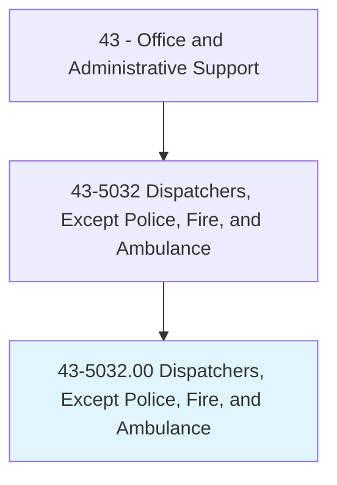
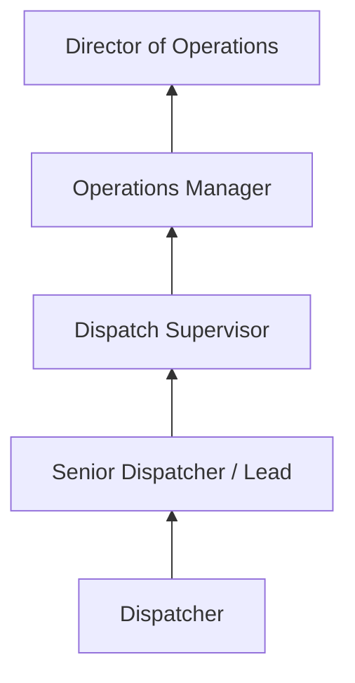
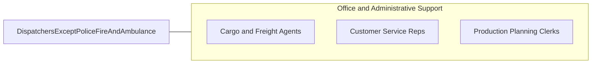

# Dispatchers, Except Police, Fire, and Ambulance

> Schedule and dispatch workers, work crews, equipment, or service vehicles for conveyance of materials, freight, or passengers, or for normal installation, service, or emergency repairs rendered outside the place of business.

## Overview

Dispatchers coordinate the deployment of workers, vehicles, and equipment to serve customers and fulfill service requests. They receive incoming calls, prioritize requests, assign resources, monitor field operations, and communicate with drivers and technicians to ensure efficient routing and timely service delivery.

Working in trucking, utilities, towing, HVAC, telecommunications, and taxi/rideshare companies, dispatchers serve as the communication hub between customers requesting service and field personnel delivering it. They use computer-aided dispatch systems, GPS tracking, and radio communications to manage real-time operations across geographic territories.

The role demands quick decision-making, multitasking ability, and clear communication under pressure. Dispatchers must balance competing priorities -- emergency vs routine requests, geographic efficiency, worker availability, and customer expectations -- while maintaining composure during high-volume periods.

## Classification Hierarchy

## Key Statistics

| Metric | Value |
|--------|-------|
| SOC Code | 43-5032.00 |
| Job Zone | 3 (Medium Preparation) |
| Category | [Office and Administrative Support](/occupations/Administrative/index) |
| Median Annual Salary | $43,600 |
| Employment | ~198,000 |
| Projected Growth | 3% (average) |
| Core Tasks | 50 |
| Source | O*NET |

## Core Tasks

Core task data with GraphDL semantic actions for this occupation is maintained in the data pipeline. See [O*NET 43-5032.00](https://www.onetonline.org/link/summary/43-5032.00) for detailed task information.

## Skills & Competencies

### Technical Skills
- **Computer-Aided Dispatch (CAD)** - Advanced
- **GPS and Fleet Tracking** - Advanced
- **Radio Communications** - Advanced
- **Route Optimization** - Intermediate
- **Scheduling Systems** - Advanced

### Soft Skills
- **Multitasking** - Critical
- **Quick Decision Making** - Critical
- **Communication** - Critical
- **Composure Under Pressure** - Essential
- **Organization** - Essential

## Education & Certifications

| Requirement | Details |
|-------------|---------|
| Typical Education | High school diploma |
| Dispatch Certification | Industry-specific training |
| FCC Radio License | Required for some positions |
| CDL Knowledge | Beneficial for trucking dispatch |

## Career Progression

## Industry Variations

| Setting | Focus | Unique Aspects |
|---------|-------|----------------|
| Trucking | Freight and delivery | Load optimization; DOT hours compliance; multi-stop routing |
| Utilities | Service crew deployment | Emergency response; territory management; outage coordination |
| HVAC/Plumbing | Service technician dispatch | Appointment scheduling; parts availability; skill matching |
| Taxi/Rideshare | Passenger transport | Real-time demand; surge management; driver assignment |

## Technology & Tools

- **Dispatch Software** - ServiceTitan, FieldEdge, TMW Suite
- **GPS Tracking** - Fleet management platforms
- **Communication** - Two-way radio, mobile apps, phone systems
- **Scheduling** - Automated scheduling and routing tools

## Related Occupations

## Departments

This occupation typically works in:
- [Operations](/departments/Operations) - Field service coordination
- [Logistics](/departments/SupplyChain) - Fleet management
- Customer Service - Service scheduling
- Emergency Services - Urgent response coordination

---

*Source: O*NET 43-5032.00 - ONETOccupation*
