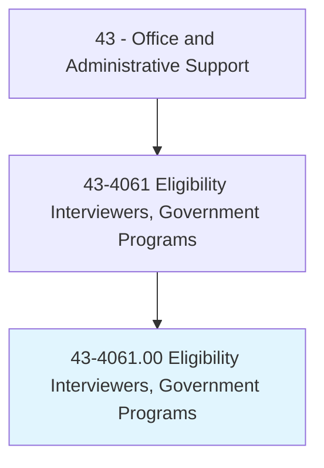
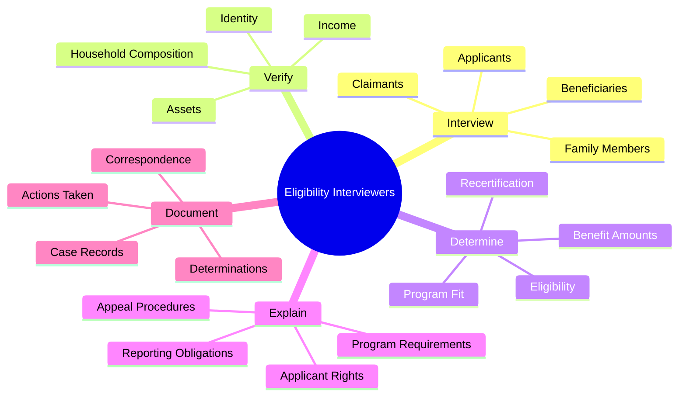
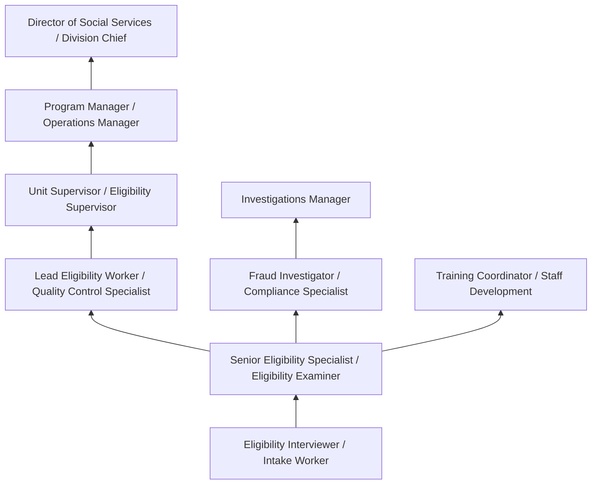
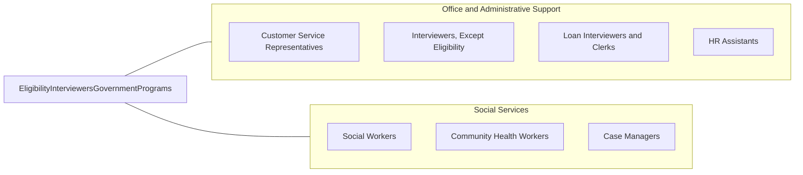

# Eligibility Interviewers, Government Programs

> Determine eligibility of persons applying to receive assistance from government programs and agency resources, such as welfare, unemployment benefits, social security, and public housing.

## Overview

Eligibility Interviewers for Government Programs assess and determine whether applicants qualify for public assistance programs including welfare (TANF), unemployment insurance, Social Security benefits, Medicaid, SNAP (food stamps), public housing, and other government-funded services. They interview applicants, verify documentation, explain program requirements, and process applications according to federal and state regulations.

These professionals work primarily in government agencies -- state employment offices, social services departments, Social Security Administration offices, and public housing authorities. They serve diverse populations, many facing difficult life circumstances, requiring both procedural expertise and compassionate customer service. The role involves verifying income, assets, household composition, employment status, and other eligibility criteria through interviews, document review, and database verification.

Eligibility determination requires navigating complex, frequently changing regulations and maintaining detailed case records. Interviewers must balance thoroughness with efficiency, processing applications within mandated timeframes while ensuring accuracy. They use specialized government systems and databases to cross-check information and prevent fraud. The work is both procedurally demanding and emotionally challenging, as interviewers regularly engage with individuals experiencing financial hardship, family crises, health problems, or other difficult circumstances.

## Classification Hierarchy



## Key Statistics

| Metric | Value |
|--------|-------|
| SOC Code | 43-4061.00 |
| Job Zone | 3 (Medium Preparation) |
| Category | [Office and Administrative Support](/occupations/Administrative/index) |
| Median Annual Salary | $48,200 |
| Salary Range | $34,000 - $68,000 |
| 10th Percentile | $34,500 |
| 90th Percentile | $67,800 |
| Employment | ~128,000 |
| Projected Growth | 2% (slower than average) |
| Annual Openings | ~14,000 |
| Core Tasks | 45 |
| Source | O*NET |

## Core Tasks



### interview.Applicants

Eligibility Interviewers conduct interviews to gather information.

**Actions:**
- `interview.Applicants.for.ProgramEligibility`
- `gather.Information.from.Claimants`
- `ask.Questions.about.Circumstances`
- `document.Responses.in.CaseRecords`

### determine.Eligibility

Eligibility Interviewers make determinations based on regulations.

**Actions:**
- `determine.Eligibility.based.on.Criteria`
- `calculate.Benefits.using.Guidelines`
- `apply.Regulations.to.IndividualCases`
- `process.Applications.within.Timeframes`

## Skills & Competencies

### Technical Skills
- **Government Program Regulations** - Expert (federal and state eligibility rules)
- **Case Management Systems** - Expert (SAWS, EPPIC, state-specific systems)
- **Interview Techniques** - Advanced (structured interviewing, active listening)
- **Eligibility Determination** - Expert (applying complex rules to cases)
- **Documentation and Verification** - Expert (record-keeping, source verification)
- **Benefits Calculation** - Advanced (income disregards, benefit levels)
- **Database Navigation** - Advanced (cross-referencing, verification systems)
- **Microsoft Office** - Advanced (Word, Excel, Outlook)

### Soft Skills
- **Empathy and Compassion** - Critical (understanding difficult circumstances)
- **Communication** - Critical (explaining complex information clearly)
- **Attention to Detail** - Critical (accurate eligibility determinations)
- **Patience** - Critical (working with stressed or frustrated applicants)
- **Cultural Sensitivity** - Essential (serving diverse populations)
- **Integrity** - Critical (ethical handling of sensitive information)
- **Problem Solving** - Essential (navigating complex case situations)
- **Stress Tolerance** - Essential (high volume, emotional situations)

## Education & Certifications

| Requirement | Details |
|-------------|---------|
| Typical Education | Bachelor's degree preferred; associate's with experience accepted |
| Preferred Degree | Social Work, Public Administration, Human Services, or related field |
| Government Caseworker Training | Agency-specific program training (2-8 weeks) |
| Civil Service Exam | Required for many government positions |
| Background Check | Required for government employment |
| Continuing Education | Annual regulatory updates, fraud detection training |
| Specialized Training | Program-specific certification (UI, SNAP, Medicaid) |
| Security Clearance | May be required for SSA positions |

## Career Progression



### Career Pathway Details

| Level | Title | Years Experience | Key Responsibilities |
|-------|-------|------------------|----------------------|
| Entry | Eligibility Interviewer / Intake Worker | 0-2 years | Application processing, routine determinations |
| Mid | Senior Eligibility Specialist | 2-5 years | Complex cases, multi-program coordination, training |
| Lead | Lead Worker / QC Specialist | 5-8 years | Quality review, team support, policy interpretation |
| Supervisory | Unit Supervisor | 8-12 years | Team management, performance monitoring, case review |
| Management | Program Manager | 12-15 years | Program oversight, policy implementation, reporting |
| Executive | Director of Social Services | 15+ years | Agency leadership, legislative relations, budget management |

## Industry Variations

| Setting | Focus | Unique Aspects |
|---------|-------|----------------|
| Social Services | Welfare, SNAP, Medicaid | Complex eligibility; multi-program coordination; poverty assessment; family dynamics |
| Unemployment Insurance | UI benefits | Labor market knowledge; employer verification; job search requirements; claim adjudication |
| Social Security | SSI, SSDI | Medical documentation; disability determination; federal regulations; appeals process |
| Public Housing | Public housing, Section 8 | Waiting lists; income verification; property inspections; housing quality standards |
| Veterans Affairs | VA benefits | Military service verification; disability ratings; education benefits; healthcare enrollment |
| Child Support | Support enforcement | Locate absent parents; payment processing; enforcement actions; interstate coordination |

### Social Services (TANF, SNAP, Medicaid)

Social services eligibility workers handle multiple programs simultaneously, determining eligibility for cash assistance, food benefits, and healthcare. They must understand income calculations, household composition rules, work requirements, and reporting obligations. Medicaid eligibility has become increasingly complex with Affordable Care Act provisions and managed care options.

### Unemployment Insurance

Unemployment eligibility interviewers determine claimant eligibility, adjudicate questionable claims, and handle employer protests. They must understand labor law, separation reasons, work search requirements, and fraud indicators. Economic downturns create dramatic workload surges requiring rapid staff scaling.

### Social Security Administration

SSA eligibility specialists process applications for retirement, disability, survivor, and SSI benefits. Disability determination requires understanding medical evidence and vocational factors. Federal regulations and nationwide consistency requirements create highly structured processes.

### Public Housing Authorities

Housing eligibility workers manage waiting lists, conduct income verifications, and determine tenant rents. They must understand HUD regulations, fair housing requirements, and local housing programs. Section 8 voucher administration involves coordination with private landlords.

## Technology & Tools

### Case Management Systems
- **State Systems** - SAWS, EPPIC, FLORIDA, state-specific eligibility systems
- **Federal Systems** - SSA ORSIS, CBSV, federal verification databases
- **Document Management** - Scanning, imaging, electronic case files

### Verification Tools
- **Income Verification** - The Work Number, state wage databases, IRS interfaces
- **Identity Verification** - SAVE (immigration), SSN verification, vital records
- **Cross-Matching** - Public assistance recovery, fraud detection databases
- **Real-Time Eligibility** - Federal Data Services Hub (healthcare.gov)

### Communication Tools
- **Client Communication** - Phone systems, appointment scheduling, correspondence
- **Video Conferencing** - Remote interviews, virtual appointments
- **Email and Messaging** - Internal communication, client correspondence

### Emerging Technology
- **Online Applications** - Self-service portals, mobile applications
- **Document Upload** - Client-submitted verification documents
- **Chatbots** - Automated inquiry handling, appointment scheduling
- **Predictive Analytics** - Fraud detection, workload forecasting

## Related Occupations



### Related Occupation Comparison

| Occupation | Similarity | Key Difference |
|------------|------------|----------------|
| Social Workers | Medium | Counseling focus vs eligibility determination |
| Loan Interviewers | High | Private sector vs government; credit vs benefits |
| Customer Service Reps | Medium | General inquiries vs eligibility determination |
| Case Managers | Medium | Ongoing support vs initial eligibility |

## Industries

- [State Government](/industries/PublicAdministration/StateGovernment) - High Employment
- [Local Government](/industries/PublicAdministration/LocalGovernment) - High Employment
- [Federal Government](/industries/PublicAdministration/FederalGovernment) - Moderate Employment
- [Social Assistance](/industries/HealthCare/SocialAssistance) - Moderate Employment

## Departments

This occupation typically works in:
- Social Services - Benefits administration and eligibility determination
- Government Administration - Public services and program administration
- Human Services - Client assistance and case management
- Compliance - Program integrity and fraud investigation
- Employment Services - Unemployment insurance and workforce programs
- Housing Authority - Public housing and rental assistance programs

## Work Environment

### Physical Setting
- Government office or service center environment
- Interview cubicles or private offices for client meetings
- Call center settings for phone-based determinations
- Some positions may involve home visits

### Work Schedule
- Typically Monday-Friday, standard government hours (8:30-5:00)
- Some offices offer extended hours for client convenience
- Application deadlines may create periodic peak workloads
- Emergency events (disasters, economic downturns) can require surge staffing

### Work Characteristics
- High client interaction throughout the day
- Significant paperwork and documentation requirements
- Processing quotas and productivity expectations
- Emotionally demanding client interactions
- Regular regulatory changes requiring ongoing learning

### Challenges and Stressors
- Managing high caseloads efficiently
- Dealing with frustrated or desperate applicants
- Balancing thoroughness with productivity requirements
- Staying current with changing regulations
- Fraud detection while maintaining customer service

## Government Employment Considerations

### Benefits of Government Employment
- Job security and civil service protections
- Comprehensive benefits (health, retirement, leave)
- Regular schedule with overtime limitations
- Defined career progression paths
- Public service loan forgiveness eligibility

### Civil Service Requirements
- Civil service examination may be required
- Background investigation for government employment
- Citizenship or legal work authorization requirements
- Drug testing in some jurisdictions
- Probationary period before permanent status

### Union Representation
- Many positions represented by public employee unions
- Collective bargaining for wages and conditions
- Grievance procedures for disciplinary matters
- Seniority considerations for assignments and promotions

## GraphDL Semantic Structure

```graphdl
Eligibility Interviewers, Government Programs perform:
- interview.Applicants.for.Eligibility
- verify.Documents.from.Applicants
- determine.Eligibility.according.to.Regulations
- explain.Requirements.to.Applicants
- calculate.Benefits.using.Guidelines
- document.Determinations.in.CaseRecords
- process.Applications.within.Timeframes
- refer.Clients.to.AdditionalServices
```

---

*Source: O*NET 43-4061.00 - ONETOccupation*
