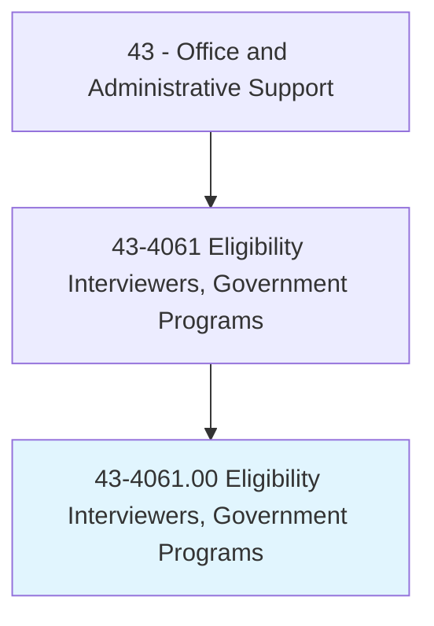
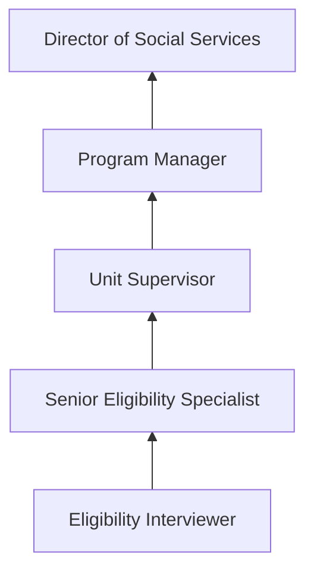
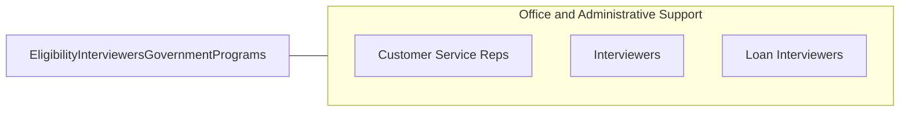

# Eligibility Interviewers, Government Programs

> Determine eligibility of persons applying to receive assistance from government programs and agency resources, such as welfare, unemployment benefits, social security, and public housing.

## Overview

Eligibility Interviewers for Government Programs assess and determine whether applicants qualify for public assistance programs including welfare, unemployment insurance, Social Security benefits, Medicaid, SNAP (food stamps), public housing, and other government-funded services. They interview applicants, verify documentation, explain program requirements, and process applications according to federal and state regulations.

These professionals work primarily in government agencies -- state employment offices, social services departments, Social Security Administration offices, and public housing authorities. They serve diverse populations, many facing difficult life circumstances, requiring both procedural expertise and compassionate customer service. The role involves verifying income, assets, household composition, employment status, and other eligibility criteria.

Eligibility determination requires navigating complex, frequently changing regulations and maintaining detailed case records. Interviewers must balance thoroughness with efficiency, processing applications within mandated timeframes while ensuring accuracy. They use specialized government systems and databases to cross-check information and prevent fraud.

## Classification Hierarchy

## Key Statistics

| Metric | Value |
|--------|-------|
| SOC Code | 43-4061.00 |
| Job Zone | 3 (Medium Preparation) |
| Category | [Office and Administrative Support](/occupations/Administrative/index) |
| Median Annual Salary | $48,200 |
| Employment | ~128,000 |
| Projected Growth | 2% (slower than average) |
| Core Tasks | 45 |
| Source | O*NET |

## Core Tasks

Core task data with GraphDL semantic actions for this occupation is maintained in the data pipeline. See [O*NET 43-4061.00](https://www.onetonline.org/link/summary/43-4061.00) for detailed task information.

## Skills & Competencies

### Technical Skills
- **Government Program Regulations** - Expert
- **Case Management Systems** - Advanced
- **Interview Techniques** - Advanced
- **Eligibility Determination** - Expert
- **Documentation and Verification** - Advanced
- **Benefits Calculation** - Advanced

### Soft Skills
- **Empathy and Compassion** - Critical
- **Communication** - Critical
- **Attention to Detail** - Critical
- **Patience** - Essential
- **Cultural Sensitivity** - Essential
- **Integrity** - Critical

## Education & Certifications

| Requirement | Details |
|-------------|---------|
| Typical Education | Bachelor's degree preferred; associate's with experience |
| Government Caseworker Training | Agency-specific program training |
| Civil Service Exam | Required for many government positions |
| Background Check | Required for government employment |

## Career Progression

## Industry Variations

| Setting | Focus | Unique Aspects |
|---------|-------|----------------|
| Social Services | Welfare, SNAP, Medicaid | Complex eligibility; multi-program coordination; poverty assessment |
| Unemployment | UI benefits | Labor market knowledge; employer verification; job search requirements |
| Social Security | SSI, SSDI | Medical documentation; disability determination; federal regulations |
| Housing | Public housing, Section 8 | Waiting lists; income verification; property inspections |

## Technology & Tools

- **Case Management** - State-specific eligibility systems
- **Benefits Calculation** - Automated eligibility engines
- **Verification** - Database cross-checking, document scanning
- **Communication** - Phone, in-person interview stations

## Related Occupations

## Departments

This occupation typically works in:
- [Social Services](/departments/SocialServices) - Benefits administration
- [Government Administration](/departments/GovernmentAdmin) - Public services
- [Human Services](/departments/HumanServices) - Client assistance
- [Compliance](/departments/Compliance) - Program integrity

---

*Source: O*NET 43-4061.00 - ONETOccupation*
