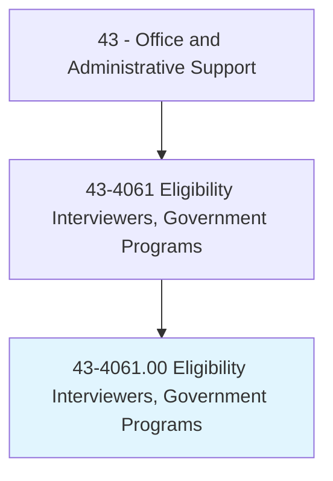
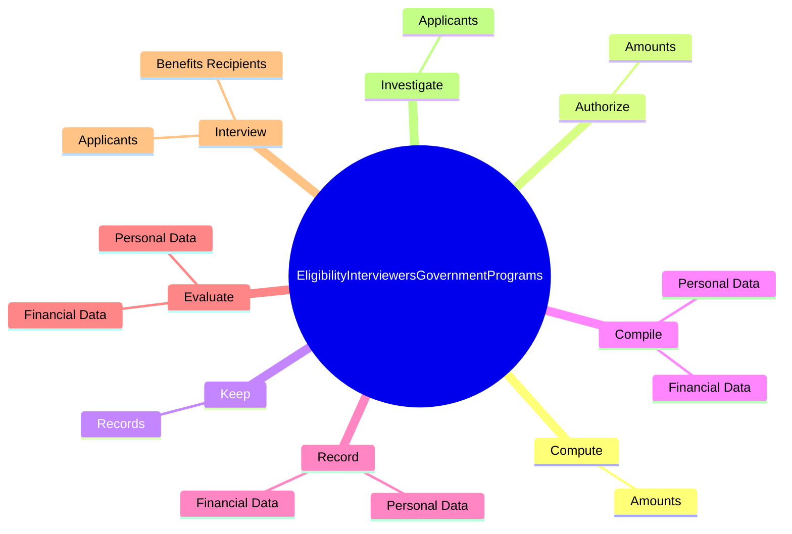
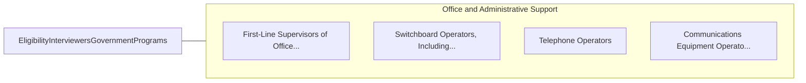

# Eligibility Interviewers, Government Programs

> Determine eligibility of persons applying to receive assistance from government programs and agency resources, such as welfare, unemployment benefits, social security, and public housing.

## Overview

Eligibility Interviewers, Government Programs is classified under Office and Administrative Support (SOC 43). Determine eligibility of persons applying to receive assistance from government programs and agency resources, such as welfare, unemployment benefits, social security, and public housing.

## Classification Hierarchy

## Key Statistics

| Metric | Value |
|--------|-------|
| SOC Code | 43-4061.00 |
| Category | [Office and Administrative Support](/occupations/Administrative) |
| Task Count | 73 |
| Source | O*NET |

## Core Tasks

### compute.Amounts

Eligibility Interviewers, Government Programs compute amounts as part of their core responsibilities.

**Actions:**
- `compute.Amounts.of.Assistance.for.Programs`
- `compute.Amounts.of.Grants`
- `compute.Amounts.of.MonetaryPayments`
- `compute.Amounts.of.FoodStamps`

### authorize.Amounts

Eligibility Interviewers, Government Programs authorize amounts as part of their core responsibilities.

**Actions:**
- `authorize.Amounts.of.Assistance.for.Programs`
- `authorize.Amounts.of.Grants`
- `authorize.Amounts.of.MonetaryPayments`
- `authorize.Amounts.of.FoodStamps`

### keep.Records

Eligibility Interviewers, Government Programs keep records as part of their core responsibilities.

**Actions:**
- `keep.Records.of.AssignedCases`
- `keep.Records.of.PrepareRequiredReports`

## Skills & Competencies

### Technical Skills
- **Office Management** - Advanced
- **Data Entry** - Advanced
- **Records Management** - Advanced

### Soft Skills
- **Communication** - Essential
- **Problem Solving** - Essential
- **Critical Thinking** - Important
- **Teamwork** - Important
- **Adaptability** - Important

## Related Occupations

## Industries

This occupation is found across multiple industries. See [Industries](/industries) for sector-specific employment data.

## Career Progression

---

*Source: O*NET 43-4061.00 - ONETOccupation*
