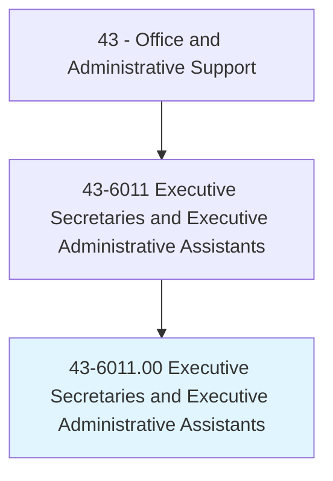
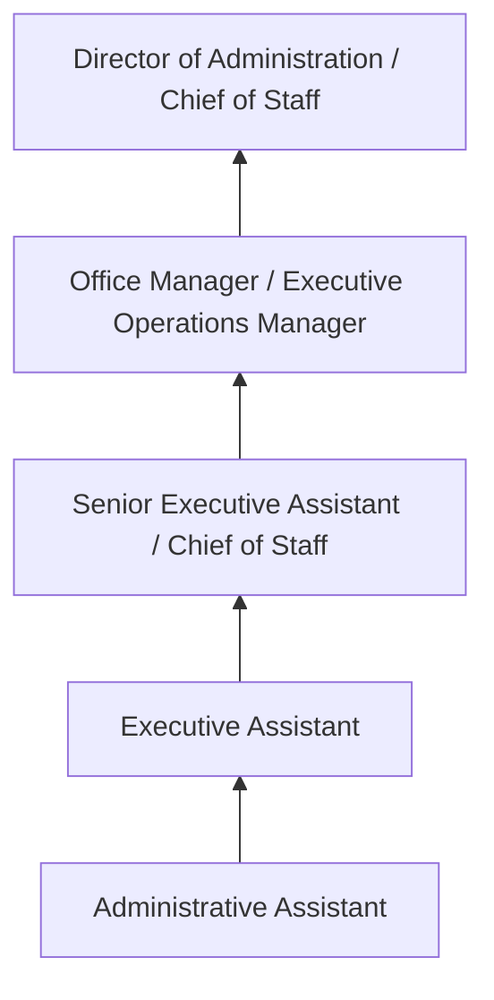
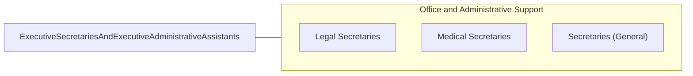

# Executive Secretaries and Executive Administrative Assistants

> Provide high-level administrative support by conducting research, preparing statistical reports, and handling information requests, as well as performing routine administrative functions such as preparing correspondence, receiving visitors, arranging conference calls, and scheduling meetings.

## Overview

Executive Secretaries and Executive Administrative Assistants provide high-level administrative support to senior executives, C-suite officers, and organizational leaders. They manage complex calendars, coordinate meetings and travel, prepare confidential reports and presentations, handle sensitive correspondence, and serve as gatekeepers controlling access to executives' time and attention. Their role requires exceptional organizational skills, discretion, and the ability to anticipate needs.

These professionals operate as the operational right hand of senior leaders, managing information flow, prioritizing communications, and ensuring executives are prepared for meetings, presentations, and decisions. They often coordinate across departments, manage special projects, plan corporate events, and handle budget tracking. In many organizations, executive assistants wield significant informal influence due to their proximity to decision-makers.

The role has evolved from traditional secretarial duties to a strategic support function. Modern executive assistants leverage technology, manage virtual meetings, coordinate global travel, and often serve as project managers for executive initiatives. Top performers develop deep organizational knowledge and become indispensable partners to the leaders they support.

## Classification Hierarchy

## Key Statistics

| Metric | Value |
|--------|-------|
| SOC Code | 43-6011.00 |
| Job Zone | 3 (Medium Preparation) |
| Category | [Office and Administrative Support](/occupations/Administrative/index) |
| Median Annual Salary | $65,980 |
| Employment | ~490,000 |
| Projected Growth | -19% (rapidly declining) |
| Core Tasks | 55 |
| Source | O*NET |

## Core Tasks

Core task data with GraphDL semantic actions for this occupation is maintained in the data pipeline. See [O*NET 43-6011.00](https://www.onetonline.org/link/summary/43-6011.00) for detailed task information.

## Skills & Competencies

### Technical Skills
- **Calendar and Schedule Management** - Expert
- **Meeting Coordination and Minutes** - Advanced
- **Travel Arrangement** - Advanced
- **Document Preparation (Word, PowerPoint, Excel)** - Expert
- **Expense Reporting** - Advanced
- **Event Planning** - Intermediate
- **Confidential Records Management** - Advanced

### Soft Skills
- **Discretion and Confidentiality** - Critical
- **Organizational Skills** - Critical
- **Communication** - Critical
- **Anticipation of Needs** - Essential
- **Professionalism** - Critical
- **Time Management** - Essential
- **Adaptability** - Essential

## Education & Certifications

| Requirement | Details |
|-------------|---------|
| Typical Education | Associate's or bachelor's degree |
| Certified Administrative Professional (CAP) | IAAP professional certification |
| Microsoft Office Specialist (MOS) | Advanced proficiency validation |
| Project Management Certificate | PMP or CAPM beneficial |
| Notary Public | Useful for document processing |

## Career Progression

## Industry Variations

| Setting | Focus | Unique Aspects |
|---------|-------|----------------|
| Corporate | C-suite support | Board meeting coordination; investor relations support; confidential M&A documents |
| Government | Senior official support | Security clearance; protocol; legislative scheduling; constituent management |
| Legal | Managing partner support | Court deadlines; client meetings; billing oversight; case coordination |
| Healthcare | Hospital executive support | Medical staff coordination; regulatory meetings; patient confidentiality |

## Technology & Tools

- **Productivity** - Microsoft 365, Google Workspace
- **Calendar** - Outlook, Google Calendar, scheduling tools
- **Travel** - Concur, TripIt, booking platforms
- **Communication** - Zoom, Teams, Slack
- **Expense** - Concur, Expensify
- **Project Management** - Asana, Trello, Monday.com

## Related Occupations

## Departments

This occupation typically works in:
- [Executive Office](/departments/ExecutiveOffice) - C-suite support
- [Administration](/departments/Administration) - Office management
- [Human Resources](/departments/HumanResources) - HR administrative support
- [Board Relations](/departments/BoardRelations) - Governance support

---

*Source: O*NET 43-6011.00 - ONETOccupation*
