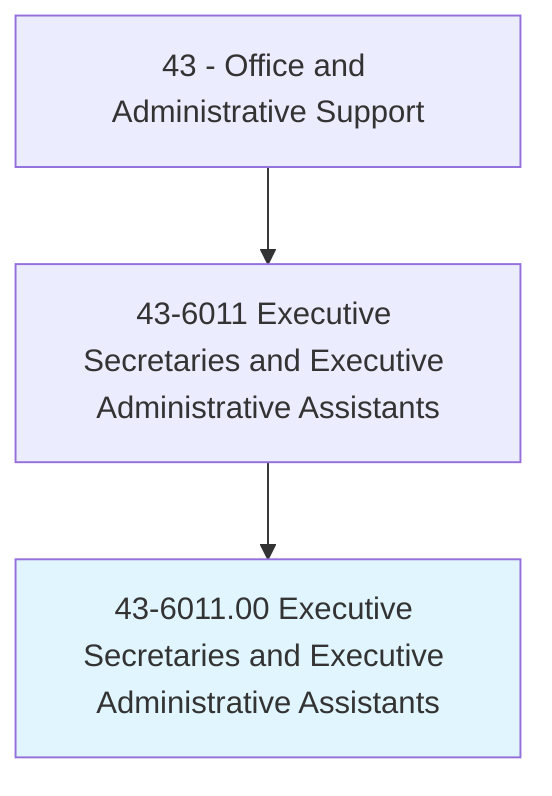
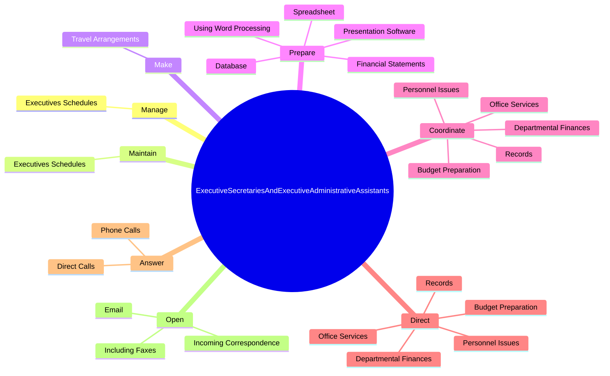
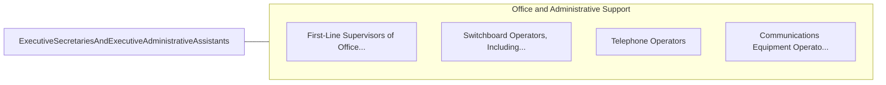

# Executive Secretaries and Executive Administrative Assistants

> Provide high-level administrative support by conducting research, preparing statistical reports, and handling information requests, as well as performing routine administrative functions such as preparing correspondence, receiving visitors, arranging conference calls, and scheduling meetings. May also train and supervise lower-level clerical staff.

## Overview

Executive Secretaries and Executive Administrative Assistants is an occupation within the Office and Administrative Support category. Provide high-level administrative support by conducting research, preparing statistical reports, and handling information requests, as well as performing routine administrative functions such as preparing correspondence, receiving visitors, arranging conference calls, and scheduling meetings. 

## Classification Hierarchy

## Key Statistics

| Metric | Value |
|--------|-------|
| SOC Code | 43-6011.00 |
| Category | [Office and Administrative Support](/occupations/Administrative/index) |
| Task Count | 116 |
| Source | O*NET |

## Core Tasks

### manage.ExecutivesSchedules

Executive Secretaries and Executive Administrative Assistants manage executives schedules as part of their core responsibilities.

**Actions:**
- `manage.ExecutivesSchedules`

### maintain.ExecutivesSchedules

Executive Secretaries and Executive Administrative Assistants maintain executives schedules as part of their core responsibilities.

**Actions:**
- `maintain.ExecutivesSchedules`

### make.TravelArrangements

Executive Secretaries and Executive Administrative Assistants make travel arrangements as part of their core responsibilities.

**Actions:**
- `make.TravelArrangements.for.Executives`

## Skills & Competencies

### Technical Skills
- **Office Management** - Advanced
- **Data Entry** - Advanced
- **Records Management** - Advanced

### Soft Skills
- **Communication** - Essential
- **Problem Solving** - Essential
- **Critical Thinking** - Important
- **Teamwork** - Important
- **Adaptability** - Important

## Related Occupations

## Industries

This occupation is found across multiple industries. See [Industries](/industries) for sector-specific employment data.

## Career Progression

---

*Source: O*NET 43-6011.00 - ONETOccupation*
