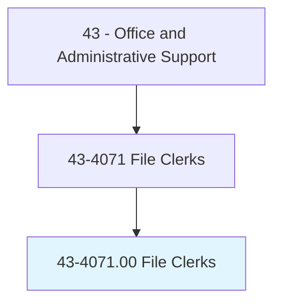
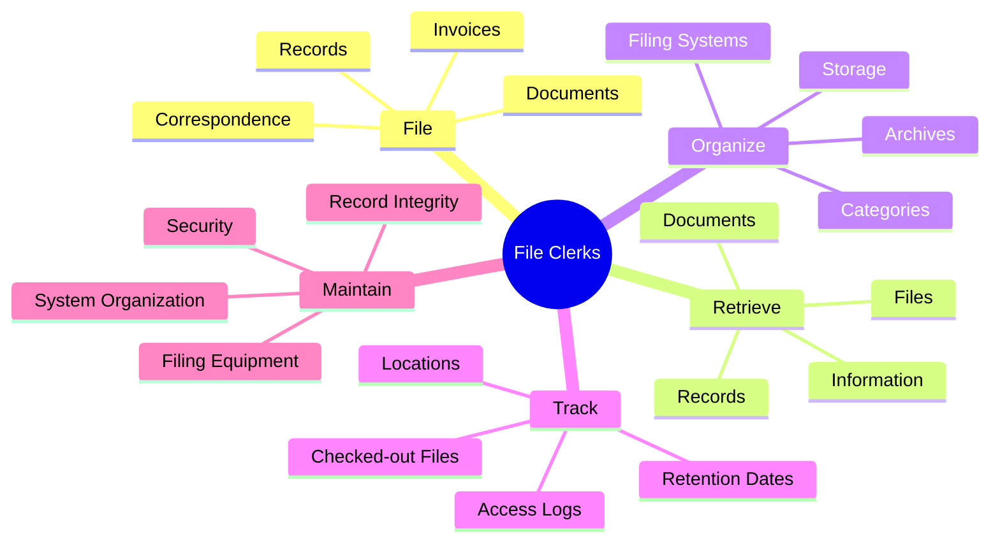
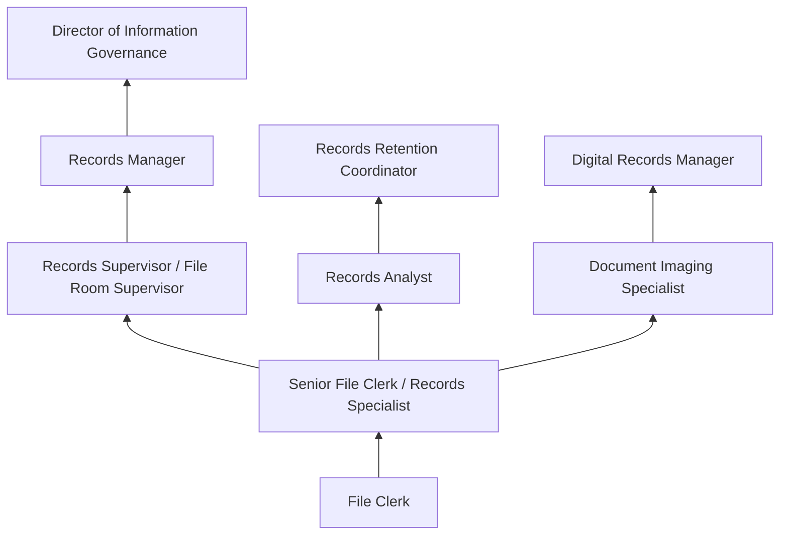
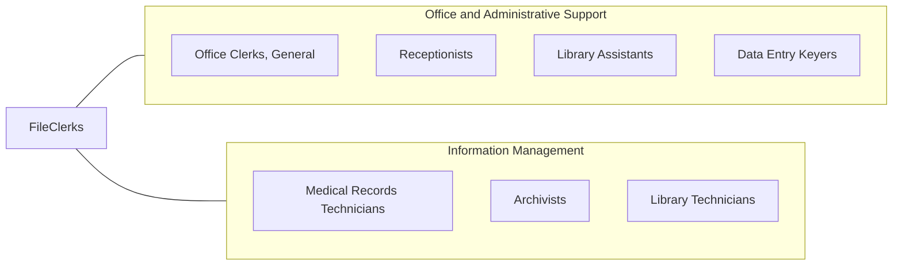

# File Clerks

> File correspondence, cards, invoices, receipts, and other records in alphabetical or numerical order or according to the filing system used. Locate and remove material from file when requested.

## Overview

File Clerks organize, maintain, and retrieve documents and records using established filing systems. They classify and file correspondence, invoices, receipts, contracts, and other business records in alphabetical, numerical, chronological, or subject-matter order. When information is needed, they locate and retrieve files for authorized personnel, track checked-out materials, and maintain the integrity of filing systems.

While digital document management has significantly reduced the volume of physical filing, many organizations still maintain paper records for legal, regulatory, or operational reasons. File clerks working with physical records manage file rooms, archive older documents, prepare materials for offsite storage, and assist with records retention and destruction schedules. Those working with electronic systems manage digital filing structures, scan documents, index records, and maintain electronic document management platforms.

The profession has evolved toward records management and information governance, with clerks increasingly responsible for ensuring compliance with records retention policies, privacy regulations, and document preservation requirements. Healthcare, legal, government, and financial services organizations have particularly robust filing and records management needs, often requiring specialized knowledge of industry-specific regulations such as HIPAA, SOX, or FOIA.

## Classification Hierarchy



## Key Statistics

| Metric | Value |
|--------|-------|
| SOC Code | 43-4071.00 |
| Job Zone | 2 (Some Preparation) |
| Category | [Office and Administrative Support](/occupations/Administrative/index) |
| Median Annual Salary | $35,300 |
| Salary Range | $26,000 - $48,000 |
| 10th Percentile | $26,200 |
| 90th Percentile | $47,800 |
| Employment | ~48,000 |
| Projected Growth | -15% (declining) |
| Annual Openings | ~5,000 |
| Core Tasks | 25 |
| Source | O*NET |

## Core Tasks



### file.Documents

File Clerks organize and store documents systematically.

**Actions:**
- `file.Documents.in.ProperLocation`
- `classify.Records.by.Category`
- `organize.Files.according.to.System`
- `store.Archives.in.Storage`

### retrieve.Records

File Clerks locate and retrieve materials upon request.

**Actions:**
- `retrieve.Files.for.Personnel`
- `locate.Documents.in.FilingSystems`
- `track.CheckedOutMaterials.for.Return`
- `deliver.Records.to.Requestors`

## Skills & Competencies

### Technical Skills
- **Filing Systems (Alpha, Numeric, Subject)** - Expert (multiple classification methods)
- **Records Management** - Advanced (retention schedules, disposition)
- **Document Scanning and Digitization** - Advanced (OCR, indexing)
- **Electronic Document Management** - Advanced (SharePoint, Laserfiche)
- **Records Retention Schedules** - Advanced (legal holds, destruction)
- **Database Systems** - Intermediate (tracking, searching)
- **Microsoft Office** - Advanced (Excel, Word, Outlook)
- **Barcode and RFID Systems** - Intermediate (tracking, inventory)

### Soft Skills
- **Organizational Skills** - Critical (systematic arrangement)
- **Attention to Detail** - Critical (accurate filing, retrieval)
- **Reliability** - Critical (consistent performance)
- **Physical Stamina** - Important (for physical filing operations)
- **Confidentiality** - Critical (protecting sensitive information)
- **Memory and Recall** - Essential (remembering filing locations)
- **Patience** - Essential (repetitive tasks)
- **Time Management** - Important (meeting retrieval requests)

## Education & Certifications

| Requirement | Details |
|-------------|---------|
| Typical Education | High school diploma |
| Preferred Education | Some college or associate's degree |
| Records Management Training | ARMA International courses and workshops |
| Certified Records Manager (CRM) | ICRM professional certification |
| Information Governance Professional (IGP) | ARMA certification |
| HIPAA Training | Required for healthcare settings |
| Privacy Training | Required for handling personal information |
| On-the-Job Training | Short to moderate; system-specific |

## Career Progression



### Career Pathway Details

| Level | Title | Years Experience | Key Responsibilities |
|-------|-------|------------------|----------------------|
| Entry | File Clerk | 0-2 years | Filing, retrieval, basic maintenance |
| Mid | Senior File Clerk / Records Specialist | 2-5 years | Complex filing, training, system maintenance |
| Supervisory | Records Supervisor | 5-8 years | Team oversight, quality control, procedures |
| Management | Records Manager | 8-12 years | Department leadership, policy development, compliance |
| Executive | Director of Information Governance | 12+ years | Enterprise records strategy, legal compliance |

### Transition Paths

| Alternative Path | Skills Applied | Additional Requirements |
|-----------------|----------------|------------------------|
| Legal Secretary | Organization, confidentiality | Legal terminology, procedures |
| Medical Records Tech | Records management, HIPAA | Medical coding, terminology |
| Library Technician | Classification, retrieval | Library science knowledge |
| Administrative Assistant | Organization, office skills | Broader administrative duties |
| Compliance Specialist | Records retention, regulations | Compliance knowledge, analysis |

## Industry Variations

| Setting | Focus | Unique Aspects |
|---------|-------|----------------|
| Healthcare | Medical records filing | HIPAA compliance; chart management; EHR transition support; patient confidentiality |
| Legal | Case file management | Attorney-client privilege; litigation holds; discovery support; court filing |
| Government | Public records management | FOIA compliance; archival standards; retention schedules; public access |
| Financial | Account and transaction records | Regulatory retention; audit support; secure destruction; SOX compliance |
| Insurance | Policy and claims files | Long retention periods; claims history; actuarial access; regulatory filings |
| Real Estate | Property and transaction records | Title documents; closing files; lien records; recording requirements |

### Healthcare Records Management

Healthcare file clerks manage patient charts, medical records, and administrative files within HIPAA regulations. They support the transition from paper to electronic health records, often scanning historical records for digital integration. Understanding of medical record organization, numbering systems, and patient confidentiality is essential.

### Legal Records Management

Legal file clerks maintain case files, client documents, contracts, and court records. They must understand litigation hold requirements, discovery processes, and attorney-client privilege. Many legal records have indefinite retention requirements, creating large archives requiring systematic organization.

### Government Records Management

Government file clerks handle public records subject to Freedom of Information Act requests, archival preservation requirements, and specific retention schedules. They must understand which records are public, confidential, or classified, and manage access accordingly.

### Financial Services Records

Financial industry file clerks maintain records under regulatory retention requirements (SEC, FINRA, state regulators). They support audit processes, manage account documentation, and ensure compliant destruction of expired records. Security and chain of custody are critical.

## Technology & Tools

### Document Management Systems
- **Enterprise DMS** - Laserfiche, SharePoint, M-Files, OpenText
- **Healthcare** - Epic document management, Cerner, MEDITECH
- **Legal** - iManage, NetDocuments, Worldox

### Scanning and Imaging
- **Hardware** - High-speed document scanners, production scanners
- **Software** - OCR (ABBYY, Kofax), indexing tools
- **Quality Control** - Image verification, exception handling

### Records Tracking
- **Check-out Systems** - Barcode tracking, RFID
- **Inventory Management** - Records center databases
- **Retention Management** - Automated destruction scheduling

### Physical Filing Equipment
- **Filing Cabinets** - Lateral, vertical, fireproof
- **Shelving** - Open shelving, high-density mobile shelving
- **Storage** - Banker's boxes, archive containers
- **Labels** - Color coding, barcode labels

### Emerging Technology
- **AI Classification** - Automated document categorization
- **Machine Learning** - Intelligent indexing and search
- **Cloud Storage** - Remote document management
- **Workflow Automation** - Routing, approval, retention

## Related Occupations



### Related Occupation Comparison

| Occupation | Similarity | Key Difference |
|------------|------------|----------------|
| Office Clerks | High | Broader duties vs filing specialization |
| Medical Records Techs | High | Healthcare specialization, coding |
| Library Assistants | Medium | Public service focus, cataloging |
| Data Entry Keyers | Medium | Data input vs physical organization |
| Archivists | Medium | Preservation focus, professional degree |

## Industries

- [Healthcare Facilities](/industries/Healthcare/index) - High Employment
- [Legal Services](/industries/ProfessionalServices/Legal) - High Employment
- [Government](/industries/PublicAdministration) - Moderate Employment
- [Financial Services](/industries/Finance/index) - Moderate Employment
- [Insurance Carriers](/industries/Insurance) - Moderate Employment
- [Educational Institutions](/industries/Education) - Moderate Employment

## Departments

This occupation typically works in:
- Records Management - Filing and records operations center
- Administration - General office support
- [Legal Department](/departments/Legal) - Case file management
- Compliance - Regulatory recordkeeping and retention
- Health Information - Medical records (healthcare settings)
- Central Files - Centralized organizational records

## Work Environment

### Physical Setting
- File rooms, records centers, or archive facilities
- Climate-controlled storage areas for sensitive documents
- Office settings with filing equipment
- May involve basement or warehouse locations

### Work Schedule
- Typically Monday-Friday, standard business hours
- Some positions may require early morning or evening hours
- Deadline pressure around audit periods
- Consistent, routine schedule

### Physical Demands
- Standing for extended periods
- Bending, reaching, and lifting (boxes up to 40 lbs)
- Repetitive motion (filing, sorting)
- Pushing mobile shelving systems
- Walking throughout large file storage areas

### Work Characteristics
- Repetitive, detail-oriented tasks
- Independent work with minimal supervision
- Quiet, organized environment
- Periodic interaction with records requestors
- Exposure to paper dust (potential allergen)

## Records Management Concepts

### Retention Schedules

| Record Type | Typical Retention | Governing Regulation |
|-------------|-------------------|---------------------|
| Tax Records | 7 years | IRS requirements |
| Employment Records | 7 years after termination | EEOC, DOL |
| Medical Records | 6-10 years (varies by state) | HIPAA, state law |
| Contracts | 7 years after expiration | UCC, legal practice |
| Corporate Records | Permanent | State incorporation law |

### Legal Holds
When litigation is anticipated, file clerks must understand legal hold procedures that suspend normal destruction and require preservation of potentially relevant documents. This requires coordination with legal counsel and careful tracking of held materials.

### Privacy and Security
File clerks handling personal information must understand applicable privacy regulations:
- **HIPAA** - Healthcare information
- **GLBA** - Financial information
- **FERPA** - Educational records
- **State Privacy Laws** - Varies by jurisdiction

## GraphDL Semantic Structure

```graphdl
File Clerks perform:
- file.Documents.in.FilingSystems
- retrieve.Records.for.Personnel
- organize.Files.according.to.Categories
- track.CheckedOutMaterials.for.Return
- maintain.FilingSystems.for.Integrity
- scan.Documents.for.Digitization
- archive.Records.for.LongTermStorage
- destroy.Documents.following.RetentionSchedules
```

---

*Source: O*NET 43-4071.00 - ONETOccupation*
