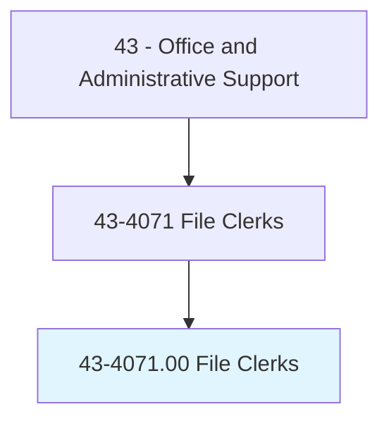
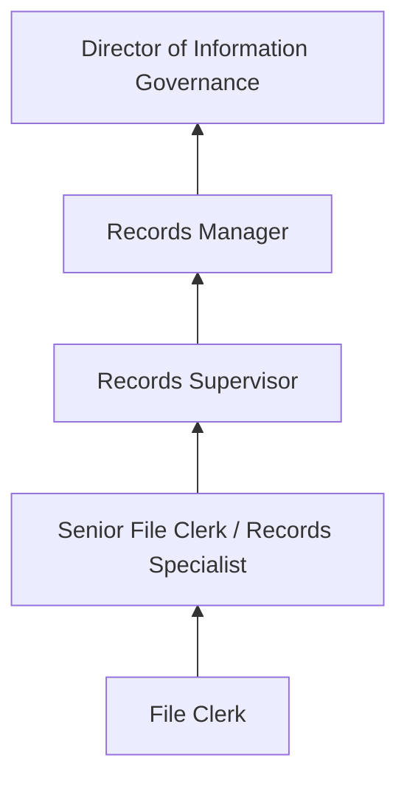
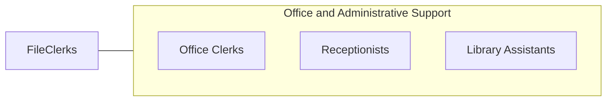

# File Clerks

> File correspondence, cards, invoices, receipts, and other records in alphabetical or numerical order or according to the filing system used. Locate and remove material from file when requested.

## Overview

File Clerks organize, maintain, and retrieve documents and records using established filing systems. They classify and file correspondence, invoices, receipts, contracts, and other business records in alphabetical, numerical, chronological, or subject-matter order. When information is needed, they locate and retrieve files for authorized personnel, track checked-out materials, and maintain the integrity of filing systems.

While digital document management has significantly reduced the volume of physical filing, many organizations still maintain paper records for legal, regulatory, or operational reasons. File clerks working with physical records manage file rooms, archive older documents, prepare materials for offsite storage, and assist with records retention and destruction schedules. Those working with electronic systems manage digital filing structures, scan documents, index records, and maintain electronic document management platforms.

The profession has evolved toward records management and information governance, with clerks increasingly responsible for ensuring compliance with records retention policies, privacy regulations, and document preservation requirements. Healthcare, legal, government, and financial services organizations have particularly robust filing and records management needs.

## Classification Hierarchy

## Key Statistics

| Metric | Value |
|--------|-------|
| SOC Code | 43-4071.00 |
| Job Zone | 2 (Some Preparation) |
| Category | [Office and Administrative Support](/occupations/Administrative/index) |
| Median Annual Salary | $35,300 |
| Employment | ~48,000 |
| Projected Growth | -15% (declining) |
| Core Tasks | 25 |
| Source | O*NET |

## Core Tasks

Core task data with GraphDL semantic actions for this occupation is maintained in the data pipeline. See [O*NET 43-4071.00](https://www.onetonline.org/link/summary/43-4071.00) for detailed task information.

## Skills & Competencies

### Technical Skills
- **Filing Systems (Alpha, Numeric, Subject)** - Expert
- **Records Management** - Advanced
- **Document Scanning and Digitization** - Intermediate
- **Electronic Document Management** - Intermediate
- **Records Retention Schedules** - Intermediate

### Soft Skills
- **Organizational Skills** - Critical
- **Attention to Detail** - Critical
- **Reliability** - Essential
- **Physical Stamina** - Important (for physical filing)
- **Confidentiality** - Essential

## Education & Certifications

| Requirement | Details |
|-------------|---------|
| Typical Education | High school diploma |
| Records Management Training | ARMA International courses |
| Certified Records Manager (CRM) | ICRM professional certification |
| HIPAA Training | Required for healthcare settings |

## Career Progression

## Industry Variations

| Setting | Focus | Unique Aspects |
|---------|-------|----------------|
| Healthcare | Medical records filing | HIPAA compliance; chart management; EHR transition support |
| Legal | Case file management | Attorney-client privilege; litigation holds; discovery support |
| Government | Public records management | FOIA compliance; archival standards; retention schedules |
| Financial | Account and transaction records | Regulatory retention; audit support; secure destruction |

## Technology & Tools

- **Document Management** - Laserfiche, SharePoint, M-Files
- **Scanning** - Document scanners, OCR software
- **Records Tracking** - Check-out/in systems
- **Office Equipment** - Label makers, filing cabinets, barcode systems

## Related Occupations

## Departments

This occupation typically works in:
- [Records Management](/departments/Records) - Filing and records operations
- [Administration](/departments/Administration) - Office support
- [Legal Department](/departments/Legal) - Case file management
- [Compliance](/departments/Compliance) - Regulatory records

---

*Source: O*NET 43-4071.00 - ONETOccupation*
