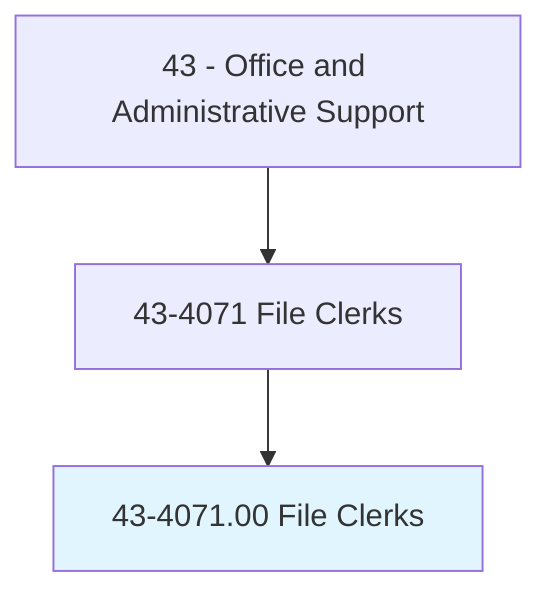
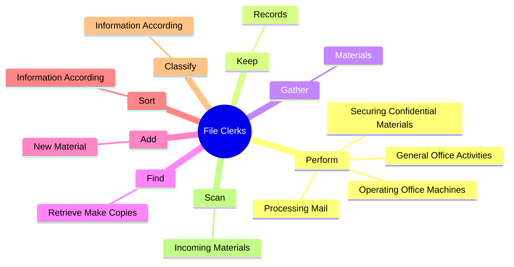
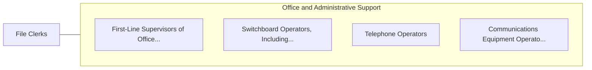

# File Clerks

> File correspondence, cards, invoices, receipts, and other records in alphabetical or numerical order or according to the filing system used. Locate and remove material from file when requested.

## Overview

File Clerks is an occupation within the Office and Administrative Support category. File correspondence, cards, invoices, receipts, and other records in alphabetical or numerical order or according to the filing system used. 

## Classification Hierarchy

## Key Statistics

| Metric | Value |
|--------|-------|
| SOC Code | 43-4071.00 |
| Category | [Office and Administrative Support](/occupations/Administrative/index) |
| Task Count | 90 |
| Source | O*NET |

## Core Tasks

### perform.GeneralOfficeActivities

File Clerks perform general office activities as part of their core responsibilities.

**Actions:**
- `perform.GeneralOfficeActivities`
- `perform.OperatingOfficeMachines`
- `perform.ProcessingMail`
- `perform.SecuringConfidentialMaterials`

### keep.Records

File Clerks keep records as part of their core responsibilities.

**Actions:**
- `keep.Records.of.MaterialsFiled`
- `keep.Records.of.Removed`
- `keep.Records.of.UsingLogbooks`
- `keep.Records.of.Computers`

### gather.Materials

File Clerks gather materials as part of their core responsibilities.

**Actions:**
- `gather.Materials.to.BeFiledFromDepartments`
- `gather.Materials.to.Employees`

## Skills & Competencies

### Technical Skills
- **Office Management** - Advanced
- **Data Entry** - Advanced
- **Records Management** - Advanced

### Soft Skills
- **Communication** - Essential
- **Problem Solving** - Essential
- **Critical Thinking** - Important
- **Teamwork** - Important
- **Adaptability** - Important

## Related Occupations

## Industries

This occupation is found across multiple industries. See [Industries](/industries) for sector-specific employment data.

## Career Progression

---

*Source: O*NET 43-4071.00 - ONETOccupation*
