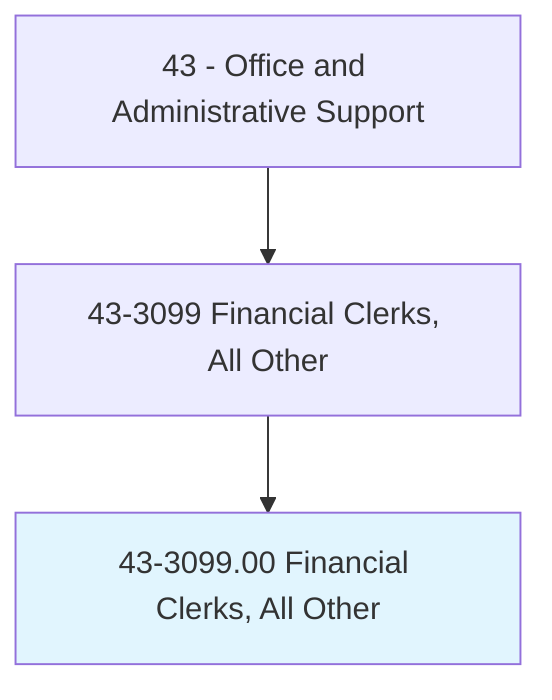
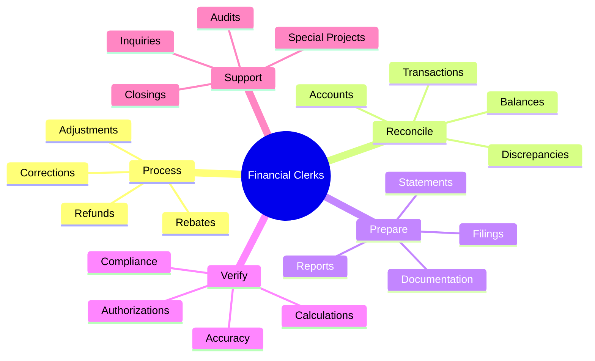
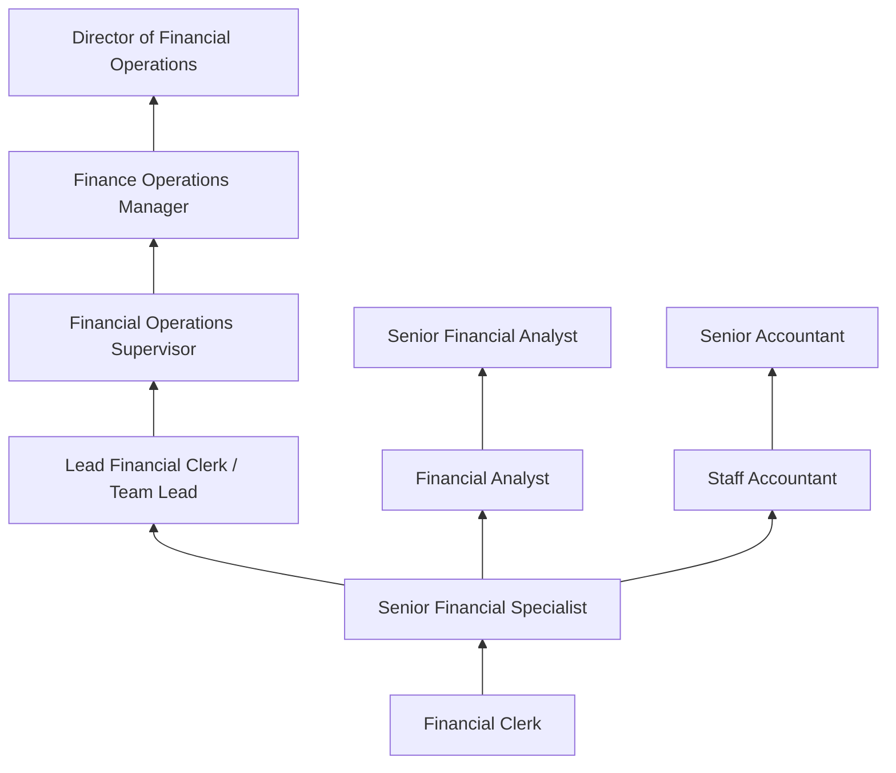
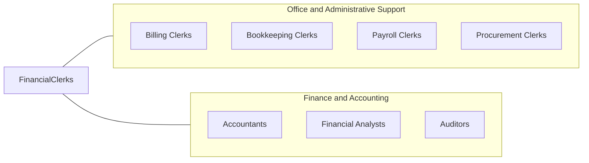

# Financial Clerks, All Other

> All financial clerks not listed separately.

## Overview

Financial Clerks, All Other encompasses specialized financial clerical workers whose duties do not fall into other classified categories such as billing, bookkeeping, payroll, or procurement clerks. This residual category includes positions such as accounts adjustment clerks, rebate processors, financial records specialists, escrow assistants, trust administrators' clerks, dividend clerks, and other specialized financial support roles.

These professionals handle a variety of financial transactions and records that support organizational financial operations. Their work may include processing refunds, adjusting account balances, reconciling financial discrepancies, preparing financial documentation, and supporting audit and compliance activities. Each role requires understanding of financial principles, attention to accuracy, and proficiency with financial systems.

The diversity of this category reflects the specialized nature of financial operations across industries, where unique business processes create need for clerks with specific expertise that transcends standard classification boundaries. Many positions in this category support complex financial products, specialized accounting functions, or industry-specific financial processes that require dedicated clerical support.

## Classification Hierarchy



## Key Statistics

| Metric | Value |
|--------|-------|
| SOC Code | 43-3099.00 |
| Job Zone | 2 (Some Preparation) |
| Category | [Office and Administrative Support](/occupations/Administrative/index) |
| Median Annual Salary | $43,100 |
| Salary Range | $30,000 - $58,000 |
| 10th Percentile | $30,500 |
| 90th Percentile | $57,800 |
| Employment | ~65,000 |
| Projected Growth | 1% (slower than average) |
| Annual Openings | ~7,000 |
| Core Tasks | Varies |
| Source | O*NET |

## Core Tasks



### process.Transactions

Financial Clerks process specialized financial transactions.

**Actions:**
- `process.Adjustments.to.Accounts`
- `process.Refunds.for.Customers`
- `process.Rebates.according.to.Programs`
- `correct.Errors.in.FinancialRecords`

### reconcile.Accounts

Financial Clerks reconcile accounts and resolve discrepancies.

**Actions:**
- `reconcile.Accounts.for.Accuracy`
- `identify.Discrepancies.in.Transactions`
- `research.Errors.to.ResolveDifferences`
- `balance.Records.to.ControlTotals`

## Skills & Competencies

### Technical Skills
- **Financial Recordkeeping** - Expert (ledgers, journals, transaction records)
- **Accounting Software** - Advanced (QuickBooks, Sage, Oracle, SAP)
- **Data Entry and Verification** - Expert (high accuracy, volume processing)
- **Spreadsheet Applications** - Expert (Excel formulas, pivot tables, VLOOKUP)
- **Financial Regulations** - Intermediate (SOX, industry-specific rules)
- **ERP Systems** - Advanced (SAP, Oracle, NetSuite)
- **Reconciliation Techniques** - Advanced (three-way matching, variance analysis)
- **Financial Math** - Advanced (interest calculations, proration, allocations)

### Soft Skills
- **Attention to Detail** - Critical (accuracy in financial records)
- **Accuracy** - Critical (error-free processing)
- **Organizational Skills** - Essential (managing multiple accounts/tasks)
- **Analytical Thinking** - Essential (identifying and resolving discrepancies)
- **Communication** - Important (explaining financial information)
- **Integrity** - Critical (ethical handling of financial data)
- **Problem Solving** - Essential (researching and resolving issues)
- **Time Management** - Important (meeting deadlines and closings)

## Education & Certifications

| Requirement | Details |
|-------------|---------|
| Typical Education | High school diploma; associate's preferred |
| Preferred Degree | Associate's or Bachelor's in Accounting, Finance, or Business |
| Bookkeeping Certification | AIPB Certified Bookkeeper or NACPB |
| QuickBooks Certification | Intuit QuickBooks Certified User |
| Microsoft Excel Certification | MOS Expert level |
| Industry-Specific Training | Company and role-specific programs |
| Continuing Education | Regulatory updates, software training |
| On-the-Job Training | Moderate; company-specific processes |

## Career Progression



### Career Pathway Details

| Level | Title | Years Experience | Key Responsibilities |
|-------|-------|------------------|----------------------|
| Entry | Financial Clerk | 0-2 years | Transaction processing, data entry, basic reconciliation |
| Mid | Senior Financial Specialist | 2-5 years | Complex transactions, exception handling, training |
| Lead | Lead Financial Clerk | 5-7 years | Team coordination, quality control, process improvement |
| Supervisory | Financial Operations Supervisor | 7-10 years | Team management, performance monitoring, procedure development |
| Management | Finance Operations Manager | 10-15 years | Department leadership, process optimization, reporting |
| Executive | Director of Financial Operations | 15+ years | Strategic operations, technology implementation, executive reporting |

## Industry Variations

| Setting | Focus | Unique Aspects |
|---------|-------|----------------|
| Banking | Account adjustments, trust administration | Regulatory compliance; audit support; customer account management; interest calculations |
| Insurance | Claims processing, premium adjustments | Policy details; regulatory filings; actuarial support; commission calculations |
| Government | Budget support, grants processing | Fund accounting; compliance reporting; public accountability; appropriations |
| Corporate | AP/AR support, expense processing | Month-end close; reconciliation; audit preparation; intercompany transactions |
| Real Estate | Escrow processing, closing support | Title calculations; proration; disbursement; regulatory compliance |
| Investment | Dividend processing, asset transfers | Securities regulations; custody; corporate actions; beneficial owner records |

### Banking Financial Clerks

Bank financial clerks handle trust account administration, dividend processing, estate settlements, wire transfer support, and account reconciliation. They work with complex regulatory requirements including FDIC, OCC, and state banking regulations. Trust and estate work requires understanding of fiduciary responsibilities and legal documentation.

### Insurance Financial Clerks

Insurance financial clerks process premium calculations, commission payments, claims adjustments, and regulatory filings. They support actuarial functions with data preparation and maintain policy-level financial records. State insurance regulations vary significantly, requiring awareness of jurisdiction-specific requirements.

### Corporate Financial Clerks

Corporate financial clerks support accounts payable, accounts receivable, expense reporting, and general ledger functions not covered by standard classifications. They handle intercompany transactions, accruals, and closing entries. Understanding of GAAP principles and internal controls is essential.

### Real Estate Financial Clerks

Escrow clerks and closing assistants prepare settlement statements, calculate prorations, process disbursements, and maintain escrow accounts. They work under tight closing deadlines with multiple parties and must understand real estate transaction documentation and regulations.

## Technology & Tools

### Financial Software
- **Accounting Systems** - QuickBooks, Sage, Oracle Financials, SAP
- **ERP Systems** - SAP, NetSuite, Microsoft Dynamics
- **Banking Systems** - Core banking platforms, trust systems
- **Specialized Systems** - Escrow platforms, claims systems

### Productivity Tools
- **Spreadsheets** - Microsoft Excel (advanced functions required)
- **Google Sheets** - Collaborative spreadsheets
- **Database** - Access, SQL queries
- **Document Management** - SharePoint, OneDrive

### Reconciliation Tools
- **Automated Matching** - BlackLine, Trintech, ReconArt
- **Bank Reconciliation** - Automated clearing and matching
- **Exception Management** - Workflow systems for discrepancy resolution

### Emerging Technology
- **RPA (Robotic Process Automation)** - Automated transaction processing
- **AI/ML** - Intelligent matching, anomaly detection
- **Cloud Accounting** - Remote access, real-time processing
- **Blockchain** - Transaction verification, audit trails

## Related Occupations



### Related Occupation Comparison

| Occupation | Similarity | Key Difference |
|------------|------------|----------------|
| Bookkeeping Clerks | High | Full-cycle bookkeeping vs specialized functions |
| Billing Clerks | High | Invoicing focus vs transaction processing |
| Payroll Clerks | Medium | Payroll-specific vs general financial |
| Accountants | Medium | Professional judgment vs clerical processing |

## Industries

- [Banking and Depository Institutions](/industries/Finance/Banking) - High Employment
- [Insurance Carriers](/industries/Insurance) - High Employment
- [Corporate Finance](/industries/Finance/index) - Moderate Employment
- [Real Estate](/industries/RealEstate) - Moderate Employment
- [Government](/industries/PublicAdministration) - Moderate Employment
- [Securities and Investments](/industries/Finance/Securities) - Moderate Employment

## Departments

This occupation typically works in:
- [Finance Department](/departments/Finance) - Financial operations and transaction processing
- Accounting - Transaction support and reconciliation
- Treasury - Cash management support and bank operations
- Compliance - Regulatory recordkeeping and reporting
- Trust Administration - Estate and trust processing
- Operations - Back-office financial processing

## Work Environment

### Physical Setting
- Climate-controlled office environment
- Desk-based work with computer equipment
- Open office or cubicle configurations
- Some positions offer remote work opportunities

### Work Schedule
- Typically Monday-Friday, standard business hours
- Month-end and quarter-end may require extended hours
- Year-end closing creates peak workloads
- Some positions require deadline adherence

### Work Characteristics
- High volume transaction processing
- Deadline-driven work (closings, filings)
- Accuracy-critical tasks
- Detailed documentation requirements
- Regulatory compliance focus

### Challenges
- Meeting accuracy standards under volume pressure
- Staying current with regulatory changes
- Managing multiple deadlines simultaneously
- Resolving complex discrepancies
- Adapting to system changes and upgrades

## Internal Controls

### Control Environment
Financial clerks work within internal control frameworks requiring:
- **Segregation of Duties** - Separation of authorization, custody, and recording
- **Authorization Limits** - Approval thresholds for transactions
- **Reconciliation** - Independent verification of balances
- **Documentation** - Audit trail for all transactions
- **Review and Approval** - Supervisory oversight

### SOX Compliance (Publicly Traded Companies)
- Documentation of control procedures
- Testing of control effectiveness
- Timely resolution of control deficiencies
- Management certification support

## GraphDL Semantic Structure

```graphdl
Financial Clerks, All Other perform:
- process.Transactions.for.FinancialRecords
- reconcile.Accounts.to.EnsureAccuracy
- verify.Calculations.for.Correctness
- prepare.Documentation.for.Processing
- support.Audits.with.Records
- research.Discrepancies.to.Resolve
- maintain.Records.for.Compliance
- coordinate.Activities.with.Departments
```

---

*Source: O*NET 43-3099.00 - ONETOccupation*
