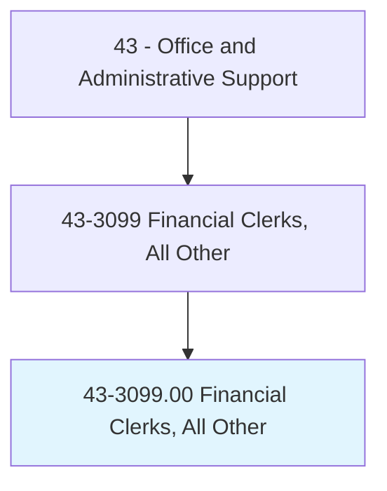
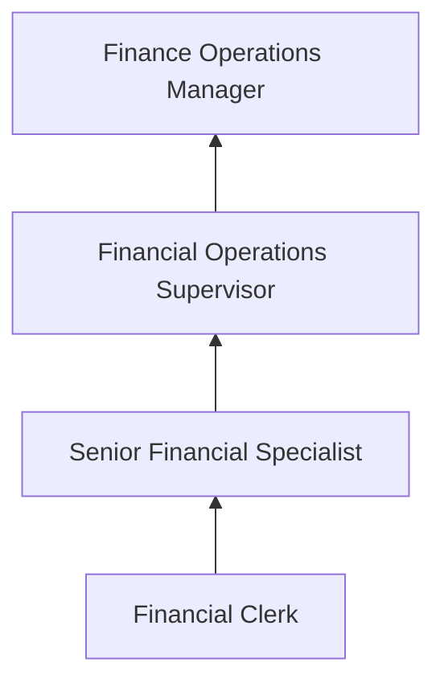

# Financial Clerks, All Other

> All financial clerks not listed separately.

## Overview

Financial Clerks, All Other encompasses specialized financial clerical workers whose duties do not fall into other classified categories such as billing, bookkeeping, payroll, or procurement clerks. This residual category includes positions such as accounts adjustment clerks, rebate processors, financial records specialists, escrow assistants, trust administrators' clerks, and other specialized financial support roles.

These professionals handle a variety of financial transactions and records that support organizational financial operations. Their work may include processing refunds, adjusting account balances, reconciling financial discrepancies, preparing financial documentation, and supporting audit and compliance activities. Each role requires understanding of financial principles and attention to accuracy.

The diversity of this category reflects the specialized nature of financial operations across industries, where unique business processes create need for clerks with specific expertise that transcends standard classification boundaries.

## Classification Hierarchy

## Key Statistics

| Metric | Value |
|--------|-------|
| SOC Code | 43-3099.00 |
| Job Zone | 2 (Some Preparation) |
| Category | [Office and Administrative Support](/occupations/Administrative/index) |
| Median Annual Salary | $43,100 |
| Employment | ~65,000 |
| Projected Growth | 1% (slower than average) |
| Core Tasks | Varies |
| Source | O*NET |

## Core Tasks

Core task data with GraphDL semantic actions for this occupation is maintained in the data pipeline. See [O*NET 43-3099.00](https://www.onetonline.org/link/summary/43-3099.00) for detailed task information.

## Skills & Competencies

### Technical Skills
- **Financial Recordkeeping** - Advanced
- **Accounting Software** - Intermediate
- **Data Entry and Verification** - Advanced
- **Spreadsheet Applications** - Advanced
- **Financial Regulations** - Intermediate

### Soft Skills
- **Attention to Detail** - Critical
- **Accuracy** - Critical
- **Organizational Skills** - Essential
- **Communication** - Important
- **Integrity** - Essential

## Education & Certifications

| Requirement | Details |
|-------------|---------|
| Typical Education | High school diploma; associate's preferred |
| Bookkeeping Certification | AIPB or NACPB credentials |
| Industry-Specific Training | Company and role-specific |
| Microsoft Excel Certification | Advanced spreadsheet proficiency |

## Career Progression

## Industry Variations

| Setting | Focus | Unique Aspects |
|---------|-------|----------------|
| Banking | Account adjustments, trust administration | Regulatory compliance; audit support; customer account management |
| Insurance | Claims processing, premium adjustments | Policy details; regulatory filings; actuarial support |
| Government | Budget support, grants processing | Fund accounting; compliance reporting; public accountability |
| Corporate | AP/AR support, expense processing | Month-end close; reconciliation; audit preparation |

## Technology & Tools

- **Accounting Software** - QuickBooks, Sage, Oracle
- **ERP Systems** - SAP, NetSuite
- **Spreadsheets** - Excel, Google Sheets
- **Banking Systems** - Core banking platforms

## Related Occupations

## Departments

This occupation typically works in:
- [Finance Department](/departments/Finance) - Financial operations
- Accounting - Transaction processing
- Treasury - Cash management support
- Compliance - Regulatory recordkeeping

---

*Source: O*NET 43-3099.00 - ONETOccupation*
