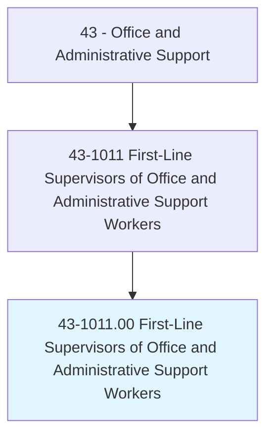
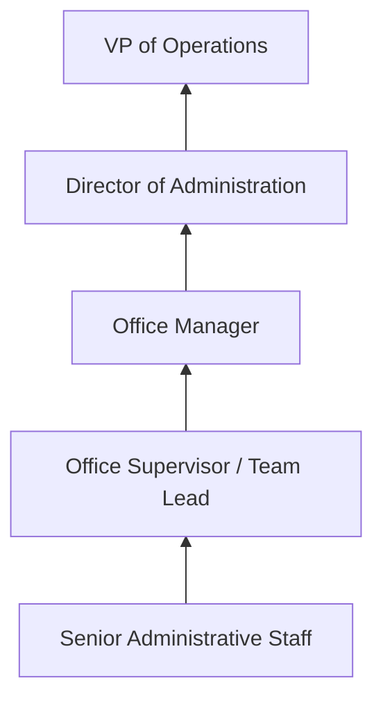
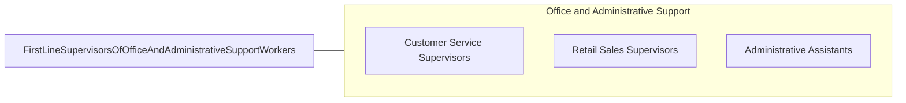

# First-Line Supervisors of Office and Administrative Support Workers

> Directly supervise and coordinate the activities of clerical and administrative support workers.

## Overview

First-Line Supervisors of Office and Administrative Support Workers manage and coordinate the activities of clerical, secretarial, data entry, customer service, and other administrative support staff. They oversee daily operations, assign tasks, monitor performance, train employees, resolve workplace issues, and ensure that office functions are performed efficiently and in compliance with organizational standards.

These supervisors serve as the bridge between management and front-line office workers, translating organizational objectives into operational procedures and workflows. They manage staffing schedules, conduct performance evaluations, recommend hiring and disciplinary actions, and implement process improvements. Many also handle escalated customer issues and ensure service quality standards are maintained.

The role requires a combination of administrative expertise, leadership ability, and operational management skills. Supervisors must understand the functions they oversee well enough to train others, troubleshoot problems, and identify improvement opportunities. This position is one of the most common supervisory roles in the economy, found in virtually every organization with administrative support functions.

## Classification Hierarchy

## Key Statistics

| Metric | Value |
|--------|-------|
| SOC Code | 43-1011.00 |
| Job Zone | 3 (Medium Preparation) |
| Category | [Office and Administrative Support](/occupations/Administrative/index) |
| Median Annual Salary | $63,450 |
| Employment | ~1,480,000 |
| Projected Growth | -6% (declining) |
| Core Tasks | 50 |
| Source | O*NET |

## Core Tasks

Core task data with GraphDL semantic actions for this occupation is maintained in the data pipeline. See [O*NET 43-1011.00](https://www.onetonline.org/link/summary/43-1011.00) for detailed task information.

## Skills & Competencies

### Technical Skills
- **Office Operations Management** - Expert
- **Staff Scheduling and Labor Management** - Advanced
- **Performance Management** - Advanced
- **Process Improvement** - Intermediate
- **Office Technology and Systems** - Advanced
- **Budget Management** - Intermediate
- **Policy and Procedure Development** - Intermediate

### Soft Skills
- **Leadership** - Critical
- **Communication** - Critical
- **Problem Solving** - Essential
- **Decision Making** - Essential
- **Coaching and Development** - Essential
- **Conflict Resolution** - Essential
- **Organization** - Essential

## Education & Certifications

| Requirement | Details |
|-------------|---------|
| Typical Education | High school diploma to bachelor's degree |
| Certified Administrative Professional (CAP) | IAAP certification |
| Certified Manager (CM) | ICPM certification |
| Project Management Certificate | PMP or CAPM |
| Leadership Development | Company-specific management programs |

## Career Progression

## Industry Variations

| Setting | Focus | Unique Aspects |
|---------|-------|----------------|
| Corporate | Multi-department office oversight | Large teams; diverse functions; process standardization |
| Government | Administrative unit supervision | Civil service rules; union environments; regulatory procedures |
| Healthcare | Medical office management | Clinical-administrative interface; patient privacy; scheduling complexity |
| Financial Services | Operations center supervision | Transaction accuracy; compliance monitoring; customer service standards |

## Technology & Tools

- **Office Suites** - Microsoft 365, Google Workspace
- **Workforce Management** - Kronos, Deputy, When I Work
- **Communication** - Teams, Slack, phone systems
- **Project Management** - Asana, Trello
- **HR Systems** - ADP, Workday
- **Reporting** - Excel, Power BI

## Related Occupations

## Departments

This occupation typically works in:
- Administration - Office operations management
- Human Resources - Staff management
- [Operations](/departments/Operations) - Process oversight
- Customer Service - Service team supervision

---

*Source: O*NET 43-1011.00 - ONETOccupation*
