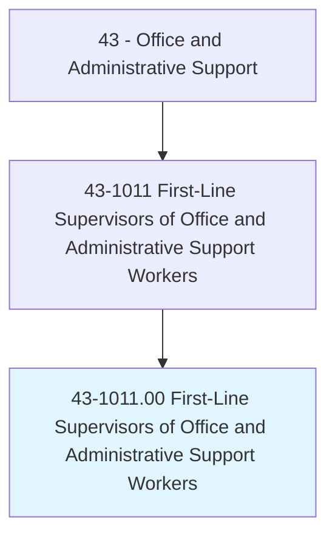
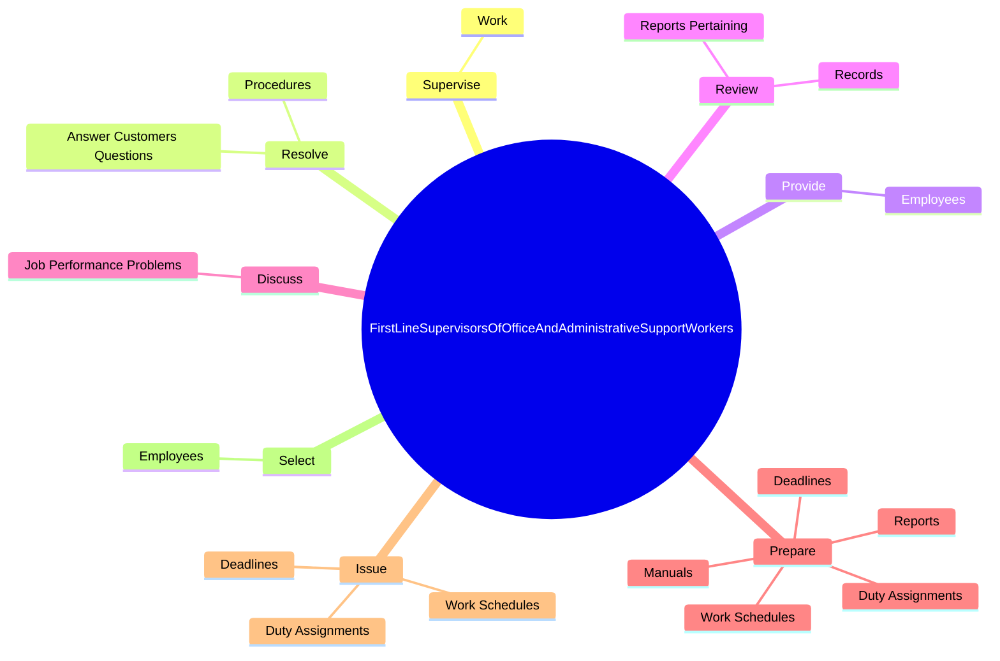
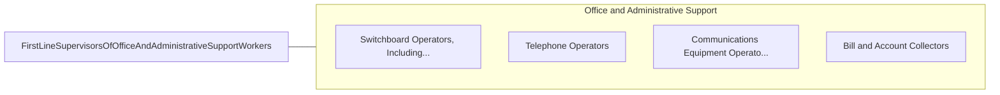

# First-Line Supervisors of Office and Administrative Support Workers

> Directly supervise and coordinate the activities of clerical and administrative support workers.

## Overview

First-Line Supervisors of Office and Administrative Support Workers is classified under Office and Administrative Support (SOC 43). Directly supervise and coordinate the activities of clerical and administrative support workers.

## Classification Hierarchy

## Key Statistics

| Metric | Value |
|--------|-------|
| SOC Code | 43-1011.00 |
| Category | [Office and Administrative Support](/occupations/Administrative/index) |
| Task Count | 156 |
| Source | O*NET |

## Core Tasks

### supervise.Work

First-Line Supervisors of Office and Administrative Support Workers supervise work as part of their core responsibilities.

**Actions:**
- `supervise.Work.of.Office`
- `supervise.Work.of.Administrative`
- `supervise.Work.of.CustomerserviceEmployees.to.ensure.AdherenceToQualityStandards`
- `supervise.Work.of.Deadlines`

### resolve.AnswerCustomersQuestions

First-Line Supervisors of Office and Administrative Support Workers resolve answer customers questions as part of their core responsibilities.

**Actions:**
- `resolve.AnswerCustomersQuestions.regarding.Policies`
- `resolve.Procedures`

### provide.Employees

First-Line Supervisors of Office and Administrative Support Workers provide employees as part of their core responsibilities.

**Actions:**
- `provide.Employees.with.Guidance.in.HandlingDifficultProblemsInResolvingEscalatedComplaintsDisputes`
- `provide.Employees.with.ComplexProblems.in.ResolvingEscalatedComplaintsDisputes`

## Skills & Competencies

### Technical Skills
- **Office Management** - Advanced
- **Data Entry** - Advanced
- **Records Management** - Advanced

### Soft Skills
- **Communication** - Essential
- **Problem Solving** - Essential
- **Critical Thinking** - Important
- **Teamwork** - Important
- **Adaptability** - Important

## Related Occupations

## Industries

This occupation is found across multiple industries. See [Industries](/industries) for sector-specific employment data.

## Career Progression

---

*Source: O*NET 43-1011.00 - ONETOccupation*
