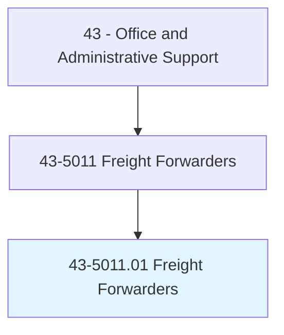
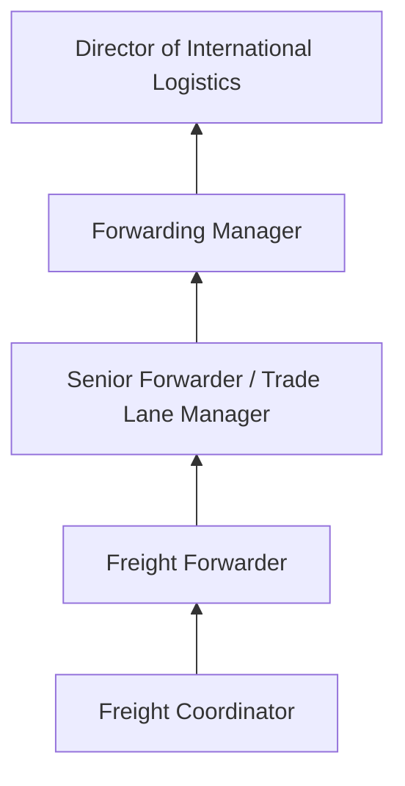
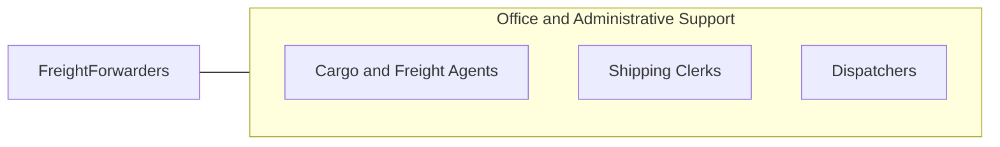

# Freight Forwarders

> Research rates, routings, or modes of transport for shipment of products. Maintain awareness of regulations affecting the international movement of cargo.

## Overview

Freight Forwarders specialize in arranging the transportation of goods on behalf of shippers, coordinating the complex logistics of international and domestic cargo movement. They research optimal shipping routes, negotiate rates with carriers, prepare export/import documentation, arrange customs clearance, and ensure compliance with international trade regulations. They act as intermediaries between shippers and transportation carriers.

Working for freight forwarding companies, logistics firms, or as independent agents, these professionals manage the end-to-end movement of goods across borders. They must understand international trade law, customs procedures, Incoterms, letters of credit, and the documentation requirements of different countries. Their expertise helps businesses navigate the complexities of global supply chains.

The profession has grown with globalization and e-commerce, as more businesses require expertise in moving goods across international borders efficiently and compliantly.

## Classification Hierarchy

## Key Statistics

| Metric | Value |
|--------|-------|
| SOC Code | 43-5011.01 |
| Job Zone | 3 (Medium Preparation) |
| Category | [Office and Administrative Support](/occupations/Administrative/index) |
| Median Annual Salary | $49,200 |
| Employment | ~25,000 |
| Projected Growth | 6% (faster than average) |
| Core Tasks | 45 |
| Source | O*NET |

## Core Tasks

Core task data with GraphDL semantic actions for this occupation is maintained in the data pipeline. See [O*NET 43-5011.01](https://www.onetonline.org/link/summary/43-5011.01) for detailed task information.

## Skills & Competencies

### Technical Skills
- **International Shipping Regulations** - Expert
- **Customs Documentation** - Expert
- **Rate Negotiation** - Advanced
- **Transportation Management Systems** - Advanced
- **Incoterms and Trade Finance** - Advanced
- **Hazmat Shipping** - Intermediate

### Soft Skills
- **Problem Solving** - Critical
- **Communication** - Critical
- **Negotiation** - Essential
- **Attention to Detail** - Critical
- **Multitasking** - Essential

## Education & Certifications

| Requirement | Details |
|-------------|---------|
| Typical Education | Associate's or bachelor's degree |
| Licensed Customs Broker | Required for customs brokerage |
| Certified International Freight Forwarder | FIATA diploma |
| HAZMAT Certification | Required for dangerous goods |

## Career Progression

## Industry Variations

| Setting | Focus | Unique Aspects |
|---------|-------|----------------|
| Ocean Freight | Container shipping | FCL/LCL; port operations; demurrage management |
| Air Freight | Express and charter cargo | Time-sensitive; weight restrictions; airport procedures |
| Cross-Border Ground | Trucking across borders | Customs clearance; bonded transport; free trade zones |
| Project Cargo | Oversized and heavy lift | Specialized equipment; permits; route surveys |

## Technology & Tools

- **TMS** - CargoWise, Descartes, SAP TM
- **Customs** - ABI, ACE portal, customs filing systems
- **Documentation** - Electronic bills of lading, AES filing
- **Communication** - Email, phone, EDI

## Related Occupations

## Departments

This occupation typically works in:
- [Logistics](/departments/SupplyChain) - International shipping
- Trade Compliance - Customs and regulations
- [Operations](/departments/Operations) - Cargo coordination
- Customer Service - Client support

---

*Source: O*NET 43-5011.01 - ONETOccupation*
