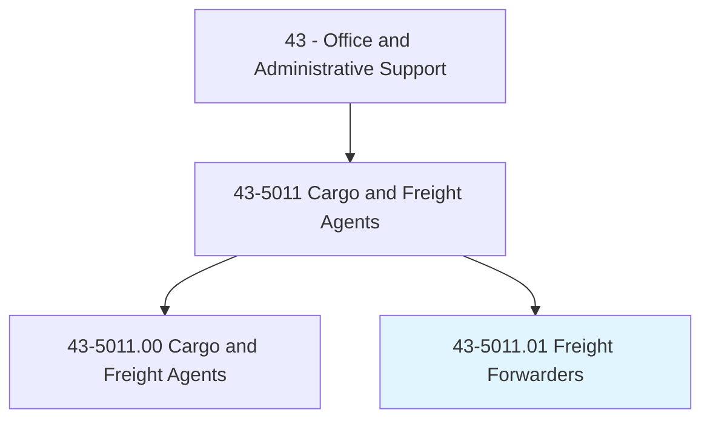
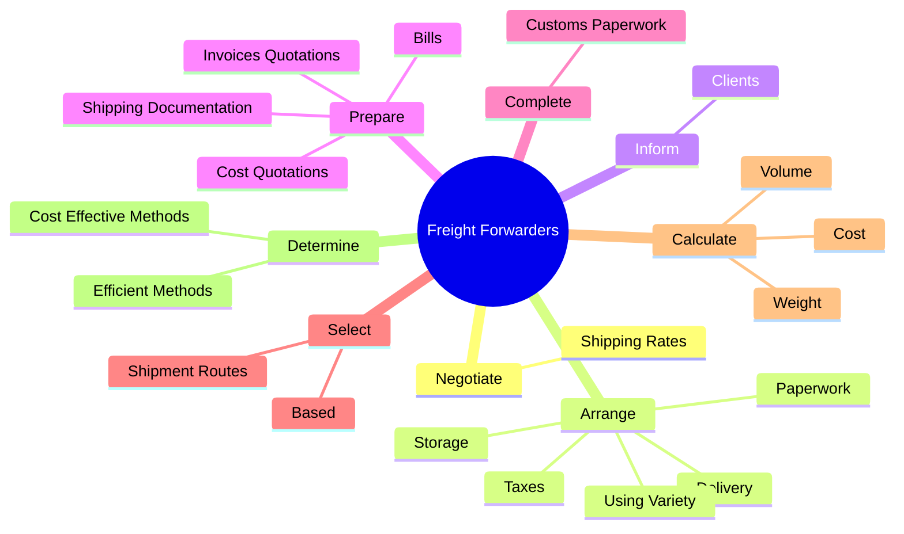
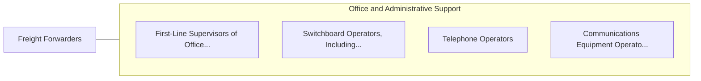

# Freight Forwarders

> Research rates, routings, or modes of transport for shipment of products. Maintain awareness of regulations affecting the international movement of cargo. Make arrangements for additional services, such as storage or inland transportation.

## Overview

Freight Forwarders is a specialized variant within the Office and Administrative Support category. Research rates, routings, or modes of transport for shipment of products. Maintain awareness of regulations affecting the international movement of cargo.

## Classification Hierarchy

## Key Statistics

| Metric | Value |
|--------|-------|
| SOC Code | 43-5011.01 |
| Category | [Office and Administrative Support](/occupations/Administrative) |
| Task Count | 95 |
| Source | O*NET |

## Core Tasks

### negotiate.ShippingRates

Freight Forwarders negotiate shipping rates as part of their core responsibilities.

**Actions:**
- `negotiate.ShippingRates.with.FreightCarriers`

### arrange.Taxes

Freight Forwarders arrange taxes as part of their core responsibilities.

**Actions:**
- `arrange.Taxes.for.CustomsClearance`
- `arrange.Paperwork.for.CustomsClearance`
- `arrange.Delivery.of.Goods.at.Destinations`
- `arrange.Storage.of.Goods.at.Destinations`

### inform.Clients

Freight Forwarders inform clients as part of their core responsibilities.

**Actions:**
- `inform.Clients.of.Factors`
- `inform.Clients.of.ShippingOptions`
- `inform.Clients.of.Timelines`
- `inform.Clients.of.Transfers`

## Skills & Competencies

### Technical Skills
- **Office Management** - Advanced
- **Data Entry** - Advanced
- **Records Management** - Advanced

### Soft Skills
- **Communication** - Essential
- **Problem Solving** - Essential
- **Critical Thinking** - Important
- **Teamwork** - Important
- **Adaptability** - Important

## Related Occupations

## Industries

This occupation is found across multiple industries. See [Industries](/industries) for sector-specific employment data.

## Career Progression

---

*Source: O*NET 43-5011.01 - ONETOccupation*
