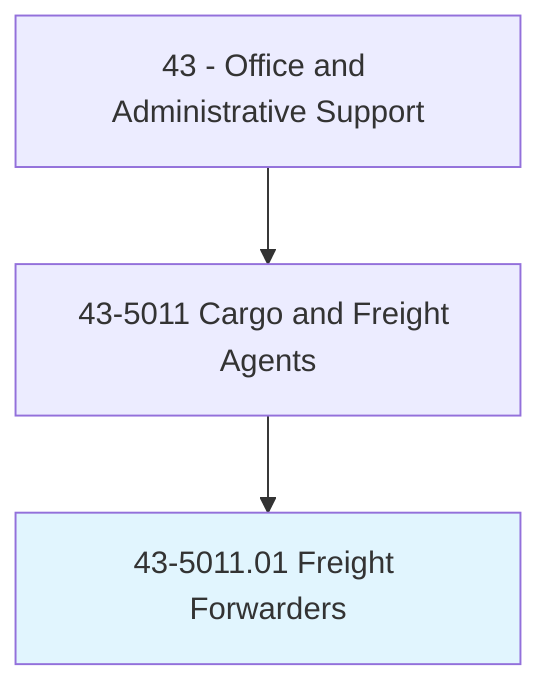
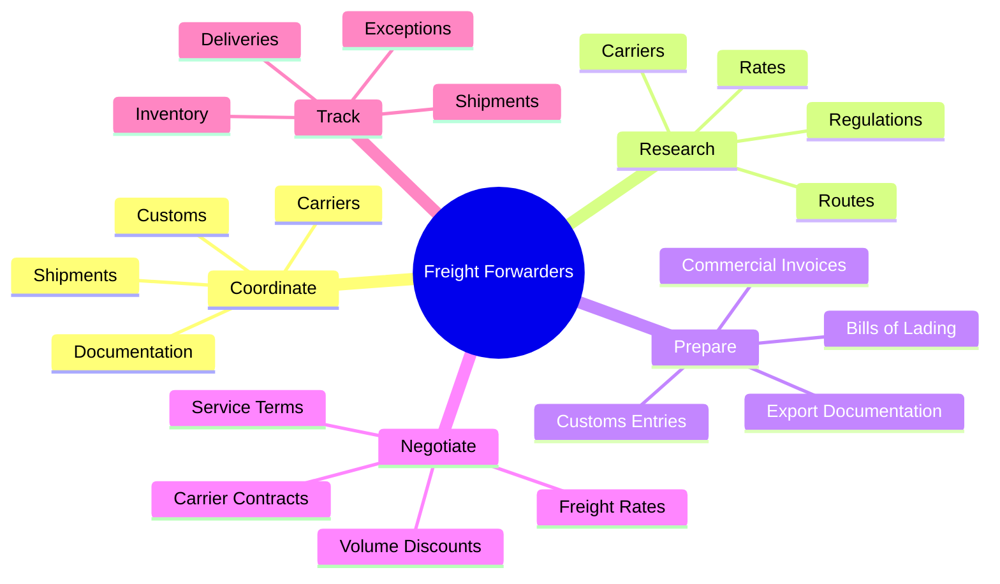
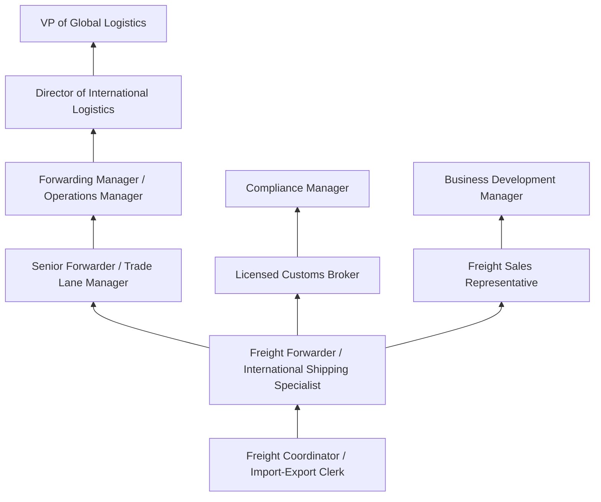
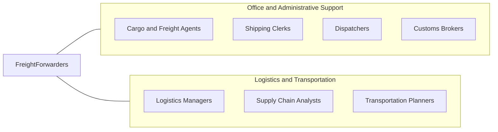

# Freight Forwarders

> Research rates, routings, or modes of transport for shipment of products. Maintain awareness of regulations affecting the international movement of cargo.

## Overview

Freight Forwarders specialize in arranging the transportation of goods on behalf of shippers, coordinating the complex logistics of international and domestic cargo movement. They research optimal shipping routes, negotiate rates with carriers, prepare export/import documentation, arrange customs clearance, and ensure compliance with international trade regulations. They act as intermediaries between shippers and transportation carriers, managing the entire supply chain logistics process.

Working for freight forwarding companies, logistics firms, or as independent agents, these professionals manage the end-to-end movement of goods across borders. They must understand international trade law, customs procedures, Incoterms, letters of credit, and the documentation requirements of different countries. Their expertise helps businesses navigate the complexities of global supply chains, ensuring goods arrive on time while meeting regulatory requirements.

The profession has grown with globalization and e-commerce, as more businesses require expertise in moving goods across international borders efficiently and compliantly. Freight forwarders combine knowledge of transportation modes (ocean, air, truck, rail), regulatory requirements, and commercial practices to optimize shipping solutions for their clients. They manage risks related to cargo security, insurance, and compliance throughout the transportation process.

## Classification Hierarchy



## Key Statistics

| Metric | Value |
|--------|-------|
| SOC Code | 43-5011.01 |
| Job Zone | 3 (Medium Preparation) |
| Category | [Office and Administrative Support](/occupations/Administrative/index) |
| Median Annual Salary | $49,200 |
| Salary Range | $32,000 - $75,000 |
| 10th Percentile | $32,500 |
| 90th Percentile | $74,800 |
| Employment | ~25,000 |
| Projected Growth | 6% (faster than average) |
| Annual Openings | ~3,500 |
| Core Tasks | 45 |
| Source | O*NET |

## Core Tasks



### coordinate.Shipments

Freight Forwarders coordinate logistics for cargo movement.

**Actions:**
- `coordinate.Shipments.across.Borders`
- `arrange.Transportation.with.Carriers`
- `schedule.Pickups.for.Cargo`
- `manage.Deliveries.to.Destinations`

### prepare.Documentation

Freight Forwarders prepare required shipping documentation.

**Actions:**
- `prepare.BillsOfLading.for.Shipments`
- `prepare.CustomsDocumentation.for.Clearance`
- `complete.ExportFilings.with.Authorities`
- `create.CommercialInvoices.for.Trade`

## Skills & Competencies

### Technical Skills
- **International Shipping Regulations** - Expert (customs, export controls, sanctions)
- **Customs Documentation** - Expert (HS codes, commercial invoices, certificates)
- **Rate Negotiation** - Advanced (carrier contracts, volume pricing)
- **Transportation Management Systems (TMS)** - Expert (CargoWise, Descartes)
- **Incoterms and Trade Finance** - Expert (FOB, CIF, DDP, letters of credit)
- **Hazmat Shipping** - Advanced (IMDG, IATA DGR, DOT)
- **Tariff Classification** - Advanced (Harmonized System codes)
- **Marine Insurance** - Intermediate (cargo coverage, claims)

### Soft Skills
- **Problem Solving** - Critical (resolving shipping issues)
- **Communication** - Critical (coordinating multiple parties)
- **Negotiation** - Critical (carrier rates, service terms)
- **Attention to Detail** - Critical (documentation accuracy)
- **Multitasking** - Critical (managing multiple shipments)
- **Customer Service** - Essential (client relationship management)
- **Stress Tolerance** - Essential (deadline pressure)
- **Cultural Awareness** - Important (international business)

## Education & Certifications

| Requirement | Details |
|-------------|---------|
| Typical Education | Associate's or bachelor's degree |
| Preferred Degree | International Business, Logistics, Supply Chain Management |
| Licensed Customs Broker | Required for customs brokerage functions |
| Certified International Freight Forwarder | FIATA diploma program |
| Dangerous Goods Certification | IATA DGR, IMDG Code training |
| Export Compliance Training | EAR, ITAR awareness and compliance |
| Carnet/ATA Training | Temporary import/export procedures |
| Continuing Education | Regulatory updates, technology training |

## Career Progression



### Career Pathway Details

| Level | Title | Years Experience | Key Responsibilities |
|-------|-------|------------------|----------------------|
| Entry | Freight Coordinator | 0-2 years | Documentation, tracking, carrier communication |
| Mid | Freight Forwarder | 2-5 years | Full shipment coordination, rate negotiation |
| Senior | Senior Forwarder / Trade Lane Manager | 5-8 years | Key accounts, specialized trade lanes, mentoring |
| Management | Forwarding Manager | 8-12 years | Team leadership, operations oversight, carrier relations |
| Director | Director of International Logistics | 12-15 years | Strategic planning, compliance oversight, vendor management |
| Executive | VP of Global Logistics | 15+ years | Enterprise strategy, global operations, executive relationships |

## Industry Variations

| Setting | Focus | Unique Aspects |
|---------|-------|----------------|
| Ocean Freight | Container shipping | FCL/LCL; port operations; demurrage management; vessel scheduling |
| Air Freight | Express and charter cargo | Time-sensitive; weight restrictions; airport procedures; AWB documentation |
| Cross-Border Ground | Trucking across borders | Customs clearance; bonded transport; free trade zones; cabotage rules |
| Project Cargo | Oversized and heavy lift | Specialized equipment; permits; route surveys; engineering coordination |
| Cold Chain | Temperature-controlled | Pharmaceutical, food; GDP/FSMA compliance; temperature monitoring |
| E-Commerce | Parcel and small package | Direct-to-consumer; returns; last-mile; duty calculations |

### Ocean Freight Forwarding

Ocean freight forwarders coordinate container shipments (FCL - Full Container Load, LCL - Less than Container Load), managing booking with steamship lines, container positioning, port operations, and drayage. They must understand vessel schedules, port congestion, demurrage and detention charges, and documentation requirements including ocean bills of lading and manifests.

### Air Freight Forwarding

Air freight specialists handle time-sensitive cargo requiring fast transit, managing bookings with airlines, ground handling, and airport procedures. They must understand IATA regulations, air waybill documentation, dimensional weight calculations, and restricted commodity requirements. Charter operations require specialized knowledge of aircraft capabilities.

### Project Cargo

Project cargo forwarders handle oversized, heavy-lift, and out-of-gauge shipments for construction, energy, and industrial projects. They coordinate specialized equipment (heavy-lift vessels, multi-axle trailers), obtain permits and route surveys, and manage engineering aspects of cargo handling and transport.

### Trade Compliance Specialization

Some freight forwarders specialize in trade compliance, managing export controls (EAR, ITAR), sanctions compliance (OFAC), restricted party screening, and classification. This requires deep knowledge of regulations and close coordination with government agencies.

## Technology & Tools

### Transportation Management Systems
- **Forwarding Platforms** - CargoWise, Descartes, Magaya
- **Visibility Tools** - project44, FourKites, Shippeo
- **Rate Management** - Freightos, Xeneta, NYSHEX

### Customs and Compliance
- **Customs Filing** - ABI/ACE portal, automated broker interface
- **Export Control** - Visual Compliance, OCR Services
- **Screening** - Restricted party screening platforms
- **Classification** - HS code databases, tariff tools

### Documentation
- **E-Documentation** - Electronic bills of lading, digital customs
- **Trade Finance** - Letter of credit platforms, trade document exchange
- **Digitization** - Document scanning, OCR processing

### Emerging Technology
- **Blockchain** - TradeLens, supply chain transparency
- **AI/ML** - Predictive routing, exception management
- **IoT** - Container tracking, condition monitoring
- **Digital Freight** - Online booking platforms, instant quotes

## Related Occupations



### Related Occupation Comparison

| Occupation | Similarity | Key Difference |
|------------|------------|----------------|
| Customs Brokers | High | Customs focus vs full logistics |
| Cargo Agents | High | Carrier-employed vs forwarder |
| Logistics Managers | Medium | Strategic oversight vs operational coordination |
| Shipping Clerks | Medium | Documentation focus vs full forwarding |

## Industries

- [Freight Transportation Arrangement](/industries/Transportation/FreightArrangement) - High Employment
- [Manufacturing](/industries/Manufacturing/index) - Moderate Employment
- [Wholesale Trade](/industries/Wholesale) - Moderate Employment
- [Retail Trade](/industries/Retail/index) - Moderate Employment
- [Third-Party Logistics (3PL)](/industries/Transportation) - High Employment
- [Customs Brokerage](/industries/Transportation/FreightArrangement) - Moderate Employment

## Departments

This occupation typically works in:
- [Logistics](/departments/SupplyChain) - International shipping coordination
- Trade Compliance - Customs and regulatory compliance
- [Operations](/departments/Operations) - Cargo coordination and execution
- Customer Service - Client support and communication
- [Sales](/departments/Sales) - Business development and client acquisition
- Documentation - Shipping documentation processing

## Work Environment

### Physical Setting
- Office environment with computer workstations
- Warehouse or freight terminal for cargo inspection
- Port or airport for cargo operations oversight
- Client site visits for project coordination

### Work Schedule
- Standard business hours with extended availability
- Time zone considerations for international coordination
- On-call for cargo emergencies and exceptions
- Deadline-driven around vessel cutoffs and flight departures

### Work Characteristics
- High communication volume (phone, email, messaging)
- Fast-paced, deadline-driven environment
- Multiple simultaneous shipments to manage
- Problem-solving under time pressure
- International contact across time zones

### Challenges
- Managing unexpected delays and disruptions
- Coordinating across multiple parties and countries
- Keeping current with regulatory changes
- Resolving customs clearance issues
- Managing rate volatility and capacity constraints

## Trade and Regulatory Knowledge

### Key Trade Terms (Incoterms 2020)

| Term | Risk Transfer | Freight Payment | Common Use |
|------|---------------|-----------------|------------|
| EXW | At origin | Buyer pays all | Minimal seller responsibility |
| FOB | On vessel | Buyer from port | Ocean freight standard |
| CIF | On vessel | Seller to destination | Common in ocean |
| DDP | At destination | Seller pays all | Full service to buyer |

### Export Control Regimes
- **EAR** - Export Administration Regulations (Commerce)
- **ITAR** - International Traffic in Arms Regulations (State)
- **OFAC** - Sanctions and embargoes (Treasury)
- **Denied Party Screening** - Restricted entity checking

### Customs Compliance
- **HTS Classification** - Correct tariff codes
- **Valuation** - Transaction value methodology
- **Country of Origin** - Rules of origin determination
- **Free Trade Agreements** - Preferential duty programs

## GraphDL Semantic Structure

```graphdl
Freight Forwarders perform:
- coordinate.Shipments.across.Borders
- research.Rates.from.Carriers
- prepare.Documentation.for.Customs
- negotiate.Terms.with.Carriers
- track.Cargo.throughout.Transit
- ensure.Compliance.with.Regulations
- arrange.Insurance.for.Cargo
- communicate.Updates.to.Clients
```

---

*Source: O*NET 43-5011.01 - ONETOccupation*
