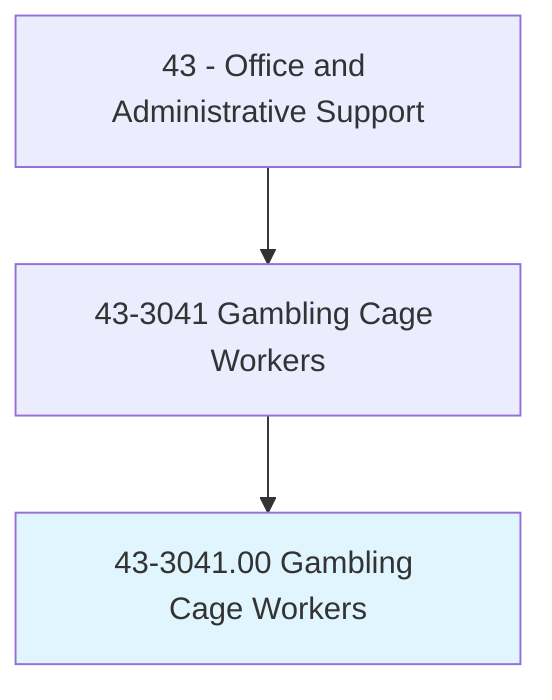
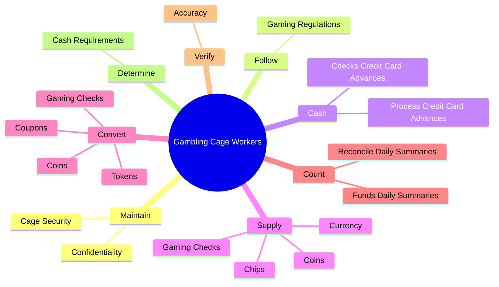
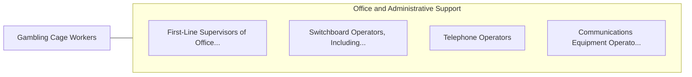

# Gambling Cage Workers

> In a gambling establishment, conduct financial transactions for patrons. Accept patron's credit application and verify credit references to provide check-cashing authorization or to establish house credit accounts. May reconcile daily summaries of transactions to balance books. May sell gambling chips, tokens, or tickets to patrons, or to other workers for resale to patrons. May convert gambling chips, tokens, or tickets to currency upon patron's request. May use a cash register or computer to record transaction.

## Overview

Gambling Cage Workers is an occupation within the Office and Administrative Support category. In a gambling establishment, conduct financial transactions for patrons. Accept patron's credit application and verify credit references to provide check-cashing authorization or to establish house credit accounts.

## Classification Hierarchy

## Key Statistics

| Metric | Value |
|--------|-------|
| SOC Code | 43-3041.00 |
| Category | [Office and Administrative Support](/occupations/Administrative/index) |
| Task Count | 46 |
| Source | O*NET |

## Core Tasks

### maintain.Confidentiality

Gambling Cage Workers maintain confidentiality as part of their core responsibilities.

**Actions:**
- `maintain.Confidentiality.of.CustomersTransactions`
- `maintain.CageSecurity`

### follow.GamingRegulations

Gambling Cage Workers follow gaming regulations as part of their core responsibilities.

**Actions:**
- `follow.GamingRegulations`

### cash.ChecksCreditCardAdvances

Gambling Cage Workers cash checks credit card advances as part of their core responsibilities.

**Actions:**
- `cash.ChecksCreditCardAdvances.for.Patrons`
- `cash.ProcessCreditCardAdvances.for.Patrons`

## Skills & Competencies

### Technical Skills
- **Office Management** - Advanced
- **Data Entry** - Advanced
- **Records Management** - Advanced

### Soft Skills
- **Communication** - Essential
- **Problem Solving** - Essential
- **Critical Thinking** - Important
- **Teamwork** - Important
- **Adaptability** - Important

## Related Occupations

## Industries

This occupation is found across multiple industries. See [Industries](/industries) for sector-specific employment data.

## Career Progression

---

*Source: O*NET 43-3041.00 - ONETOccupation*
