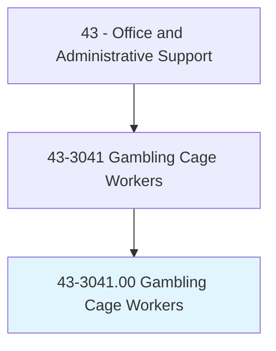
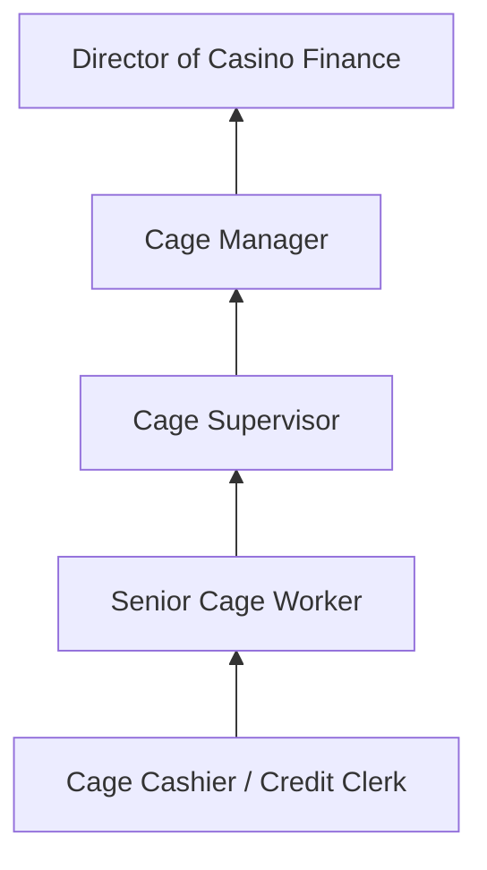
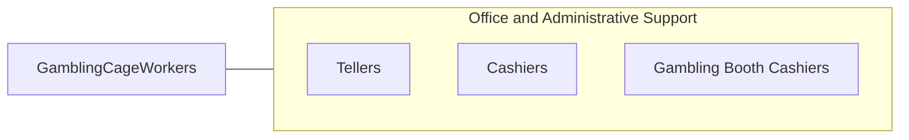

# Gambling Cage Workers

> In a gambling establishment, conduct financial transactions for patrons. Accept patron's credit application and verify credit references to provide check-cashing authorization or to establish house credit accounts.

## Overview

Gambling Cage Workers conduct financial transactions in casino environments, managing the exchange of currency, chips, tokens, and tickets. They process credit applications, verify references, authorize check-cashing, establish house credit accounts, reconcile daily transactions, and maintain accurate records of all monetary exchanges. Working in the secure cage area of casinos, they serve as the financial operations backbone of gaming establishments.

These workers must comply with extensive gaming regulations, anti-money laundering (AML) requirements, and Title 31 reporting obligations. They handle large sums of currency, manage multiple currency denominations, and maintain chain-of-custody documentation for all funds. The role requires mathematical precision, trustworthiness, and the ability to work in a fast-paced environment.

Gaming regulations require extensive background checks, licensing, and ongoing compliance training for cage workers. The profession is concentrated in casino markets including Las Vegas, Atlantic City, tribal gaming operations, and regional casino markets.

## Classification Hierarchy

## Key Statistics

| Metric | Value |
|--------|-------|
| SOC Code | 43-3041.00 |
| Job Zone | 2 (Some Preparation) |
| Category | [Office and Administrative Support](/occupations/Administrative/index) |
| Median Annual Salary | $33,500 |
| Employment | ~15,000 |
| Projected Growth | -8% (declining) |
| Core Tasks | 35 |
| Source | O*NET |

## Core Tasks

Core task data with GraphDL semantic actions for this occupation is maintained in the data pipeline. See [O*NET 43-3041.00](https://www.onetonline.org/link/summary/43-3041.00) for detailed task information.

## Skills & Competencies

### Technical Skills
- **Cash Handling and Counting** - Expert
- **Gaming Regulatory Compliance** - Advanced
- **Credit Investigation** - Intermediate
- **AML/Title 31 Reporting** - Advanced
- **Casino Management Systems** - Advanced

### Soft Skills
- **Integrity and Honesty** - Critical
- **Attention to Detail** - Critical
- **Accuracy Under Pressure** - Essential
- **Customer Service** - Essential
- **Composure** - Essential

## Education & Certifications

| Requirement | Details |
|-------------|---------|
| Typical Education | High school diploma |
| Gaming License | State/tribal gaming commission |
| Background Check | Extensive investigation required |
| AML/Title 31 Training | Mandatory compliance training |

## Career Progression

## Industry Variations

| Setting | Focus | Unique Aspects |
|---------|-------|----------------|
| Large Casino Resorts | High-volume operations | Multiple cage locations; VIP services; international patrons |
| Tribal Casinos | Compact-regulated operations | Tribal gaming commission; IGRA compliance |
| Regional Casinos | Community gaming | Smaller scale; local customer base |
| Online Gaming | Digital transactions | Payment processing; identity verification; digital wallets |

## Technology & Tools

- **Casino Management Systems** - IGT, Bally, Konami SYNKROS
- **Currency Counters** - Bill and coin counting machines
- **Compliance** - CTR/SAR filing, Title 31 tools
- **Surveillance** - Camera and recording systems

## Related Occupations

## Departments

This occupation typically works in:
- [Cage Operations](/departments/CageOps) - Casino cash management
- [Finance](/departments/Finance) - Financial controls
- [Compliance](/departments/Compliance) - Gaming regulatory compliance
- [Security](/departments/Security) - Asset protection

---

*Source: O*NET 43-3041.00 - ONETOccupation*
