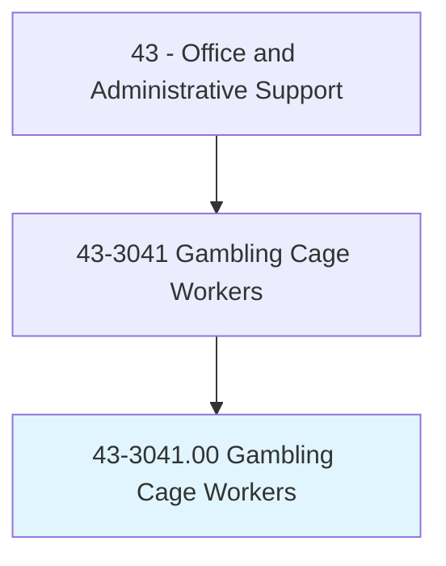
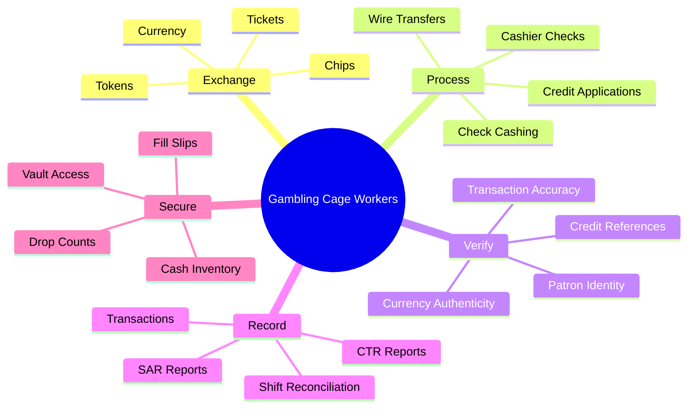
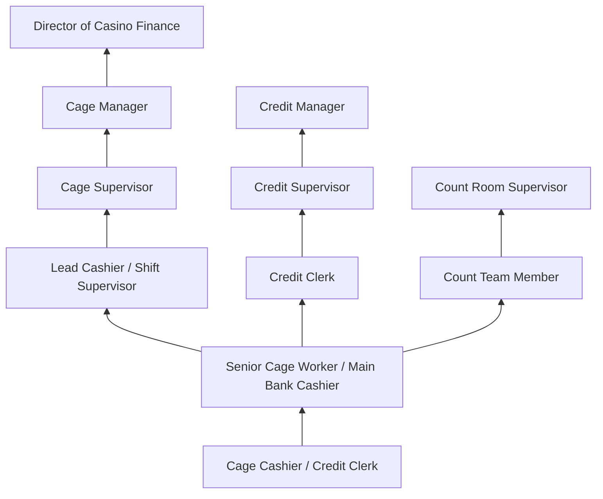
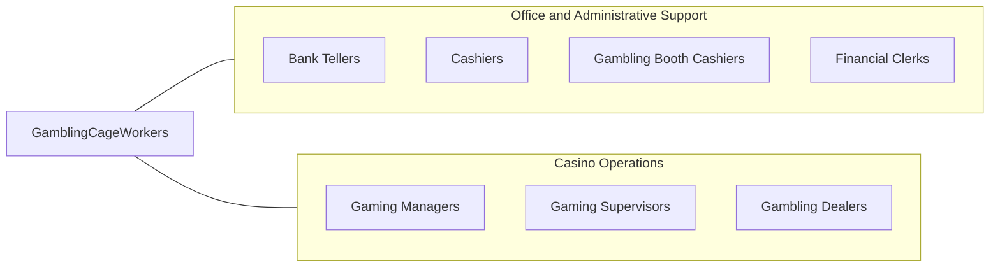

# Gambling Cage Workers

> In a gambling establishment, conduct financial transactions for patrons. Accept patron's credit application and verify credit references to provide check-cashing authorization or to establish house credit accounts.

## Overview

Gambling Cage Workers conduct financial transactions in casino environments, managing the exchange of currency, chips, tokens, and tickets. They process credit applications, verify references, authorize check-cashing, establish house credit accounts, reconcile daily transactions, and maintain accurate records of all monetary exchanges. Working in the secure cage area of casinos, they serve as the financial operations backbone of gaming establishments.

These workers must comply with extensive gaming regulations, anti-money laundering (AML) requirements, and Title 31 reporting obligations. They handle large sums of currency, manage multiple currency denominations, process wire transfers, issue cashier's checks, and maintain chain-of-custody documentation for all funds. The role requires mathematical precision, unwavering trustworthiness, and the ability to work in a fast-paced, high-security environment.

Gaming regulations require extensive background checks, licensing, and ongoing compliance training for cage workers. The profession is concentrated in casino markets including Las Vegas, Atlantic City, tribal gaming operations, and regional casino markets across the country. As casinos have expanded into new jurisdictions and integrated technology into their operations, cage workers must also navigate electronic payment systems, ticket-in-ticket-out (TITO) machines, and digital wallet transactions.

## Classification Hierarchy



## Key Statistics

| Metric | Value |
|--------|-------|
| SOC Code | 43-3041.00 |
| Job Zone | 2 (Some Preparation) |
| Category | [Office and Administrative Support](/occupations/Administrative/index) |
| Median Annual Salary | $33,500 |
| Salary Range | $24,000 - $48,000 |
| 10th Percentile | $24,200 |
| 90th Percentile | $47,500 |
| Employment | ~15,000 |
| Projected Growth | -8% (declining) |
| Annual Openings | ~2,000 |
| Core Tasks | 35 |
| Source | O*NET |

## Core Tasks



### exchange.Currency

Cage Workers exchange currency and gaming instruments.

**Actions:**
- `exchange.Currency.for.Chips`
- `exchange.Tokens.for.Cash`
- `process.TITO.Tickets.for.Payment`
- `cash.Chips.for.Patrons`

### process.CreditApplications

Cage Workers process credit and financial transactions.

**Actions:**
- `process.CreditApplications.for.HouseCredit`
- `verify.CreditReferences.from.Banks`
- `authorize.CheckCashing.for.Patrons`
- `issue.Markers.to.ApprovedPlayers`

## Skills & Competencies

### Technical Skills
- **Cash Handling and Counting** - Expert (high-speed currency counting, multiple denominations)
- **Gaming Regulatory Compliance** - Expert (state gaming commission, tribal compacts)
- **Credit Investigation** - Advanced (Central Credit, credit verification)
- **AML/Title 31 Reporting** - Expert (CTR, SAR filing, suspicious activity)
- **Casino Management Systems** - Expert (IGT, Bally, Konami systems)
- **Counterfeit Detection** - Advanced (bill validators, UV detection, security features)
- **TITO Systems** - Advanced (ticket processing, validation)
- **Chip Tracking** - Advanced (RFID, denomination management)

### Soft Skills
- **Integrity and Honesty** - Critical (handling large cash volumes)
- **Attention to Detail** - Critical (accurate transactions)
- **Accuracy Under Pressure** - Critical (busy gaming periods)
- **Customer Service** - Essential (patron interaction)
- **Composure** - Essential (handling difficult situations)
- **Confidentiality** - Critical (patron financial information)
- **Mathematical Aptitude** - Essential (calculations, reconciliation)
- **Stress Tolerance** - Important (high-volume periods)

## Education & Certifications

| Requirement | Details |
|-------------|---------|
| Typical Education | High school diploma |
| Gaming License | State or tribal gaming commission license required |
| Background Check | Extensive criminal, financial, and personal history investigation |
| AML/Title 31 Training | Annual mandatory compliance training |
| Key Employee License | Required for supervisory positions in many jurisdictions |
| Work Cards | Local jurisdiction work permits |
| Fingerprinting | Required for all gaming licenses |
| Continuing Education | Ongoing compliance and regulatory updates |

## Career Progression



### Career Pathway Details

| Level | Title | Years Experience | Key Responsibilities |
|-------|-------|------------------|----------------------|
| Entry | Cage Cashier / Credit Clerk | 0-2 years | Basic transactions, chip exchange, patron service |
| Mid | Senior Cage Worker / Main Bank | 2-4 years | High-value transactions, vault work, training |
| Lead | Lead Cashier | 4-6 years | Shift oversight, exception handling, reporting |
| Supervisory | Cage Supervisor | 6-10 years | Team management, compliance oversight, shift operations |
| Management | Cage Manager | 10-15 years | Department leadership, regulatory liaison, financial controls |
| Executive | Director of Casino Finance | 15+ years | Enterprise cage operations, strategic planning |

## Industry Variations

| Setting | Focus | Unique Aspects |
|---------|-------|----------------|
| Large Casino Resorts | High-volume operations | Multiple cage locations; VIP services; international patrons; high-limit credit |
| Tribal Casinos | Compact-regulated operations | Tribal gaming commission; IGRA compliance; sovereign immunity considerations |
| Regional Casinos | Community gaming | Smaller scale; local customer base; tighter staffing; multi-function roles |
| Cruise Ship Casinos | Maritime gaming | International waters; multi-currency; limited resources; compact operations |
| Online Gaming | Digital transactions | Payment processing; identity verification; digital wallets; age verification |
| Racinos | Combined gaming/racing | Mixed customer base; multiple revenue streams; racing payouts |

### Major Casino Resorts

Large Las Vegas and Atlantic City properties operate multiple cage locations, including main cage, satellite cages on the gaming floor, and VIP cage facilities for high rollers. Workers in these environments handle diverse patron populations including international visitors, requiring foreign currency exchange capabilities and multi-language skills. High-limit credit operations involve significant risk management.

### Tribal Gaming Operations

Tribal casinos operate under Indian Gaming Regulatory Act (IGRA) provisions and tribal-state compacts. Cage workers must understand tribal gaming commission regulations, which may differ from state requirements. Many tribal operations provide comprehensive benefits and career development opportunities within tribal enterprises.

### Regional and Riverboat Casinos

Smaller regional casinos and riverboat operations typically have single cage locations with workers performing multiple functions. The patron base is more local, with emphasis on player loyalty programs and regular customer relationships. Staff may work across both cage and other customer service functions.

## Technology & Tools

### Casino Management Systems
- **IGT** - SDS, CMS systems for player tracking and cage
- **Bally/Scientific Games** - iVIEW, Accel for cage operations
- **Konami SYNKROS** - Integrated gaming and cage management
- **Aristocrat** - Oasis 360 patron management

### Cash Handling Equipment
- **Currency Counters** - High-speed bill counters with counterfeit detection
- **Coin Counters** - Token and coin sorting equipment
- **Counterfeit Detection** - UV lights, magnetic ink detection, bill validators
- **Chip Sorting** - RFID readers, chip verification equipment

### Compliance and Reporting
- **Title 31/AML Software** - CTR filing, SAR reporting systems
- **Player Tracking** - Patron identification and tracking
- **Surveillance Integration** - Camera systems, transaction monitoring
- **Audit Trail** - Transaction logging, reconciliation systems

### Payment Systems
- **TITO Systems** - Ticket-in-ticket-out processing
- **Credit Card Processing** - Cash advance terminals
- **Digital Wallets** - Mobile payment integration
- **Wire Transfer** - Electronic fund transfer processing

## Related Occupations



### Related Occupation Comparison

| Occupation | Similarity | Key Difference |
|------------|------------|----------------|
| Bank Tellers | High | Gaming regulation vs banking regulation |
| Cashiers | Medium | Customer service vs financial transaction focus |
| Gambling Dealers | Medium | Table games vs cage operations |
| Gaming Supervisors | Medium | Floor operations vs financial operations |

## Industries

- [Gambling Industries](/industries/ArtsEntertainment/Gambling) - High Employment
- [Hotels and Casino Resorts](/industries/Accommodation) - High Employment
- [Cruise Lines](/industries/Transportation/WaterTransportation) - Low Employment
- [Tribal Gaming Operations](/industries/ArtsEntertainment/Gambling) - Moderate Employment

## Departments

This occupation typically works in:
- Cage Operations - Casino cash management and patron transactions
- [Finance](/departments/Finance) - Financial controls and reporting
- Compliance - Gaming regulatory compliance and AML
- [Security](/departments/Security) - Asset protection and surveillance coordination
- Credit Department - Player credit and collections
- Count Room - Revenue counting and verification

## Work Environment

### Physical Setting
- Secure cage area behind bulletproof glass
- Climate-controlled casino environment
- Standing for extended periods at transaction windows
- Access to vault and secure storage areas
- High-security environment with continuous surveillance

### Work Schedule
- 24/7 casino operations with shift work
- Day, swing, and graveyard shifts
- Weekends and holidays required
- Shift bidding based on seniority
- Overtime during peak periods and special events

### Work Characteristics
- High-volume cash handling
- Continuous customer interaction
- Surveillance and security monitoring
- Regulatory compliance documentation
- Team-based operations with multiple checks

### Unique Considerations
- Extensive background and credit checks for employment
- Gaming license requirements and renewal
- Restrictions on personal gaming at employer property
- Drug testing and ongoing compliance requirements
- Security protocols for vault access and cash movement

## Regulatory Compliance

### Title 31 / Bank Secrecy Act Requirements

| Requirement | Threshold | Action Required |
|-------------|-----------|-----------------|
| Currency Transaction Report (CTR) | $10,000+ in currency | File within 15 days |
| Suspicious Activity Report (SAR) | Unusual activity | File within 30 days |
| Player Rating | $10,000+ in gaming activity | Document and report |
| Multiple Transactions | Aggregated $10,000+ | Treat as single transaction |

### Know Your Customer (KYC)
- Patron identification for threshold transactions
- Verification of identification documents
- Documentation of credit applications
- Retention of records for 5+ years

### Gaming Commission Requirements
- Periodic audits of cage operations
- Internal controls and procedures
- Licensing renewal and background updates
- Minimum bankroll requirements

## GraphDL Semantic Structure

```graphdl
Gambling Cage Workers perform:
- exchange.Currency.for.GamingInstruments
- process.Transactions.for.Patrons
- verify.Identity.of.Players
- maintain.Records.for.Compliance
- file.Reports.according.to.Title31
- reconcile.CashDrawers.at.ShiftEnd
- authorize.Credit.for.ApprovedPlayers
- secure.Assets.in.Vault
```

---

*Source: O*NET 43-3041.00 - ONETOccupation*
