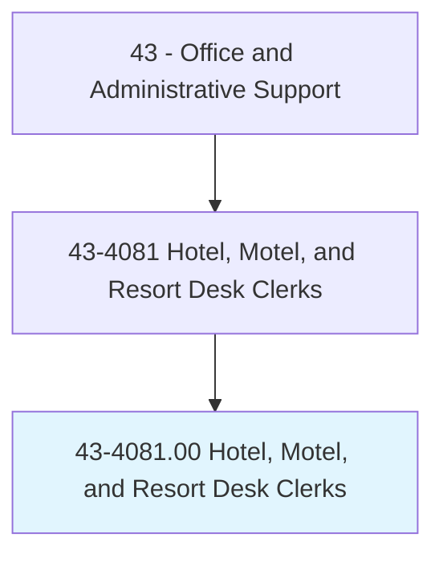
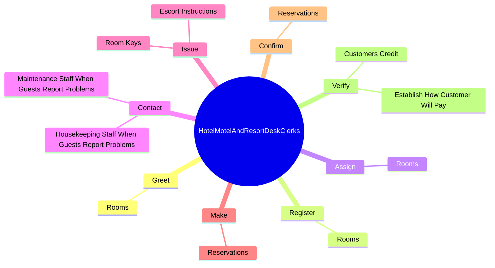
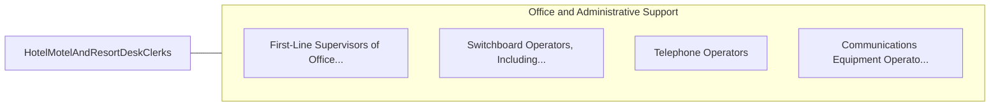

# Hotel, Motel, and Resort Desk Clerks

> Accommodate hotel, motel, and resort patrons by registering and assigning rooms to guests, issuing room keys or cards, transmitting and receiving messages, keeping records of occupied rooms and guests' accounts, making and confirming reservations, and presenting statements to and collecting payments from departing guests.

## Overview

Hotel, Motel, and Resort Desk Clerks is classified under Office and Administrative Support (SOC 43). Accommodate hotel, motel, and resort patrons by registering and assigning rooms to guests, issuing room keys or cards, transmitting and receiving messages, keeping records of occupied rooms and guests' accounts, making and confirming reservations, and presenting statements to and collecting payments from departing guests.

## Classification Hierarchy

## Key Statistics

| Metric | Value |
|--------|-------|
| SOC Code | 43-4081.00 |
| Category | [Office and Administrative Support](/occupations/Administrative) |
| Task Count | 67 |
| Source | O*NET |

## Core Tasks

### greet.Rooms

Hotel, Motel, and Resort Desk Clerks greet rooms as part of their core responsibilities.

**Actions:**
- `greet.Rooms.to.GuestsOfHotels`
- `greet.Rooms.to.Motels`

### register.Rooms

Hotel, Motel, and Resort Desk Clerks register rooms as part of their core responsibilities.

**Actions:**
- `register.Rooms.to.GuestsOfHotels`
- `register.Rooms.to.Motels`

### assign.Rooms

Hotel, Motel, and Resort Desk Clerks assign rooms as part of their core responsibilities.

**Actions:**
- `assign.Rooms.to.GuestsOfHotels`
- `assign.Rooms.to.Motels`

## Skills & Competencies

### Technical Skills
- **Office Management** - Advanced
- **Data Entry** - Advanced
- **Records Management** - Advanced

### Soft Skills
- **Communication** - Essential
- **Problem Solving** - Essential
- **Critical Thinking** - Important
- **Teamwork** - Important
- **Adaptability** - Important

## Related Occupations

## Industries

This occupation is found across multiple industries. See [Industries](/industries) for sector-specific employment data.

## Career Progression

---

*Source: O*NET 43-4081.00 - ONETOccupation*
