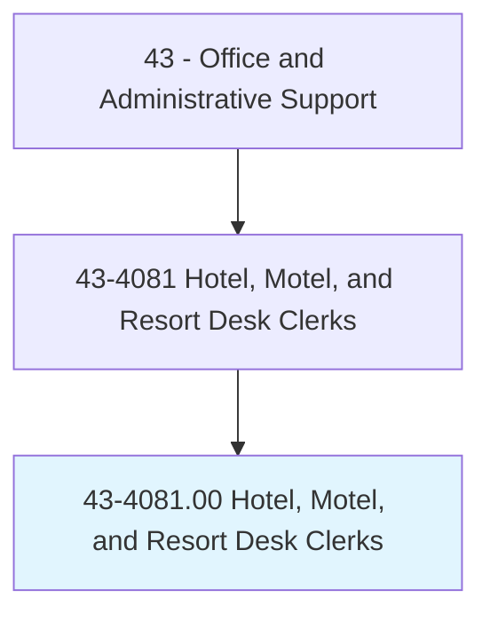
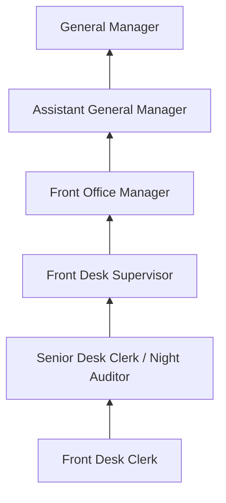
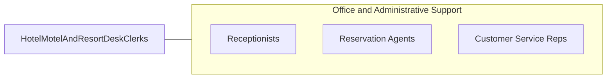

# Hotel, Motel, and Resort Desk Clerks

> Accommodate hotel, motel, and resort patrons by registering and assigning rooms to guests, issuing room keys or cards, transmitting and receiving messages, keeping records of occupied rooms and guests' accounts, making and confirming reservations, and presenting statements to and collecting payments from departing guests.

## Overview

Hotel, Motel, and Resort Desk Clerks are the primary guest-facing representatives of lodging establishments, managing the check-in and check-out processes, assigning rooms, making reservations, and addressing guest needs throughout their stay. They serve as the first and last point of contact for guests, setting the tone for the entire hospitality experience.

These clerks handle a wide range of responsibilities beyond basic registration: they process payments, manage room inventory, coordinate with housekeeping and maintenance, respond to guest complaints and requests, provide local information and recommendations, and handle special accommodations. In smaller properties, they may be the only staff member on duty, handling all guest services, security monitoring, and emergency response.

The hospitality industry has undergone significant technological transformation with online booking platforms, mobile check-in, and keyless entry systems. However, the personal interaction provided by desk clerks remains a differentiating factor in guest satisfaction, particularly in full-service hotels and resorts where concierge-level service is expected.

## Classification Hierarchy

## Key Statistics

| Metric | Value |
|--------|-------|
| SOC Code | 43-4081.00 |
| Job Zone | 2 (Some Preparation) |
| Category | [Office and Administrative Support](/occupations/Administrative/index) |
| Median Annual Salary | $29,600 |
| Employment | ~260,000 |
| Projected Growth | 9% (faster than average) |
| Core Tasks | 48 |
| Source | O*NET |

## Core Tasks

Core task data with GraphDL semantic actions for this occupation is maintained in the data pipeline. See [O*NET 43-4081.00](https://www.onetonline.org/link/summary/43-4081.00) for detailed task information.

## Skills & Competencies

### Technical Skills
- **Property Management Systems (PMS)** - Advanced
- **Reservation Systems** - Advanced
- **Payment Processing** - Advanced
- **Guest Relations** - Advanced
- **Room Revenue Management** - Intermediate
- **Multi-Language Skills** - Beneficial

### Soft Skills
- **Customer Service Excellence** - Critical
- **Communication** - Critical
- **Problem Solving** - Essential
- **Composure Under Pressure** - Essential
- **Multitasking** - Essential
- **Professionalism** - Critical

## Education & Certifications

| Requirement | Details |
|-------------|---------|
| Typical Education | High school diploma; hospitality degree preferred |
| Hotel Management Training | Brand-specific training programs |
| CPR/First Aid | Often required |
| Language Skills | Second language highly valued |
| Customer Service Certification | AH&LA credentials |

## Career Progression

## Industry Variations

| Setting | Focus | Unique Aspects |
|---------|-------|----------------|
| Luxury Hotels | High-end guest services | Concierge services; VIP protocols; premium amenities |
| Business Hotels | Corporate traveler focus | Express check-in; loyalty programs; meeting coordination |
| Resorts | Leisure and recreation | Activity booking; spa scheduling; extended stay services |
| Budget/Economy | Efficient operations | Self-service kiosks; minimal staff; value-focused |

## Technology & Tools

- **PMS** - Opera, Maestro, RoomKey
- **Reservations** - booking.com, Expedia, GDS
- **Payment** - Credit card terminals, POS systems
- **Communication** - Phone, radio, messaging apps
- **Key Systems** - Electronic key card encoders

## Related Occupations

## Departments

This occupation typically works in:
- [Front Office](/departments/FrontOffice) - Guest services and registration
- [Reservations](/departments/Reservations) - Booking management
- [Guest Services](/departments/GuestServices) - Concierge and guest support
- [Revenue Management](/departments/RevenueManagement) - Rate and inventory optimization

---

*Source: O*NET 43-4081.00 - ONETOccupation*
