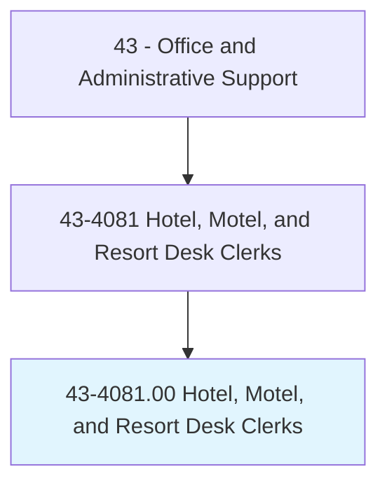
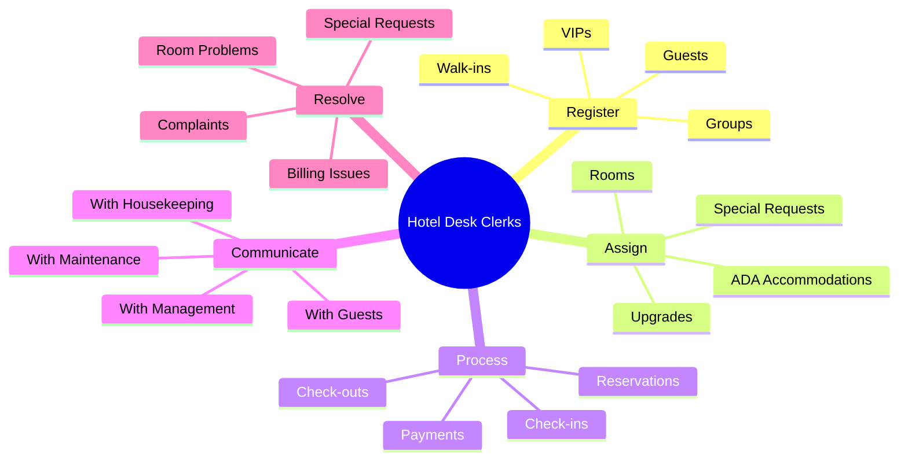
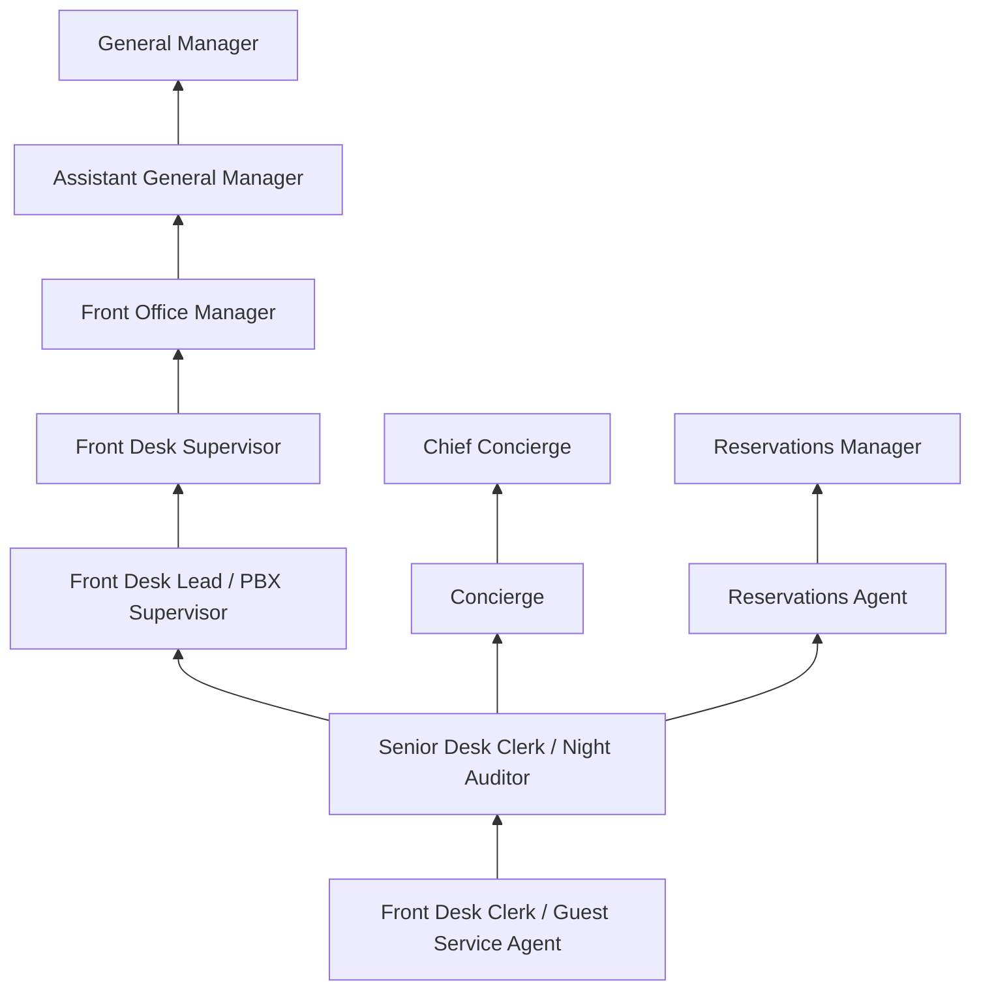
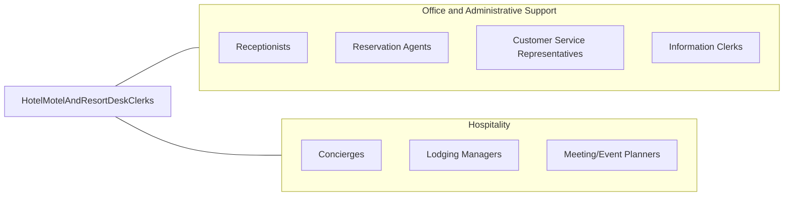

# Hotel, Motel, and Resort Desk Clerks

> Accommodate hotel, motel, and resort patrons by registering and assigning rooms to guests, issuing room keys or cards, transmitting and receiving messages, keeping records of occupied rooms and guests' accounts, making and confirming reservations, and presenting statements to and collecting payments from departing guests.

## Overview

Hotel, Motel, and Resort Desk Clerks are the primary guest-facing representatives of lodging establishments, managing the check-in and check-out processes, assigning rooms, making reservations, and addressing guest needs throughout their stay. They serve as the first and last point of contact for guests, setting the tone for the entire hospitality experience.

These clerks handle a wide range of responsibilities beyond basic registration: they process payments, manage room inventory, coordinate with housekeeping and maintenance, respond to guest complaints and requests, provide local information and recommendations, and handle special accommodations for VIP guests, guests with disabilities, or those with specific preferences. In smaller properties, they may be the only staff member on duty, handling all guest services, security monitoring, and emergency response.

The hospitality industry has undergone significant technological transformation with online booking platforms, mobile check-in, and keyless entry systems. However, the personal interaction provided by desk clerks remains a differentiating factor in guest satisfaction, particularly in full-service hotels and resorts where concierge-level service is expected. Front desk professionals must balance efficiency with warmth, technical competence with interpersonal skills, and problem-solving with hospitality.

## Classification Hierarchy



## Key Statistics

| Metric | Value |
|--------|-------|
| SOC Code | 43-4081.00 |
| Job Zone | 2 (Some Preparation) |
| Category | [Office and Administrative Support](/occupations/Administrative/index) |
| Median Annual Salary | $29,600 |
| Salary Range | $22,000 - $42,000 |
| 10th Percentile | $22,500 |
| 90th Percentile | $41,800 |
| Employment | ~260,000 |
| Projected Growth | 9% (faster than average) |
| Annual Openings | ~54,000 |
| Core Tasks | 48 |
| Source | O*NET |

## Core Tasks



### register.Guests

Desk Clerks register guests for their stay.

**Actions:**
- `register.Guests.at.CheckIn`
- `assign.Rooms.based.on.Availability`
- `issue.KeyCards.to.Guests`
- `collect.PaymentInformation.for.Incidentals`

### resolve.GuestIssues

Desk Clerks resolve guest concerns and complaints.

**Actions:**
- `resolve.Complaints.from.Guests`
- `escalate.Issues.to.Management`
- `coordinate.Solutions.with.Departments`
- `follow.Up.with.Guests`

## Skills & Competencies

### Technical Skills
- **Property Management Systems (PMS)** - Expert (Opera, Maestro, RoomKey)
- **Reservation Systems** - Expert (GDS, OTA interfaces)
- **Payment Processing** - Advanced (credit cards, mobile payments, invoicing)
- **Guest Relations** - Expert (service recovery, VIP protocols)
- **Room Revenue Management** - Intermediate (upselling, inventory management)
- **Multi-Language Skills** - Beneficial (Spanish, Mandarin, common languages)
- **Key Card Systems** - Advanced (encoding, programming, troubleshooting)
- **Microsoft Office** - Advanced (Word, Excel, Outlook)

### Soft Skills
- **Customer Service Excellence** - Critical (hospitality mindset)
- **Communication** - Critical (clear, friendly, professional)
- **Problem Solving** - Critical (resolving guest issues creatively)
- **Composure Under Pressure** - Critical (handling complaints, busy periods)
- **Multitasking** - Critical (phones, guests, systems simultaneously)
- **Professionalism** - Critical (appearance, demeanor, discretion)
- **Empathy** - Essential (understanding guest needs)
- **Cultural Sensitivity** - Essential (diverse guest populations)

## Education & Certifications

| Requirement | Details |
|-------------|---------|
| Typical Education | High school diploma; hospitality degree preferred |
| Preferred Degree | Associate's or Bachelor's in Hospitality Management |
| Hotel Brand Training | Brand-specific service and systems training |
| CPR/First Aid | Often required for emergency response |
| Language Skills | Second language highly valued in international properties |
| Customer Service Certification | AH&LA (American Hotel & Lodging Association) credentials |
| PMS Certification | Property management system vendor certification |
| Security Awareness | Safety and security training |

## Career Progression



### Career Pathway Details

| Level | Title | Years Experience | Key Responsibilities |
|-------|-------|------------------|----------------------|
| Entry | Front Desk Clerk | 0-1 years | Check-in/out, reservations, basic guest service |
| Mid | Night Auditor / Senior Clerk | 1-3 years | Overnight operations, daily close, reporting |
| Lead | Front Desk Lead | 3-5 years | Shift leadership, training, problem resolution |
| Supervisory | Front Desk Supervisor | 5-8 years | Team oversight, scheduling, performance management |
| Management | Front Office Manager | 8-12 years | Department leadership, revenue management, VIP relations |
| Executive | Assistant General Manager | 12-15 years | Multi-department oversight, owner relations |
| Executive | General Manager | 15+ years | Property leadership, P&L responsibility |

### Alternative Career Paths

| Path | Skills Applied | Transition Requirements |
|------|---------------|------------------------|
| Concierge | Guest service, local knowledge | Destination expertise, network building |
| Reservations | Booking systems, sales | Sales skills, revenue management |
| Event Coordination | Organization, communication | Event planning knowledge |
| Guest Relations Manager | Problem resolution, VIP service | Service recovery expertise |
| Revenue Management | Inventory, pricing | Analytical skills, yield management |

## Industry Variations

| Setting | Focus | Unique Aspects |
|---------|-------|----------------|
| Luxury Hotels | High-end guest services | Concierge services; VIP protocols; premium amenities; personalized service |
| Business Hotels | Corporate traveler focus | Express check-in; loyalty programs; meeting coordination; early departures |
| Resorts | Leisure and recreation | Activity booking; spa scheduling; extended stay services; family accommodations |
| Budget/Economy | Efficient operations | Self-service kiosks; minimal staff; value-focused; streamlined processes |
| Extended Stay | Long-term guests | Apartment-style service; weekly housekeeping; guest laundry; kitchen amenities |
| Boutique Hotels | Unique experience | Personalized attention; local character; distinctive service style |

### Luxury Hotel Service

Luxury properties expect desk clerks to provide white-glove service with anticipatory guest care. Workers must recognize return guests, remember preferences, coordinate seamlessly with concierge and butler services, and handle VIP arrivals with discretion. Training emphasizes service standards specific to luxury brands (Ritz-Carlton, Four Seasons, Waldorf Astoria).

### Business Hotel Operations

Business hotels focus on efficiency for corporate travelers: fast check-in, reliable Wi-Fi, express checkout, and loyalty program recognition. Desk clerks manage high volumes of business guests, often coordinating with meeting planners and handling corporate billing arrangements.

### Resort Guest Services

Resort desk clerks provide information about recreational activities, book spa treatments, arrange tours, and help guests maximize their vacation experience. The pace is often more relaxed but service expectations for creating memorable experiences are high. Knowledge of local attractions and activities is essential.

## Technology & Tools

### Property Management Systems
- **Oracle Opera** - Industry-leading PMS for full-service properties
- **Maestro PMS** - Integrated property management
- **RoomKey** - Cloud-based hotel management
- **Cloudbeds** - PMS for independent properties
- **Infor HMS** - Hospitality management suite

### Reservation and Distribution
- **Global Distribution Systems (GDS)** - Amadeus, Sabre, Travelport
- **Online Travel Agencies (OTA)** - Booking.com, Expedia, Hotels.com interfaces
- **Central Reservation Systems** - Brand booking platforms
- **Channel Management** - Rate parity and availability management

### Payment and Security
- **Credit Card Processing** - PCI-compliant payment terminals
- **Mobile Payments** - Apple Pay, Google Pay integration
- **Key Card Systems** - RFID, mobile key technology
- **Guest Identification** - ID scanning, registration systems

### Communication
- **PBX/Phone Systems** - Multi-line phone handling
- **Guest Messaging** - Text, app-based communication
- **Radio Communication** - Coordination with other departments
- **Email Management** - Guest correspondence, confirmation

## Related Occupations



### Related Occupation Comparison

| Occupation | Similarity | Key Difference |
|------------|------------|----------------|
| Receptionists | High | Office vs hospitality setting |
| Reservation Agents | High | Phone-based vs in-person service |
| Concierges | Medium | Recommendations vs registration focus |
| Customer Service Reps | Medium | General service vs lodging specialty |

## Industries

- [Hotels and Motels](/industries/Accommodation/Hotels) - High Employment
- [Resorts and Casino Hotels](/industries/Accommodation) - High Employment
- [Bed and Breakfasts](/industries/Accommodation) - Low Employment
- [Conference Centers](/industries/Accommodation) - Moderate Employment

## Departments

This occupation typically works in:
- Front Office - Guest services and registration
- Reservations - Booking management and sales
- Guest Services - Concierge and guest support
- Revenue Management - Rate and inventory optimization
- Night Audit - Overnight operations and daily close
- PBX/Communications - Phone and message handling

## Work Environment

### Physical Setting
- Front desk counter in hotel lobby
- Standing for extended periods
- Professional attire and grooming required
- Climate-controlled environment
- Access to back office and work areas

### Work Schedule
- 24/7 hotel operations with shift work
- Day (7am-3pm), evening (3pm-11pm), overnight (11pm-7am) shifts
- Weekends and holidays typically required
- Shift bidding or rotation based on seniority
- Peak periods around holidays and events

### Work Characteristics
- Continuous guest interaction
- Multi-tasking between phones, guests, and systems
- Standing and walking throughout shift
- Fast-paced during check-in/out periods
- Problem-solving under pressure

### Unique Considerations
- Professional appearance standards strictly enforced
- Interaction with guests from diverse cultures
- Handling difficult or intoxicated guests
- Privacy and security responsibilities
- Emergency response procedures

## Guest Service Standards

### Key Service Metrics

| Metric | Description | Typical Target |
|--------|-------------|----------------|
| Check-in Time | Average transaction duration | <5 minutes |
| Guest Satisfaction | Post-stay survey scores | >85% positive |
| First Contact Resolution | Issues resolved without escalation | >90% |
| Upselling Success | Room upgrades and add-ons | Varies by property |
| Response Time | Phone answer and callback | <3 rings, <5 min callback |

### Service Recovery
- Empowerment to resolve issues within limits
- Compensation guidelines for service failures
- Escalation procedures for complex issues
- Follow-up requirements for resolved complaints

## GraphDL Semantic Structure

```graphdl
Hotel, Motel, and Resort Desk Clerks perform:
- register.Guests.at.CheckIn
- assign.Rooms.based.on.Preferences
- process.Payments.from.Guests
- resolve.Complaints.for.GuestSatisfaction
- coordinate.Services.with.Housekeeping
- provide.Information.about.LocalArea
- manage.Reservations.for.FutureGuests
- ensure.Security.of.GuestInformation
```

---

*Source: O*NET 43-4081.00 - ONETOccupation*
